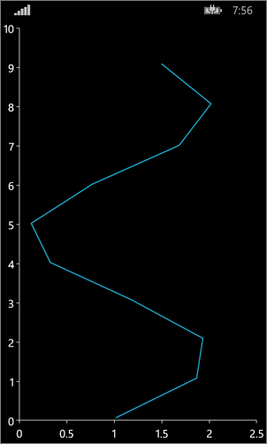
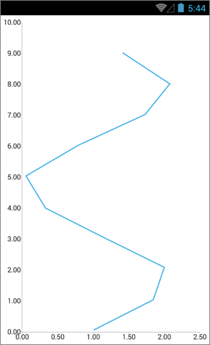
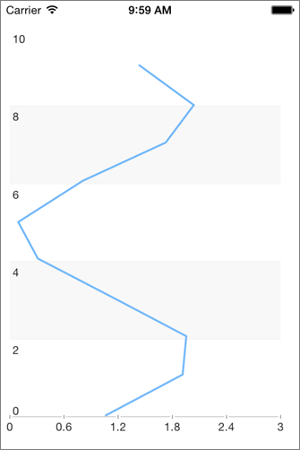

# ScatterLineSeries #

The **ScatterLineSeries** are represented on the chart as data points connected with straight line segments. The **ScatterLineSeries** inherit from the **[ScatterPointSeries]()** class and also require both axes of the chart to be of type **NumericalAxis**.

## Example ##
Here is an example of how to create a basic RadCartesianChart with ScatterLineSeries in xaml:

	<telerikChart:RadCartesianChart>
	  <telerikChart:RadCartesianChart.BindingContext>
	    <viewMoedls:ScatterViewModel/>
	  </telerikChart:RadCartesianChart.BindingContext>
	  <telerikChart:RadCartesianChart.HorizontalAxis>
	    <telerikChart:NumericalAxis/>
	  </telerikChart:RadCartesianChart.HorizontalAxis>
	  <telerikChart:RadCartesianChart.VerticalAxis>
	    <telerikChart:NumericalAxis/>
	  </telerikChart:RadCartesianChart.VerticalAxis>
	  <telerikChart:RadCartesianChart.Series>
	    <telerikChart:ScatterLineSeries ItemsSource="{Binding ScatterData}">
	      <telerikChart:ScatterLineSeries.XValueBinding>
	        <telerikChart:PropertyNameDataPointBinding PropertyName="XValue"/>
	      </telerikChart:ScatterLineSeries.XValueBinding>
	      <telerikChart:ScatterLineSeries.YValueBinding>
	        <telerikChart:PropertyNameDataPointBinding PropertyName="YValue"/>
	      </telerikChart:ScatterLineSeries.YValueBinding>
	    </telerikChart:ScatterLineSeries>
	  </telerikChart:RadCartesianChart.Series>
	</telerikChart:RadCartesianChart>
Where:

	xmlns:telerikChart="clr-namespace:Telerik.XamarinForms.Chart;assembly=Telerik.XamarinForms.Chart"
Here is an example of how to create a RadCartesianChart with ScatterLineSeries in code:

	var chart = new RadCartesianChart
	{
	    HorizontalAxis = new NumericalAxis(),
	    VerticalAxis = new NumericalAxis(),
	    BindingContext = new ScatterViewModel()
	};
	
	var series = new ScatterLineSeries();
	series.SetBinding(ScatterLineSeries.ItemsSourceProperty, new Binding("ScatterData"));   
	series.XValueBinding = new PropertyNameDataPointBinding("XValue");
	series.YValueBinding = new PropertyNameDataPointBinding("YValue");
Here is the sample data:
	
	public class NumericalData
	{
	    public double XValue { get; set; }
	    public double YValue { get; set; }
	}

	public class ScatterViewModel
	{
	    private static Random random = new Random();
	
	    public ScatterViewModel()
	    {
	        this.ScatterData = GetScatterData(10, 0.1, 0.1, this.GenerateX, this.GenerateY);
	    }
	
	    public ObservableCollection<NumericalData> ScatterData { get; set; }
	
	    public static ObservableCollection<NumericalData> GetScatterData(int dataCount, double xDispersion, double yDispersion, Func<int, double> xFunc, Func<int, double> yFunc)
	    {
	        var data = new ObservableCollection<NumericalData>();
	        for (int i = 0; i < dataCount; i++)
	        {
	            data.Add(new NumericalData() { XValue = xFunc(i) + xDispersion * random.NextDouble(), YValue = yFunc(i) + yDispersion * random.NextDouble() });
	        }
	
	        return data;
	    }
	
	    private double GenerateX(int i)
	    {
	        return 1 + Math.Sin(i);
	    }
	
	    private double GenerateY(int i)
	    {
	        return i;
	    }
	}

## Customization ##
**ScatterLineSeries** provide the following properties to change their style:

- **Stroke** (Color): changes the color used to draw lines.
- **StrokeThickness** (double): changes the width of the lines.

Here is an example:

	var series = new ScatterLineSeries { Stroke = new Color(0.6, 0.6, 0.9), StrokeThickness = 5 };

