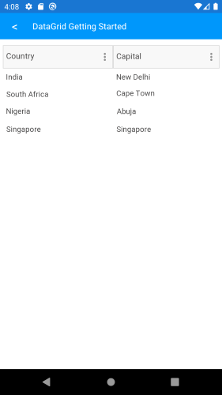

# Getting Started with DataGrid for Xamarin Moile Blazor Bindings

This article will guide you through the steps needed to add a basic **RadDataGrid** control in your application.

* [Setting up the app](#1-setting-up-the-app)
* [Adding the required Telerik references](#2-adding-the-required-telerik-references)
* [Adding RadDataGrid control](#3-adding-raddatagrid-control)

## 1. Setting up the app

Take a look at the [Getting Started](#getting-started) article how to setup the Telerik Blazor Mobile Bindings for Xamarin project.

## 2. Adding the required Telerik references

You have two options:

* Add the Telerik.UI.for.Xamarin.Blazor Nuget package following the instructions in [Telerik NuGet package server]() topic.

* Add the references to Telerik assemblies manually, check the list below with the required assemblies for **RadDataGrid** component:

| Platform | Assemblies |
| -------- | ---------- |
| Portable | Telerik.XamarinForms.Blazor.DataControls.dll<br/>Telerik.XamarinForms.Common.dll<br/>Telerik.XamarinForms.DataGrid.dll<br/>Telerik.XamarinForms.SkiaSharp.dll |
| Android  | Telerik.Xamarin.Android.Common.dll<br/>Telerik.Xamarin.Android.Data.dll<br/>Telerik.Xamarin.Android.Input.dll<br />Telerik.Xamarin.Android.List.dll<br />Telerik.Xamarin.Android.Primitives.dll<br />Telerik.XamarinForms.Common.dll<br />Telerik.XamarinForms.DataControls.dll<br />Telerik.XamarinForms.DataGrid.dll<br />Telerik.XamarinForms.Input.dll<br />Telerik.XamarinForms.Primitives.dll<br />Telerik.XamarinForms.SkiaSharp.dll |
| iOS      | Telerik.XamarinForms.Common.dll<br/>Telerik.XamarinForms.DataGrid.dll<br/>Telerik.XamarinForms.SkiaSharp.dll |

>important RadDataGrid is rendered via the **SkiaSharp** graphics library so you need to install also [SkiaSharp](https://www.nuget.org/packages/SkiaSharp/) and [SkiaSharp.Views.Forms](https://www.nuget.org/packages/SkiaSharp.Views.Forms) in all projects of the Xamarin solution (portable, android, ios, etc). 

## 3. Adding RadDataGrid control

### Example

here is a sample DataGrid definition:

```
<Grid>
    <Layout>
        <RowDefinition GridUnitType="GridUnitType.Star" />
    </Layout>
    <Contents>
        <GridCell>
            <RadDataGrid ItemsSource="@ItemSource"
                         UserGroupMode="Telerik.XamarinForms.DataGrid.DataGridUserGroupMode.Auto"
                         UserEditMode="Telerik.XamarinForms.DataGrid.DataGridUserEditMode.Cell"
                         UserFilterMode="Telerik.XamarinForms.DataGrid.DataGridUserFilterMode.Auto"/>
        </GridCell>
    </Contents>
</Grid>

@code 
{
    public ObservableCollection<Data> ItemSource { get; set; }

    protected override void OnInitialized()
    {
        base.OnInitialized();

        this.ItemSource = new ObservableCollection<Data>
        {
            new Data { Country = "India", Capital = "New Delhi" },
            new Data { Country = "South Africa", Capital = "Cape Town" },
            new Data { Country = "Nigeria", Capital = "Abuja" },
            new Data { Country = "Singapore", Capital = "Singapore" }
        };
    }
}
```

and the Data model used:

```
public class Data
{
    public string Country { get; set; }

    public string Capital { get; set; }
}
```

Here is the result:



## See Also

- [Xamarin Mobile Blazor Bindings Overview]()
