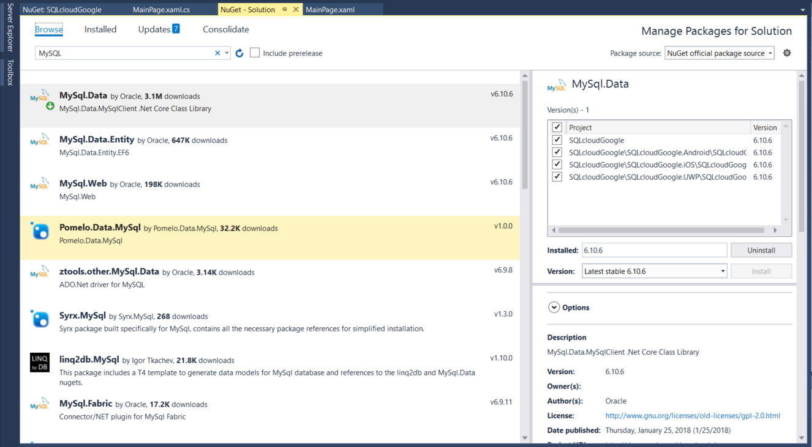
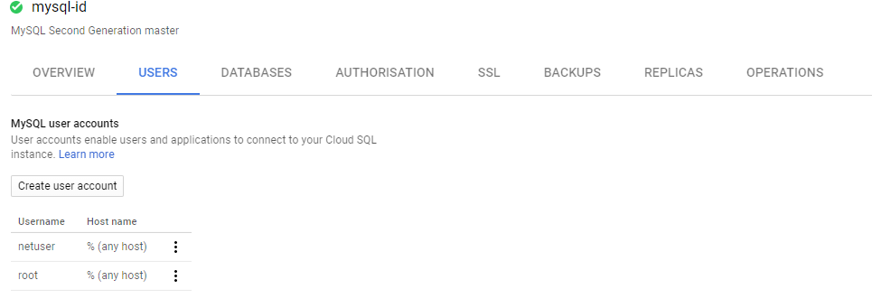
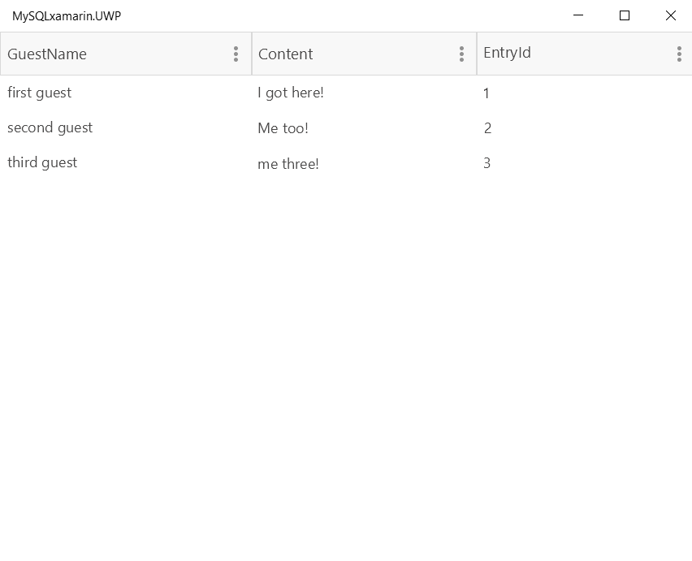

# Google Cloud SQL for MySQL 

>important this paragraph is taken from Google's docs - exactly as it is.

Google promotes its SQL solution as a fully-managed database service which is quick to set up, easy to maintain and manage. Some of the key features of the solution are the high performance, scalability, and convenience. It is hosted on Google Cloud Platform and can be accessed by applications and services running anywhere.

Using database on the cloud provides you with lots of advantages such as better focus on your application, no need of installations and backups, high performance and scalability.

Google Cloud SQL supports **PostgreSQL**(in Beta at the time of writing this article) and **MySQL** databases. For the purpose of this section we are going to show you a simple example on how to visualize data from **MySQL** database within a **RadDataGrid** Control.

## Prerequisites

**1.** In order to create a database, you need to first enable the **Cloud SQL Administration API** and set up the billing for your account through the GCP console.

**2.** As a next step, you should create a MySQL instance which can hold different MySQL databases.

**3.** Finally, you can create the database instance as shown in the official [Quickstart for Cloud SQL for MySQL](https://cloud.google.com/sql/docs/mysql/quickstart). We are going to use this exact database in this example as well. Make sure that you have added several entities so that you are not working with an empty database.

## Integration with RadDataGrid

Once you have created the database and added different entities within it, you can use some of **Telerik UI for Xamarin**'s data controls to visualize the data in your .NET application. We are going to use a **RadDataGrid**.
As we are going to work with a MySQL database, you need to install some **MySQL .NET Connector** - the connector that enabled .Net applications to communicate with MySQL servers. More information can be found on the following link - [MySQL Connector/NET Developer Guide](https://dev.mysql.com/doc/connector-net/en/)

You can install the **MySQL.Data** NuGet package as shown in the image below:

Next, you need to initialize a connection to your database. You can directly add the database server IP. For the purpose of the demo, we have added a test user in your MySQL instance through the GCP console:

The IP address of your SQL instance can be found in the Overview tab of the instance in the GCP console. The following method initializes the connection:
	
		private MySqlConnection connection;
		private string server;
	    private string database;
		private string uid;
		private string password;
	
        private void Initialize()
        {
            server = "123.123.123.123"; //enter the address of your SQL instance 
            database = "guestbook";
            uid = "netuser";
            password = "admin";
            string connectionString;
            connectionString = "SERVER=" + server + ";" + "DATABASE=" +
            database + ";" + "UID=" + uid + ";" + "PASSWORD=" + password + ";";

            connection = new MySqlConnection(connectionString);
        }

As a next step, you need to open the connection as in the method below:

        private bool OpenConnection()
        {
            try
            {
                connection.Open();
                return true;
            }
            catch (MySqlException ex)
            {
                switch (ex.Number)
                {
                    case 0:
                        Debug.WriteLine("Cannot connect to server.  Contact administrator");
                        break;

                    case 1045:
                        Debug.WriteLine("Invalid username/password, please try again");
                        break;
                }
                return false;
            }
        }

You can create a similar method for closing the connection when needed.

Finally, we have to select the data from the database and assign it as an **ItemsSource** of the **RadDataGrid** control.

     public List<Guest> Select()
        {
            string query = "SELECT * FROM entries";

            //Create a list to store the result
            List<Guest> list = new List<Guest>();

            //Open connection
            if (this.OpenConnection() == true)
            {
                //Create Command
                MySqlCommand cmd = new MySqlCommand(query, connection);
                MySqlDataReader dataReader = cmd.ExecuteReader();

                //Read the data and store them in the list
                while (dataReader.Read())
                {
                    Guest guest = new Guest();
                    guest.GuestName = dataReader["guestName"].ToString();
                    guest.Content = dataReader["content"].ToString();
                    guest.EntryId = Int32.Parse(dataReader["entryID"].ToString());
                    list.Add(guest);
                }

                //close Data Reader
                dataReader.Close();

                //close Connection
                this.CloseConnection();

                //return list to be displayed
                return list;
            }
            else
            {
                return list;
            }
        } 

Where you have created a custom Guest class:

	public class Guest
    {
        public string GuestName { get; set; }
        public string Content { get; set; }
        public int EntryId { get; set; }

    }

Setting this List of guests as an ItemsSource of the RadDataGrid:

    this.dataGrid.ItemsSource = Select();

Here is the **RadDataGrid** after it is populated:

## See Also

- [Google Cloud Overview]()
- [Google Cloud Functions]()
- [Google Cloud Translation API]()