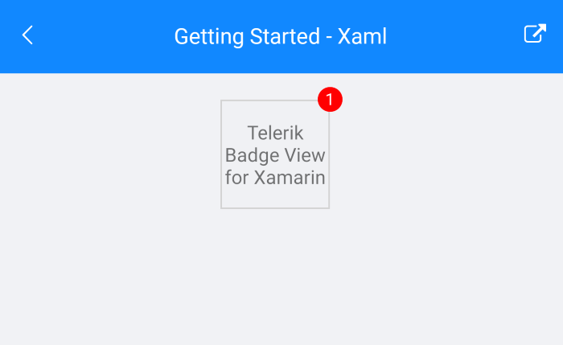

# Getting Started

This article will guide you through the steps needed to add a basic **RadBadgeView** control in your application.

* [Setting up the app](#1-setting-up-the-app)
* [Adding the required Telerik references](#2-adding-the-required-telerik-references)
* [Adding RadBadgeView control](#3-adding-radbadgeview-control)
* [Adding RadBadgeView Content](#3-adding-radbadgeview-content)

## 1. Setting up the app

Take a look at these articles and follow the instructions to setup your app:

- [Setup app with Telerik UI for Xamarin on Windows]()
- [Setup app with Telerik UI for Xamarin on Mac]()

## 2. Adding the required Telerik references

You have two options:

* Add the Telerik UI for Xamarin Nuget package following the instructions in [Telerik NuGet package server]() topic. Note that RadBarcode does not have a separate nuget package. 

* Add the references to Telerik assemblies manually, check the list below with the required assemblies for **RadBadgeView** component:

| Platform | Assemblies |
| -------- | ---------- |
| Portable | Telerik.XamarinForms.Primitives.dll  Telerik.XamarinForms.Common.dll |
| Android  | Telerik.XamarinForms.Primitives.dll Telerik.XamarinForms.Common.dll |
| iOS      | Telerik.Xamarin.iOS.dll   Telerik.XamarinForms.Primitives.dll  Telerik.XamarinForms.Common.dll |
| UWP      | Telerik.Core.dll Telerik.XamarinForms.Primitives.dll  Telerik.XamarinForms.Common.dll |

## 3. Adding RadBadgeView control

If your app is setup, you are ready to add a **RadBadgeView** control to your page. 

In addition to this you need to add the following namespace:

## 4. Adding RadBadgeView Content

>important The BadgeView will be visualized only if its `Content` property is set. 

## Example

Here is the result:

#### Figure 1: BadgeView Getting Started

>important BadgeView Getting Started Example can be found in *SDK Browser/Examples/BadgeViewControl* folder.

## See Also

- [Key Features]()
- [Badge Position and Alignment]()
- [Badge Animation]()
- [Predefined Badges]()
