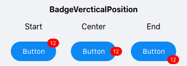
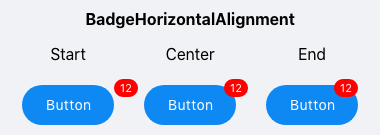
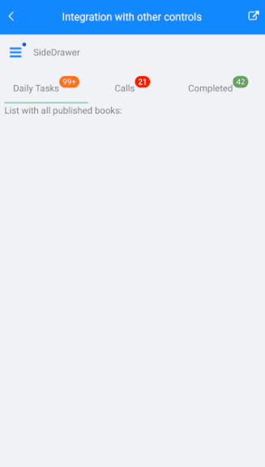

# Key Features

The purpose of this help article is to show you the key features of the **RadBadgeView** control. 

## Content

>important The BadgeView will be visualized only if its `Content` property is set. 

* **Content**(of type *Xamarin.Formd.View*): Defines the content of the RadBadgeView.

You must define a content. The Badge marker/indicatior is positioned based on the content inside the RadBadgeView. Without a content the Badge won't be visualized.

```XAML
<telerikPrimitives:RadBadgeView>
    <telerikPrimitives:RadBadgeView.Content>
        <!-- add the content of the RadBadgeView. For exmaple: Label, Image, Frame, Border, Button, etc -->
    </telerikPrimitives:RadBadgeView.Content>
</telerikPrimitives:RadBadgeView>
```

### Example

There is a Button inside the Content. The BadgeText is updated on a ButtonClick.  

<snippet id='badgeview-content'/>

and the page's code behind where is the button click implementation:

<snippet id='badgeview-content-code-behind'/>

And the result


## Badge Text

With `BadgeText` property(*string*) you can define a text. The text will be displayed in the badge marker. 

### Example

```XAML
<telerikPrimitives:RadBadgeView BadgeText="Badge Text">
    <telerikPrimitives:RadBadgeView.Content>
        <telerikPrimitives:RadBorder WidthRequest="80"
                                     HeightRequest="80"
                                     BorderThickness="1"
                                     BorderColor="LightGray">
            <Label Text="Telerik Badge View for Xamarin" 
                   FontSize="14"
                   VerticalTextAlignment="Center"
                   HorizontalTextAlignment="Center"/>
        </telerikPrimitives:RadBorder>
    </telerikPrimitives:RadBadgeView.Content>
</telerikPrimitives:RadBadgeView>
```


>tip You can fully customize the look &amp; feel of the BadgeView, for detailed information check the [Badge Styling]() and [Badge Customization]() articles.

## Badge Position 

**BadgeHorizontalPosition**


**BadgeVerticalPosition**



Use the `BadgeHorizontalPositon` and `BadgeVerticalPosition` properties to position the badge marker based on the content inside the RadBadgeView. The properties are of type *Telerik.XamarinForms.Primitives.BadgePosition* and the available options are `Start`, `Center` and `End`. 

For more details about this check the [Badge Position](#badge-position) section.

## Badge Alignment 

**BadgeHorizontalAlignment**



**BadgeVerticalAlignment**


Specify the alignment of the badge based on the content inside the RadBadgeView using the `BadgeHorizontalAlignment` and `BadgeVerticalAlignment` properties. The properties are of type *Telerik.XamarinForms.Primitives.BadgeAlignment* and the available options are `Start`, `Center` and `End`. 

For more details about this check the [Badge Alignment](#badge-alignment) section.

## Badge Offset

Specify the horizontal/vertical distance between the content of the Badge and its alignment point using the `BadgeOffsetX` and  `BadgeOffsetY` properties. 

For more details please visit our [Badge Offset](#badge-offset) section.

## Badge Animation 

You can choose whether the badge marker/indicator will be displayed with animation. In addition you can define the antimation duration and easing. 

For more details please visit our [Badge Animation]() article.

## Badge Types


You can choose what will be the type of the badge by setting the `BadgeType` property(enumeration of type *Telerik.XamarinForms.Primitives.BadgeType*). 
For more details please visit our [Badge Types]() article.

## Badge Visibility

Change the Badge visibility state using the `BadgeVisibility` property (enum of type *Telerik.XamarinForms.Common.Visibility*).

The available options are:

* **Visible** - The badge marker/indicator is visualized.
* **Hidden** - The badge marker/indicator is hidden.
* **Collapsed** - The badge marker/indicator is collapsed.

The default value of `BadgeVisibility` is `Visible`.

### Example with BadgeVisibility Hidden

```XAML
<telerikPrimitives:RadBadgeView BadgeText="1" BadgeVisibility="Hidden">
    <telerikPrimitives:RadBadgeView.Content>
        <telerikPrimitives:RadBorder WidthRequest="80"
                                    HeightRequest="80"
                                    BorderThickness="1"
                                    BorderColor="LightGray">
            <Label Text="Telerik Badge View for Xamarin" 
                FontSize="14"
                VerticalTextAlignment="Center"
                HorizontalTextAlignment="Center"/>
        </telerikPrimitives:RadBorder>
    </telerikPrimitives:RadBadgeView.Content>
</telerikPrimitives:RadBadgeView>
```


## Integration with other Controls

BadgeView control can be integrated with other controls like ListView, SideDrawer, TabView, Button, Label, Image, etc. It depends on the scenario you want to achieve. 



Sample Integration Example can be found in our [Telerik UI for Xamarin Sample application](https://github.com/telerik/telerik-xamarin-forms-samples/tree/master/QSF/QSF/Examples/BadgeViewControl/IntegrationExample) and [SDK Browser application](https://github.com/telerik/xamarin-forms-sdk/tree/master/XamarinSDK/SDKBrowser/SDKBrowser/Examples/BadgeViewControl/FeaturesCategory/BadgeViewIntegrationExample).

## See Also

- [Badge Position and Alignment]()
- [Badge Animation]()
- [Badge Types]()
- [Badge Styling]()
- [Badge Customization]()
