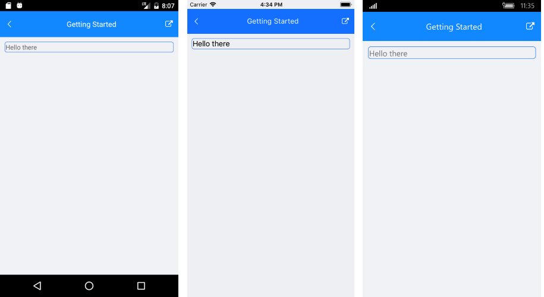

# Getting Started

This article will guide you through the steps needed to add a basic **RadBorder** control in your application.

* [Setting up the app](#1-setting-up-the-app)
* [Adding the required Telerik references](#2-adding-the-required-telerik-references)
* [Adding RadBorder control](#3-adding-radborder-control)

## 1. Setting up the app

Take a look at these articles and follow the instructions to setup your app:

- [Setup app with Telerik UI for Xamarin on Windows]()
- [Setup app with Telerik UI for Xamarin on Mac]()

## 2. Adding the required Telerik references

You have two options:

* Add the Telerik UI for Xamarin Nuget package following the instructions in [Telerik NuGet package server]() topic.

If you don't want to add the all Telerik.UI.for.Xamarin nuget package, you have the option to add a separate nuget package. For RadBorder control you have to install the **Telerik.UI.for.Xamarin.Primitives** nuget package. This nuget will automatically refer the *Telerik.UI.for.Xamarin.Common* and *Telerik.UI.for.Xamarin.SkiaSharp* nuget packages.

* Add the references to Telerik assemblies manually, check the list below with the required assemblies for **RadBorder** component:

| Platform | Assemblies |
| -------- | ---------- |
| Portable | Telerik.XamarinForms.Primitives.dll |
| Android  | Telerik.Xamarin.Android.Primitives.dll  Telerik.XamarinForms.Primitives.dll |
| iOS      | Telerik.Xamarin.iOS.dll  Telerik.XamarinForms.Primitives.dll |
| UWP      | Telerik.Core.dll   Telerik.UI.Xaml.Primitives.UWP.dll  Telerik.XamarinForms.Common.dll  Telerik.XamarinForms.Primitives.dll |

> The path of the assemblies is relative to the `Binaries` folder that is located in the installation folder of the controls. The default location is: `C:\Program Files (x86)\Progress\Telerik UI for Xamarin RX XXX\Binaries`.
>
> All binaries built for a specific platform are placed in a folder named after that platform.

## 3. Adding RadBorder control

If your app is correctly set, you are ready to add a **RadBorder** control to the page. In the example RadBorder wraps around a Label: 

<snippet id='border-getting-started-xaml'/>

In addition to this, you need to add the following namespace:

<snippet id='xmlns-telerikprimitives'/>
<snippet id='ns-telerikprimitives'/>

Here is the result:

>important **SDK Browser** and **QSF** applications contain different examples that show RadBorder's main features. You can find the applications in the **Examples** and **QSF** folders of your local **Telerik UI for Xamarin** installation.

## See Also

- [Key Features]()