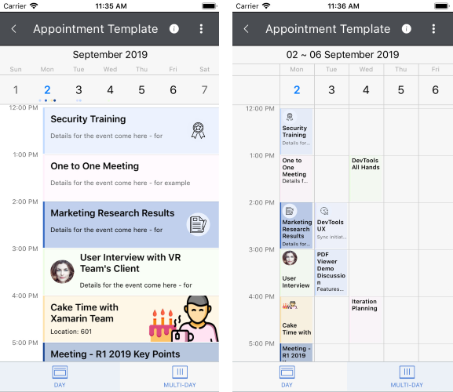

# Appointments

## Creating an Appointment

RadCalendar can display appointments by setting its **AppointmentsSource** property. It accepts a collection of objects which should implement *Telerik.XamarinForms.Input.IAppointment* interface. This interface defines the following members:

- **StartDate** *(DateTime)*
- **EndDate** *(DateTime)*
- **Title** *(string)*
- **Detail** *(string)*
- **Color** *(Color)*
- **IsAllDay** *(bool)*

>important With R1 2019 release of Telerik UI for Xamarin we have introduced **Telerik.XamarinForms.Input.Appointment** class which implements the *IAppointment* interface as well as adds **RecurrenceRule** property to support [recurrence feature](). We'd recommend you use directly the **Appointment** class when working with appointments.

<snippet id='calendar-gettingstarted-appointmentssource-csharp'/>

#### **Figure 1: Appearance of the RadCalendar control in month view mode**

#### **Figure 2: Appearance of the RadCalendar control in day view mode**

## Appointment Template

With R3 2019 Release of Telerik UI for Xamarin RadCalendar control provides the option to apply a **ContentTemplate** to the **Appointments** for **DayView** and **MultiDayView**. You could easily set a Template or TemplateSelector to the appontments through the **AppointmentContentTemplate** property of the DayViewSettings or MultiDaySettings.

* **AppointmentContentTemplate** (*DataTemplate*): Defies the DataTemplate of the Appointment based on the data object.

#### Appointment Template in DayView and MultiDayView

### Appointment Template Example

The following example shows how to set AppointmentContentTemplate in DayView Mode using DataTemplateSelector.

First, create a ViewModel class with a collection of Appointment objects:

<snippet id='calendar-appointments-template-viewmodel'/>

Create a custom appointment template selector class which inherits from DataTemplateSelector and override the OnSelectTemplate method:

<snippet id='calendar-appointments-template-selector-class'/>

Add the created DayViewAppointmentTemplateSelector as a Resource and define both DataTemplates:

<snippet id='calendar-appointments-template-selector'/>

Finally, set the AppointmentContentTemplate property of the DayViewSettings:

<snippet id='calendar-appointments-template-example'/>

Here is the result:

>important [SDK Browser application](https://docs.telerik.com/devtools/xamarin/sdk-browser-overview#sdk-browser-application) contains a sample Appointments Template example. You can find it in the **Calendar &amp; Scheduling /Features** folder.

## Events
 
**AppointmentTapped**(AppointmentTappedEventArgs): Occurs when you tap over a specific appointment when in DayView or MultiDayView mode. It can be used to get all the information regarding the appointment.

### AppointmentTapped Example

First you need to set the ViewMode to Day:

<snippet id='calendar-features-setviewmode-csharp'/>

Eventually, you can utilize the event: 

<snippet id='calendar-features-appointmenttapped-csharp'/>

## See Also

* [View Modes]()
* [Calendar Selection]()

