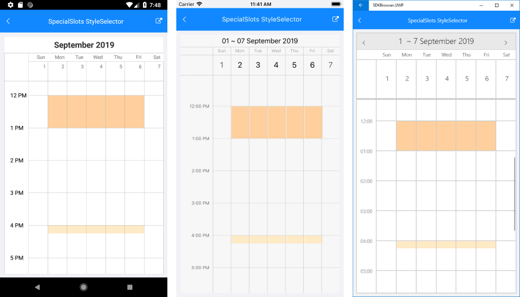
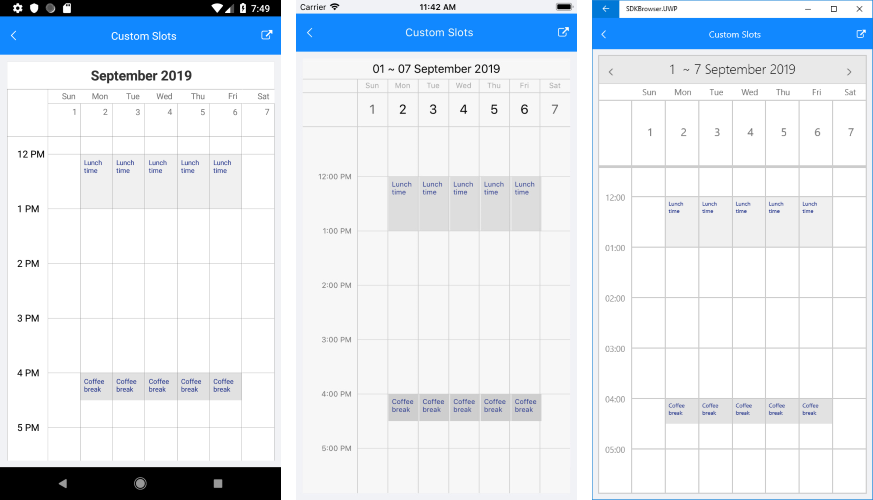

# Special and Restricted Slots

With R3 2019 release of Telerik UI for Xamarin RadCalendar provides the option to define a collection of special and restricted time slots in order to make them noticeable across the timeline of the Day and MultiDay views. 

You just need to prepare a collection of **SpecialSlot** objects and assign it to **SpecialSlotsSource** collection of the DayViewSettings / MultiDayViewSettings for Day/MultiDay view, respectively.

Every SpecialSlot has the following properties:

* **StartDate**;
* **EndDate**;
* **RecurrencePattern**: Defines whether the slot will be displayed for repeating days;
* **IsReadOnly**: When set to **True** the slot is disabled (restricted), meaning the end user wouldn't be able to create or modify appointments at that slot (tapping over a read-only slot will not show Create Appointment screen). 

>note Appointments that cover restricted and non restricted slots at the same time can still be modified through the [Scheduling UIs]().

Below you can find a quick example how to create special and restricted slots.

First, create a ViewModel class with a collection of **SpecialSlot** objects. In the example two repeating special slots are added for rest hours during weekdays. In addition, the first slot which represents a lunch break, is set as restricted time.

<snippet id='calendar-specialslots-viewmodel' />

Then, add RadCalendar definition with **MultiDay** ViewMode and **MultiDayViewSettings** applied:

<snippet id='calendar-specialslots-xaml' />

Last step is to set the BindingContext to the ViewModel class:

<snippet id='calendar-specialslots-setvm' />

Here is the result after executing the example above on different platforms:

## Setting a separate Style for different slots

Through the **SpecialSlotStyleSelector** property of the DayViewSettings (or MultiDayViewSettings) you can apply different background color to slots depending on certain condition. The SpecialSlotStyleSelector provides SelectStyle method with the **SpecialSlot** as a parameter. The method should return an object of type *CalendarSpecialSlotStyle* which exposes a **BackgroundColor** property.

The sample below extends the previous example by applying separate styles to both types of special slots through a SpecialSlotStyleSelector.

Create a custom style selector class which inherits from **SpecialSlotStyleSelector** and override SelectStyle method:

<snippet id='calendar-specialslots-customselector' />

Add the created RestHoursStyleSelector as a Resource and define both Styles:

<snippet id='calendar-specialslotsselector-resources' />

All that is left, is to set the SpecialStyleSelector property of the MultiDayViewSettings:

<snippet id='calendar-specialslotsselector-xaml' />

Check the result in the image below:

## Applying a ContentTemplate to the slots

By default the special slots are marked with a different background. In addition you could show a content of your choice inside special slots through the **SpecialSlotContentTemplate** property of the DayViewSettings / MultiDaySettings.

For the example, create a custom slot that inherits from **SpecialSlot** class:

<snippet id='calendar-specialslots-customslot' />

In the ViewModel class, add a collection of BreakSlot objects that will be then assigned as a SpecialSlotsSource:

<snippet id='calendar-customslots-vm' />

Here is the RadCalendar definition where **SpecialSlotContentTemplate** property is applied:

<snippet id='calendar-customslots-xaml' />

And, lastly, add the RestHoursDataTemplate referenced earlier as a StaticResource:

<snippet id='calendar-customslots-resources' /> 

Below you can check the result on different platforms:

>important All the Special Slots examples can be found in the Calendar &amp; Scheduling/Features folder of the [SDK Samples Browser application](#sdk-browser-application).

## See Also

* [Date Properties]()
* [View Modes]()
* [Appointments]()
* [Scheduling UI]()