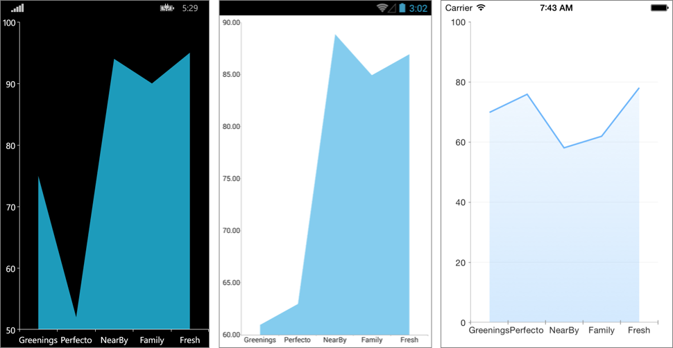
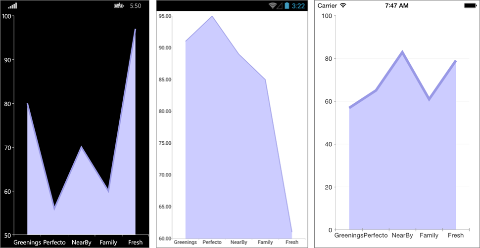

# AreaSeries #

## Overview ##

**RadCartesianChart** visualizes **AreaSeries** as an area on the chart that is enclosed by the coordinate axes and straight line segments that connect the data points represented by these series. The **AreaSeries** extend **CategoricalStrokedSeries**, so they are also **CategoricalSeries** and require one **CategoricalAxis** and one **NumricalAxis**.

## Features ##

- **Fill** : gets or sets the fill of the AreaSeries.
- **Stroke** : changes the color used to draw lines.
- **StrokeThickness** : changes the width of the lines.

## Example ##
Here is an example of how to create a basic RadCartesianChart with AreaSeries in xaml:

	<telerikChart:RadCartesianChart>
	  <telerikChart:RadCartesianChart.BindingContext>
	    <viewMoedls:CategoricalViewModel/>
	  </telerikChart:RadCartesianChart.BindingContext>
	  <telerikChart:RadCartesianChart.HorizontalAxis>
	    <telerikChart:CategoricalAxis/>
	  </telerikChart:RadCartesianChart.HorizontalAxis>
	  <telerikChart:RadCartesianChart.VerticalAxis>
	    <telerikChart:NumericalAxis/>
	  </telerikChart:RadCartesianChart.VerticalAxis>
	  <telerikChart:RadCartesianChart.Series>
	    <telerikChart:AreaSeries ItemsSource="{Binding CategoricalData}">
	      <telerikChart:AreaSeries.ValueBinding>
	        <telerikChart:PropertyNameDataPointBinding PropertyName="Value"/>
	      </telerikChart:AreaSeries.ValueBinding>
	      <telerikChart:AreaSeries.CategoryBinding>
	        <telerikChart:PropertyNameDataPointBinding PropertyName="Category"/>
	      </telerikChart:AreaSeries.CategoryBinding>
	    </telerikChart:AreaSeries>
	  </telerikChart:RadCartesianChart.Series>
	</telerikChart:RadCartesianChart>
Where:

	xmlns:telerikChart="clr-namespace:Telerik.XamarinForms.Chart;assembly=Telerik.XamarinForms.Chart"
Here is an example of how to create a RadCartesianChart with AreaSeries in code:

	var chart = new RadCartesianChart
	{
	    HorizontalAxis = new CategoricalAxis(),
	    VerticalAxis = new NumericalAxis(),
	    BindingContext = new CategoricalViewModel()
	};
	
	var series = new AreaSeries();
	series.SetBinding(AreaSeries.ItemsSourceProperty, new Binding("CategoricalData"));   
	series.ValueBinding = new PropertyNameDataPointBinding("Value");
	series.CategoryBinding = new PropertyNameDataPointBinding("Category");
		
	chart.Series.Add(series);

Here is the sample data:

	public class CategoricalData
	{
	    public object Category { get; set; }
	    public double Value { get; set; }
	}

	public class CategoricalViewModel
    {
        private static Random random = new Random();
        private static string[] categories = new string[] { "Greenings", "Perfecto", "NearBy", "Family", "Fresh" };

        public CategoricalViewModel()
        {
            this.CategoricalData = GetCategoricalData();
        }

        public ObservableCollection<CategoricalData> CategoricalData { get; set; }

        public static ObservableCollection<CategoricalData> GetCategoricalData()
        {
            var data = new ObservableCollection<CategoricalData>();
            for (int i = 0; i < categories.Length; i++)
            {
                data.Add(new CategoricalData() { Value = random.Next(50, 100), Category = categories[i] });
            }

            return data;
        }
    }

And here is the result:

Here we have some customizations:

	var series = new AreaSeries { Stroke = new Color(0.6, 0.6, 0.9), StrokeThickness = 5, Fill = new Color(0.8, 0.8, 1) };

