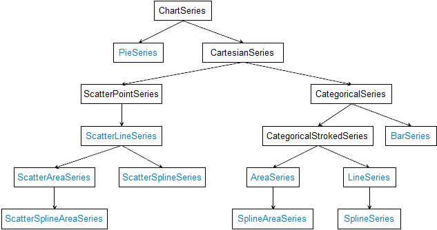

# Overview #

The data visualization in RadChart is done by a hierarchy of classes that inherit from the ChartSeries class. Each series has a collection of data points, that is the view model of the data. A series may have its data populated by data-binding to an arbitrary IEnumerable instance through the ItemsSource property.

## Series Class Hierarchy ##

Concrete series types are available for specific charts. For example, there is a set of CartesianSeries applicable in the context of a RadCartesianChart. Here is the hierarchy of all series:

Here are listed all supported series grouped by the chart types that can use them:

### CartesianChart ###

- **CategoricalSeries**
    - [BarSeries]()
    - [LineSeries]()
    - [SplineSeries]()
    - [AreaSeries]()
    - [SplineAreaSeries]()
- **ScatterSeries**
    - [ScatterPointSeries]()
    - [ScatterLineSeries]()
    - [ScatterSplineSeries]()
    - [ScatterAreaSeries]()
    - [ScatterSplineAreaSeries]()

### PieChart ###

- [PieSeries]() 

## Features ##

### Common Features ###

* **ItemsSource** (IList): Defines the data set that will fill the series data points. 
* **DisplayName** (string): The display name of the series.

#### Selection

* **AllowSelect** (bool): Specifies whether the series is selectable. If the property value is `true`, the selection is handled by the chart selection behavior.  
* **IsSelected** (bool): Specifies whether the series is selected.

#### Labels customization

* **ShowLabels** (bool): Defines whether the series will display labels for each plotted data point.
* **LabelBinding** (PropertyNameDataPointBinding): Allows the user to bind the series labels to a property of the data point item.
* **LabelFormat** (string): Sets label format string, e.g. "{0} items".
* **LabelFormatter** (ILabelFormatter): Allows custom series label formatting. 

### Categorical Series Features ###

#### Data Binding ####

All categorical series have **CategoryBinding** and **ValueBinding** properties. These properties are of **PropertyNameDataPointBinding** and specify the name  of the property from the data model used by the chart to plot the corresponding visual points.

#### Combining ###

The categorical series could be combined. Several combining strategies are supported. You can take a look at the [Grouping example]().

### Scatter Series Common Features ###

#### Data Binding ####

Scatter series provide **XValueBinding** and **YValueBinding** properties for data binding to a view model. These properties are of **PropertyNameDataPointBinding** and specify the name  of the property from the data model used by the chart to plot the corresponding visual points.