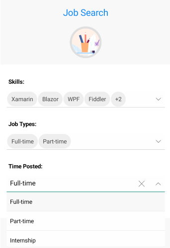

# ComboBox for Xamarin Overview

**Telerik ComboBox for Xamarin** allows users to select item/items from a dropdown list of items. The control has a number of features such as editing, searching, single and multiple selection, flexible styling API, dropdown customizations and more.  

#### Figure 1: ComboBox for Xamarin Overview

## Key features

* **Editable and NonEditable mode** – ComboBox supports both editable and noneditable state. When the control is in edit mode searching can be performed. For more details please check the [Editing]() article. 
* **Searching Support** – ComboBox provides both case-sensitive and case-insensitive searching modes. The available options are: Contains, StartsWith, ContainsCaseSensitive and StartsWithCaseSensitive. View the [Searching]() article for more details.
* **Single and Multiple Selection Support** – ComboBox control has a support for single and multiple selection. You can easily specify the required selection using the SelectionMode property. To learn more about the Selection please check the [Single and Multiple Selection]() topic.
* **Complex Object Support** – ComboBox control provides you a way to specify which property of your complex business object to be displayed in the control by setting DisplayMemberPath. Check [here]() for more details how Data Binding works.
* **Search Highlighting Text** – ComboBox control highlights the matching text inside the dropdown list based on the given input after searching is performed. For more details check [here]().
* **Placeholder** – The text which is used to give guidance to the end user on what should be entered/searched in the input. The watermark text is displayed when the input field is empty, or the selected item/s is/are cleared. Review the [Key Features]() article.
* **Header and Footer** – ComBoBox for Xamarin gives you the ability to add header and footer inside the dropdown list. For this purpose, you will need to define the HeaderTemplate property and the FooterTemplate property. Go to [Header and Footer]() article.
* **Templates** – You can easily change the default ItemTemplate and SelectedItemTemplate. In addition, if the ComboBox is in multiple selection mode, the selected item is displayed inside a token. You can customize the token using the TokenTemplate property. Also, you can customize the ShowMoreTemplate which is visualized inside the ComboBox when the control is not focused and when there is not enough space for all tokens to be displayed. Check [here]() for more detail.
* **Flexible Styling API** – Allows you to change the ComboBox background color, Style the control’s dropdown box, change the clear and dropdown buttons. In addition, you can change the Placeholder text color and the Highlighted text color.  Check [here]() how you can work with the Styling API.
* **Theming Support** - RadComboBox comes with built-in theming support that helps you achieve consistent look with the rest controls from Telerik UI for Xamarin suite. To learn more about this go to [Theme Overview]() topic. 
* **Commands Support** – ComboBox for Xamarin exposes ClearSelectionCommand that allows you clear the selected item/s from external UI and SelectAllCommand that allows you to select all items from the source. For more details check [here]().

>important **SDK Browser** and **QSF** applications contain different examples that show RadComboBox's main features. You can find the applications in the **Examples** and **QSF** folders of your local **Telerik UI for Xamarin** installation.

## See Also

- [Visual Structure]()
- [Getting Started]()
- [Key Features]()
- [Data Binding]()
- [Editing]()
- [Searching]()
- [Single and Multiple Selection]()
- [Header and Footer]()
- [Templates]()
- [Theming and Style]()
