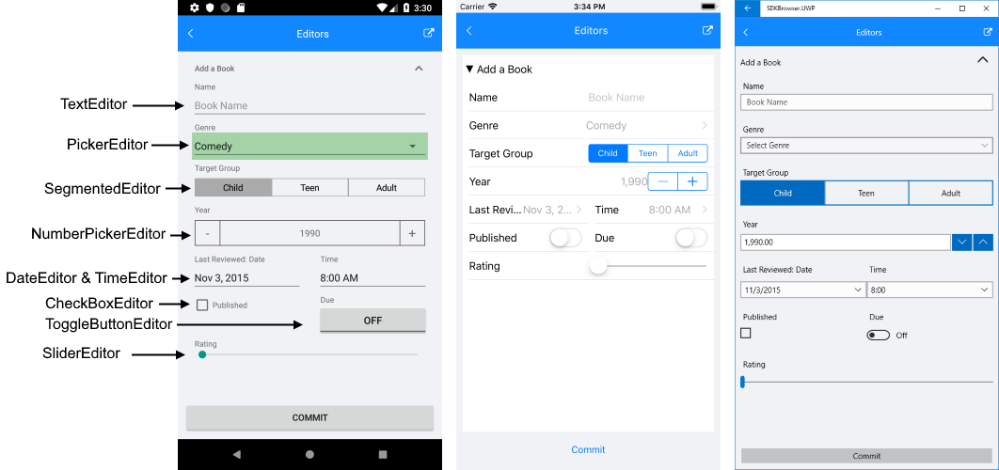

# Editors

The RadDataForm provides the following methods to replace the default editors:

- void **RegisterEditor**(string *propertyName*, EditorType *editorType*): Registers an editor type for a property with a specific name.
- void **RegisterEditor**(Type *propertyType*, EditorType *editorType*): Registers an editor type for a specific property type.

> The editors registered for property name are with higher priority than the ones registered for property type.

## Editor Types

The values from the **EditorType** enumeration are interpreted differently by each platform and when an editor type is missing, the closest type is used. The following table shows the type mapping:  

| Editor Type  		 | Native Editors | Value Type |
|--------------------|----------------|------------|
| SliderEditor 		 | Android: DataFormSeekBarEditor<br />iOS: TKDataFormSliderEditor<br /> UWP: SliderCustomEditor | float |
| PickerEditor 		 | Android: DataFormSpinnerEditor<br />iOS: TKDataFormPickerViewEditor<br />UWP: ListEditor | **requires PropertyDataSourceProvider |
| TextEditor		 | Android: DataFormTextEditor<br />iOS: TKDataFormTextFieldEditor<br />UWP: StringEditor | string |
| SegmentedEditor 	 | Android: DataFormSegmentedEditor<br />iOS: TKDataFormSegmentedEditor<br />UWP: SegmentedCustomEditor | **requires PropertyDataSourceProvider |
| NumberPickerEditor | Android: DataFormNumberPickerEditor<br />iOS: TKDataFormStepperEditor<br />UWP: NumericEditor | double |
| IntegerEditor		 | Android: DataFormIntegerEditor<br />iOS: TKDataFormNumberEditor<br />UWP: *StringEditor | int |
| DecimalEditor		 | Android: DataFormDecimalEditor<br />iOS: TKDataFormDecimalEditor<br />UWP: *StringEditor | double |
| CheckBoxEditor	 | Android: DataFormCheckBoxEditor<br />iOS: *TKDataFormSwitchEditor<br />UWP: BooleanEditor | double |
| ToggleButtonEditor | Android: DataFormToggleButtonEditor<br />iOS: *TKDataFormSwitchEditor<br />UWP: *BooleanEditor | bool |
| DateEditor		 | Android: DataFormDateEditor<br />iOS: TKDataFormDatePickerEditor<br />UWP: DateEditor | DateTime |
| TimeEditor		 | Android: DataFormTimeEditor<br />iOS: TKDataFormTimePickerEditor<br />UWP: TimeEditor | DateTime |

\* Some editors are not supported in all native platforms. In these cases we use the closest substitute.  
\** **[PropertyDataSourceProvider]()**

> Sometimes your property type will not be the same as the type supported by the editor, e.g. when you wish to edit integers with a NumberPicker editor. In this case you will have to use a **[converter]()**.

The image below shows how different editors are visualized on Android, iOS and UWP platforms.



## Events

RadDataForm provides the following event related to editors' values: 

* **EditorValueChanged**: Occurs when a value of a DataForm editor is updated. The **EditorValueChanged** event handler receives two parameters:
	* The sender argument which is of type object, but can be cast to the **RadDataForm** type.
	* An **EditorValueChangedEventArgs** object which has a reference to the PropertyName (of the DataForm Source property that has been edited) as well as the new value.

## Custom Editors

If any of the described above editors provided in RadDataForm for Xamarin is not suitable to achieve a certain requirement, a custom native editor could be created for each platform. 

>tip Through custom renderers you can use any of the available editors for the native DataForm controls on Android, iOS and UWP that are not exposed to Xamarin.Forms. You could find more information on them at the links below:
>	- [DataForm for Xamarin.Android Editors]()
>	- [DataForm for Xamarin.iOS Editors]()

First, you need to specify the property for which a custom editor will be used through RegisterEditor method of the DataForm:

```C#
dataForm.RegisterEditor("Gender", EditorType.Custom);
```

When a Custom editor type is registered, specific renderer methods will be called on each platform. You will have to inherit from the renderers and override specific methods to setup a custom editor.
	
```C#	
[assembly: ExportRenderer(typeof(RadDataForm), typeof(CustomRenderer))]

CustomRenderer : DataFormRenderer
{
	...
}
```

> The DataFormRenderer works differently on each platform - see the specific methods available for override below.

### Android

Android DataFormRenderer available methods for override:

- **GetCustomEditorForProperty**
- **GetCustomViewerForProperty**
- **UpdateEditor**
- **UpdateViewer**

> On Android if a property is read-only, a viewer is used.

>tip You can find an example demonstrating a custom editor on Android here: [Autocomplete editor in Android]().

### iOS

iOS DataFormRenderer available methods for override:

- **GetCustomEditorType**
- **InitEditor**
- **UpdateEditor**

> On iOS if a property is read-only, the editor is disabled.

>tip You can find an example demonstrating a custom editor on iOS here: [Email and Password editors on iOS]().

### UWP

UWP DataFormRenderer available methods for override:

- **GetCustomEditorType**
- **UpdateEditor**

## See Also

- [DataForm Layouts]()
- [Validate and Commit]()