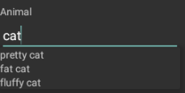

# Further Customization

## Android

This example will demonstrate how to add an auto-complete editor for a property called Animal on Android.

First you have to specify that a custom editor will be used for this property.

	dataForm.RegisterEditor("Animal", EditorType.Custom);

Then you have to inherit from the default **DataFormRenderer** and override the some of its methods.

	public class CustomRendererDroid : DataFormRenderer
	{
	    private readonly Java.Lang.Object[] items = new Java.Lang.Object[] { "pretty cat", "fat cat", "fluffy cat" };
	
	    protected override EntityPropertyEditor GetCustomEditorForProperty(RadDataForm form, IEntityProperty property, EntityPropertyMetadata metadata)
	    {
            base.UpdateEditor(editor, metadata);

	        if (property.Name() == "Animal")
	        {
	            return new DataFormAutoCompleteEditor(form, property);
	        }
	
	        return base.GetCustomEditorForProperty(form, property, metadata);
	    }
	
	    protected override void UpdateEditor(EntityPropertyEditor editor, EntityPropertyMetadata metadata)
	    {
	        if (editor.Property().Name() == "Animal")
	        {
	            var autoComplete = editor.EditorView as AutoCompleteTextView;
	            autoComplete.Adapter = new ArrayAdapter(Forms.Context, Resource.Layout.data_form_autocomplete_item, this.items);
	        }
	    }
	}

After that you will have to replace the default **DataFormRenderer** with the new one in **MainActivity.cs**:

	[assembly: ExportRenderer(typeof(Telerik.XamarinForms.Input.RadDataForm), typeof(CustomRendererDroid))]

Result:

## iOS

