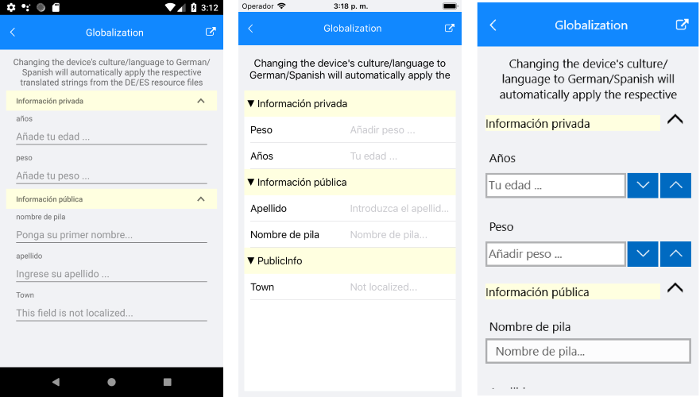

# DataForm Globalization

Globalizing an application is an important part of any development process as it ensures that your product can reach as many people as possible.The **RadDataForm** control provides a globalization mechanism which you can utilize to expand the reach of your audience and automatically visualize different strings for the headers, groups and placeholders depending on the culture of the device.

In the same way as the built-in mechanism for localizing .NET applications uses [RESX files](https://docs.microsoft.com/en-us/previous-versions/visualstudio/visual-studio-2008/ekyft91f(v=vs.90)) and the classes in the **System.Resources** and **System.Globalization** namespaces, the RadDataForm control relies on similar setup to achieve the functionality. In order to globalize the visual elements used to represent the properties of RadDataForm's item, you need to set the **DataFormLocalizationManager.Manager** property to use a custom [ResourceManager](https://docs.microsoft.com/en-us/dotnet/api/system.resources.resourcemanager?view=netframework-4.7.2). This ResourceManager can be obtained through the default resx file which holds a list of key/value pairs. This article will show you how to set up the globalization.

> You can find information on how to add different resource files to your project on the following link - [String and Image Localization - Adding Resources](https://docs.microsoft.com/en-us/xamarin/xamarin-forms/app-fundamentals/localization/text?tabs=windows#adding-resources)

By adding separate resource files for the different cultures you would like to support and providing the respective key/value pairs you can easily set up the RadDataForm control so that these values are applied when the culture of the device is changed. Here are all the steps you need to take:

### 1. Add resource files for the different cultures and fill in the values for the respective languages:

In case you would like the RadDataForm control to support two languages - English and Spanish - you should add a couple of resource files, for example - *DataFormResources.resx* and *DataFormResources.es.resx*. The former will contain the values in English and the latter the values in German. Here is an example:

### 2. Map the keys from your resource file to your business object:
 
In order make the connection between the properties of your business object and the keys you have added in the resource file, you should set any of the following properties of the [DisplayOptionsAttribute]() - *HeaderResourceKey*, *PlaceholderTextResourceKey*, *GroupResourceKey*. The following class shows such setup:

<snippet id='dataform-globalization-display-options-keys'/>

> Note that the **HomeTown** property does not use the "key" properties, meaning that the values will stay the same for all cultures/languages.

### 3. Set the ResourceManager to be used for the globalization:
All that is left is to set the control to use the **ResourceManager** of your default resource file:

<snippet id='dataform-globalization-setting-resourcemanager'/>

>important The custom ResourceManager should be set before initializing the RadDataForm component.
      
Eventually, the **RadDataForm** control will automatically detect the language set to your device and if you have added resource file for that language, it will use the values from it. In case the language is not present in your resources - the values from your default resource file will be used. 

>important You can find an example on how to globalize the RadDataForm control in the RadDataForm/Globalization section within the [SDK Samples Browser](https://github.com/telerik/xamarin-forms-sdk)(the application is also available in the Examples/Forms folder of your local Telerik UI for Xamarin installation folder).

## See Also

- [DataForm Editors]()
- [Validate and Commit]()
- [DataForm Annotations]()