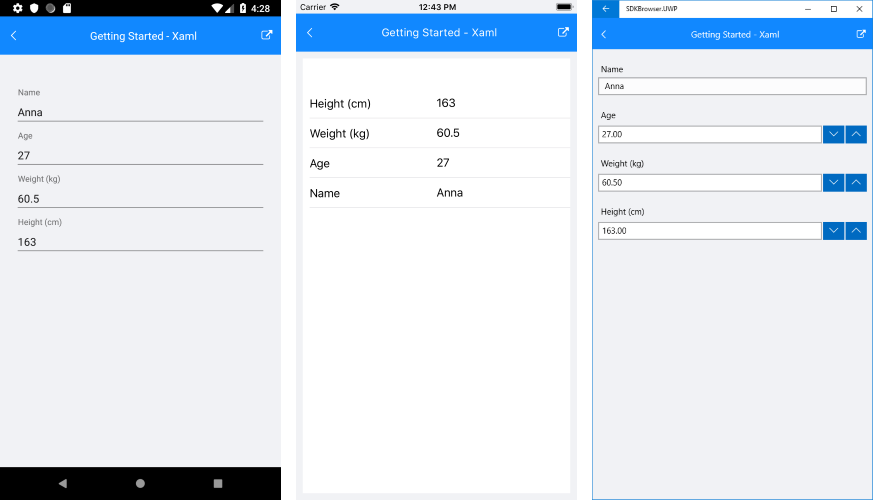

# Getting Started #

This example will guide you through the steps needed to add a basic **RadDataForm** control in your application.

>Before you proceed, please, take a look at these articles and follow the instructions to setup your app:

>- [Setup on Windows]()
>- [Setup on Mac]()

## Example

If your app is setup, you are ready to add a **RadDataForm** control.

Here is a sample class that will be the view model of the data form:

<snippet id='dataform-gettingstarted-source'/>

Here is the setup of the data form:

<snippet id='dataform-gettingstarted-setup-xaml'/>
<snippet id='dataform-gettingstarted-setup-csharp'/>

You also need to add the following namespace:

<snippet id='xmlns-telerikinput'/>
<snippet id='ns-telerikinput'/>

After that you have to specify the editor types:

<snippet id='dataform-gettingstarted-register-editors'/>

>important The **SDK Browser** and the **QSF** applications contain different examples that show RadDataForm's main features. You can find the applications in the **Examples** and **QSF** folders of your local **Telerik UI for Xamarin** installation.
	
## See Also

- [DataForm Editors]()
- [Project Wizard]()
- [Getting Started on Windows]()
- [Getting Started on Mac]()