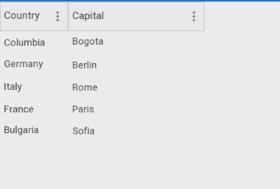
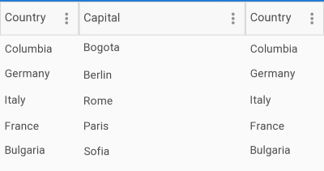

# Columns Width

This article describes how to set a width to the DataGrid column using the SizeMode and Width properties.

* **SizeMode** (DataGridColumnSizeMode): Defines the DataGridColumnSizeMode value that controls how the column and its associated cells are sized horizontally.
  * Fixed: The column has a fixed width as defined by its Width property.
  * Stretch: The column is stretched to the available width proportionally to its desired width.
  * Auto: The columns is sized to its desired width. That is the maximum desired width of all associated cells.
* **Width** (double): - Specifies the fixed width for the column. Applicable when the SizeMode property is set to DataGridColumnSizeMode.Fixed.
* **ActualWidth** (double): Gets the actual width of the column.

## Example

For the purpose of this example, we are going to use the following business object:

```C#
 public class Data
{
	public string Country { get; set; }
	public string Capital { get; set; }
}
```

After you have created your collection of custom objects, you should assign it to the ItemsSource property of the control:

```C#
this.grid.ItemsSource = new List<Data>
{
    new Data { Country = "Columbia", Capital = "Bogota" },
    new Data { Country = "Germany", Capital = "Berlin" },
    new Data { Country = "Italy", Capital = "Rome" },
    new Data { Country = "France", Capital = "Paris" },
    new Data { Country = "Bulgaria", Capital = "Sofia" },
};
```

1. First scenario when SizeMode="Fixed":

	```XAML
	<telerikGrid:RadDataGrid x:Name="grid" AutoGenerateColumns="False" BackgroundColor="Red">
		<telerikGrid:RadDataGrid.Columns>
			<telerikGrid:DataGridTextColumn PropertyName="Country" HeaderText="Country" Width="100" SizeMode="Fixed"/>
			<telerikGrid:DataGridTextColumn PropertyName="Capital" HeaderText="Capital" Width="200" SizeMode="Fixed"/>
		</telerikGrid:RadDataGrid.Columns>
	</telerikGrid:RadDataGrid>
	```

	Where the **telerikGrid** namespace is the following:

	```xml
	xmlns:telerikGrid="clr-namespace:Telerik.XamarinForms.DataGrid;assembly=Telerik.XamarinForms.DataGrid"
	```
	
	>important The **Width** property of columns will apply only when **SizeMode="Fixed"**.

	The first and second columns have set widths of 100 and 200, respectively:

	

1. Second scenario when SizeMode="Stretch":

	```XAML
	<telerikGrid:RadDataGrid x:Name="grid" AutoGenerateColumns="False" BackgroundColor="Red">
		<telerikGrid:RadDataGrid.Columns>
			<telerikGrid:DataGridTextColumn PropertyName="Country" HeaderText="Country" Width="100" SizeMode="Stretch"/>
			<telerikGrid:DataGridTextColumn PropertyName="Capital" HeaderText="Capital" Width="200" SizeMode="Stretch"/>
		</telerikGrid:RadDataGrid.Columns>
	</telerikGrid:RadDataGrid>
	```

	Where the **telerikGrid** namespace is the following:

	```xml
	xmlns:telerikGrid="clr-namespace:Telerik.XamarinForms.DataGrid;assembly=Telerik.XamarinForms.DataGrid"
	```

	The columns take all the available space proportionally. The Width property is ignored.

	

1. Third scenario when SizeMode="Auto":

	```XAML
	<telerikGrid:RadDataGrid x:Name="grid" AutoGenerateColumns="False" BackgroundColor="Red">
		<telerikGrid:RadDataGrid.Columns>
			<telerikGrid:DataGridTextColumn PropertyName="Country" HeaderText="Country" Width="100" SizeMode="Auto"/>
			<telerikGrid:DataGridTextColumn PropertyName="Capital" HeaderText="Capital" Width="200" SizeMode="Auto"/>
		</telerikGrid:RadDataGrid.Columns>
	</telerikGrid:RadDataGrid>
	```

	Where the **telerikGrid** namespace is the following:

	```xml
	xmlns:telerikGrid="clr-namespace:Telerik.XamarinForms.DataGrid;assembly=Telerik.XamarinForms.DataGrid"
	```

	The columns take only as much space as they need. The Width property is ignored.

	

Lastly, lets use three columns to fully clarify the SizeMode behavior:

```XAML
<telerikGrid:RadDataGrid x:Name="grid" AutoGenerateColumns="False">
    <telerikGrid:RadDataGrid.Columns>
        <telerikGrid:DataGridTextColumn PropertyName="Country" HeaderText="Country" Width="100" SizeMode="Fixed"/>
        <telerikGrid:DataGridTextColumn PropertyName="Capital" HeaderText="Capital" Width="200" SizeMode="Auto"/>
        <telerikGrid:DataGridTextColumn PropertyName="Country" HeaderText="Country" Width="200" SizeMode="Stretch"/>
    </telerikGrid:RadDataGrid.Columns>
</telerikGrid:RadDataGrid>
```

Where the **telerikGrid** namespace is the following:

```xml
xmlns:telerikGrid="clr-namespace:Telerik.XamarinForms.DataGrid;assembly=Telerik.XamarinForms.DataGrid"
```

The first and the third columns each have a fixed size of 100 and the second column takes all the available space because of SizeMode="Stretch":



## See Also

- [Picker Column]()
- [Template Column]()
- [Text Column]()
