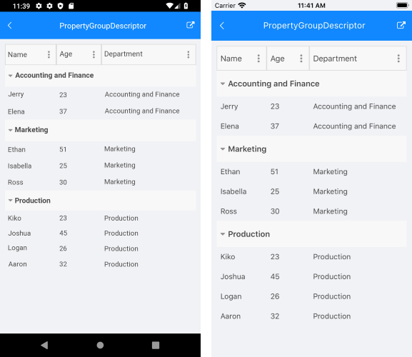

# Grouping #

**RadDataGrid** supports grouping operations either through the UI or programmatically. When grouping through code, you can achieve the functionality by utilizing the control's **GroupDescriptors** collection. 

#### Figure 1: Grouped RadDataGrid

You can choose one of the following approaches to achieve the grouping:

* Add a **PropertyGroupDescriptor**: using a property from the model as a group key.
* Add a **DelegateGroupDescriptor**: create a custom group key which you can use.

> All GroupDescriptors are located in the Telerik.XamarinForms.Common.Data namespace:
> **xmlns:common="clr-namespace:Telerik.XamarinForms.Common.Data;assembly=Telerik.XamarinForms.Common"**

## PropertyGroupDescriptor ##

The PropertyGroupDescriptor is used to group the data in a DataGrid by property from the class that defines your objects.

To use the PropertyGroupDescriptor you have to set its property PropertyName.

* **PropertyName (string):** Gets or sets the name of the property that is used to retrieve the key to group by.

>note You can easily sort the groups in ascending or descending order using the **SortOrder** property.

#### PropertyGroupDescriptor Example

<snippet id='datagrid-propertygroupdescriptor-xaml'/>

	 		<grid:RadDataGrid.GroupDescriptors>
                <common:PropertyGroupDescriptor PropertyName="Country"/>
            </grid:RadDataGrid.GroupDescriptors>

## DelegateGroupDescriptor ##

The difference between the **DelegateGroupDescriptor** and the **PropertyGroupDescriptor** is that DelegateGroupDescriptor groups data by a custom Key while the PropertyGroupDescriptor groups by a defined Key which is a property from our model.

You have to set the following property of the DelegateGroupDescriptor:

 * **KeyLookup**: Gets or sets the **IKeyLookup** instance that is used to retrieve the group key for each data item.

>note You can easily sort the groups in ascending or descending order using the **SortOrder** property.

You have to create a class that implements the **IKeyLookup** interface which will return the Key you want to group by. Then you need to add the **DelegateGroupDescriptor** to the RadDataGrid.GroupDescriptors collection and set its **KeyLookUp** property.

#### DelegateGroupDescriptor Example

The Custom **IKeyLookup** implementation

<snippet id='datagrid-delegategroupdescriptor-csharp'/>

	class CustomIKeyLookup : IKeyLookup
    {
        public object GetKey(object instance)
        {
            return (instance as Club).Country[0];
        }
    }

Adding it to the **GroupDescriptors** collection of the **RadDataGrid**:

<snippet id='datagrid-delegategroupdescriptor-csharp'/>

	this.grid.GroupDescriptors.Add(new DelegateGroupDescriptor() { KeyLookup = new CustomIKeyLookup() });

## See Also

* [DataGrid Filtering]()
* [DataGrid Sorting](%slug datagrid-sorting-overview%)
