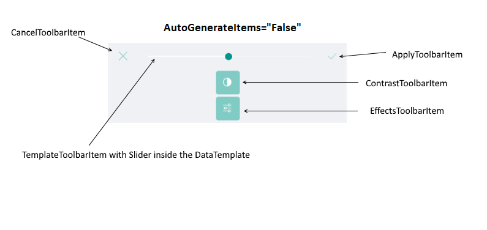

# Effects


The RadImageEditor Toolbar allows you apply **Effects** to the image using the following Toolbar Items:

* **HueToolbarItem**: Activates the hue adjustment tool in the image editor. The hue adjustment rotates the color in the hue scale by a certain angle. The HueToolbarItem exposes the following properties:
	* **Minimum**(*double*): Specifies the minimum value of the hue factor, when using an auto-generated slider content. The default value is 0.
	* **Maximum**(*double*): Specifies the maximum value of the hue factor, when using an auto-generated slider content. Its default value is 1.
* **SaturationToolbarItem**: Activates the saturation adjustment tool in the image editor. The saturation factor of 0 means no saturation (black-and-white image), while the value of 1 means full saturation (the original color of the image). Values above 1 mean oversaturation (overexposed colors of the original image).
	* **Minimum**(*double*): Specifies the minimum value of the saturation factor, when using an auto-generated slider content. The default value is 0.
	* **Maximum**(*double*): Specifies the maximum value of the saturation factor, when using an auto-generated slider content. The default value is 3.
* **BrightnessToolbarItem**: Activates the brightness adjustment tool in the image editor. The value of 0 means no change in brightness. Positive values increase the brightness, where the value of 1 gives the maximum brightness (completely white image). Negative values decrease the brightness, where the value of -1 gives no brightness (completely black image).
	* **Minimum**(*double*): Specifies the minimum value of the brightness factor, when using an auto-generated slider content. The default value is -1.
	* **Maximum**(*double*): Specifies the maximum value of the brightness factor, when using an auto-generated slider content. The default value is 1.
* **ContrastToolbarItem**: Activates the contrast adjustment tool in the image editor. The value of 0 means no contrast (completely gray image), while the value of 1 means full contrast (original color of the image). Values above 1 gives increased contrast of the image.
	* **Minimum**(*double*): Specifies the minimum value of the contrast factor, when using an auto-generated slider content. The default value is 0.
	* **Maximum**(*double*): Specifies the maximum value of the contrast factor, when using an auto-generated slider content. The default value is 3.
* **BlurToolbarItem**: Activates the blur tool in the image editor. The strength of the effect is determined by the radius of the filter. For each pixel, all neighboring pixels within the given radius affect the color of the final pixel.
	* **Minimum**(*double*): Specifies the minimum radius of the filter, when using an auto-generated slider content. The default value is 0.
	* **Maximum**(*double*): Specifies the maximum radius of the filter, when using an auto-generated slider content. The default value is 3.
* **SharpenToolbarItem**: Activates the sharpen tool in the image editor. The strength of the effect is determined by the radius of the filter. For each pixel, all neighboring pixels within the given radius affect the color of the final pixel.
	* **Minimum**(*double*): Specifies the minimum radius of the filter, when using an auto-generated slider content. The default value is 0.
	* **Maximum**(*double*): Specifies the maximum radius of the filter, when using an auto-generated slider content. The default value is 3.

>tip To group the effects you could use the common ToolbarItem: EffectsToolbarItem. By default when the EffectsToolbarItem is set to the ImageEditorToolbarItem, the value of the AutoGenerateItems is true. In case you want to customize the EffectsToolbarItem you should set the AutoGenerateItems to false. 

You could apply the following properties to each Effect

* **ApplyToolbarItem**: Applies the changes from the currently active tool and deactivates it.
* **CancelToolbarItem**: Cancels the changes from the currently active tool and deactivates it.
* **TemplateToolbarItem**: Allows displaying an arbitrary content in the toolbar via a DataTemplate. The BindingContext of the created content is set to the currently active tool in the image editor. This allows direct data binding of the components from the template to the properties of the tool. The TemplateToolbarItem exposes the following property:
	* **Template**(*DataTemplate*): Specifies the DataTemplate of the content to be displayed.

## Example

Example when AutoGenerateItems="True"

```XAML
<telerikImageEditor:RadImageEditorToolbar Grid.Row="1" ImageEditor="{x:Reference imageEditor}" AutoGenerateItems="False">
    <telerikImageEditor:EffectsToolbarItem AutoGenerateItems="True"/>
</telerikImageEditor:RadImageEditorToolbar>
```

Example when AutoGenerateItems="False"

```XAML
<telerikImageEditor:RadImageEditorToolbar Grid.Row="1" ImageEditor="{x:Reference imageEditor}" AutoGenerateItems="False">
    <telerikImageEditor:EffectsToolbarItem AutoGenerateItems="False">
        <telerikImageEditor:ContrastToolbarItem AutoGenerateItems="False">
            <telerikImageEditor:CancelToolbarItem HorizontalOptions="Start" />
            <telerikImageEditor:TemplateToolbarItem>
                <telerikImageEditor:TemplateToolbarItem.Template>
                    <DataTemplate>
                        <Slider Maximum="2" Minimum="0" Value="{Binding Value}" />
                    </DataTemplate>
                </telerikImageEditor:TemplateToolbarItem.Template>
            </telerikImageEditor:TemplateToolbarItem>
            <telerikImageEditor:ApplyToolbarItem HorizontalOptions="End" />
        </telerikImageEditor:ContrastToolbarItem>
    </telerikImageEditor:EffectsToolbarItem>
</telerikImageEditor:RadImageEditorToolbar>
```


Visual Structure of the EffectsToolbarItem when AutoGenerateItems = "False" 



## See Also

-[Image Transformations]()
-[History]()
