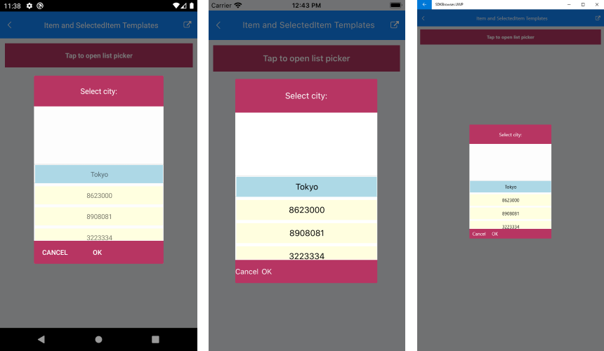

# Templates

List Picker for Xamarin provides the following templates:

* **ItemTemplate**(*DataTemplate*): Defines the template used for displaying the list of items.
* **SelectedItemTemplate**(*DataTemplate*): Specifies the template used for visualizing the selected item from the list.

In addition to this you can define the following templates provided from the RadPickerBase class:

* **PlaceholderTemplate**(*ControlTemplate*): Defines the template visualized for the placeholder.  
* **DisplayTemplate**(*ControlTemplate*): Defines the template visualized when an item from the list is selected.

And using RadPickerBase.SelectorSettings property(of type *Telerik.XamarinForms.Input.PickerPopupSelectorSettings*) you can define the following templates:

* **HeaderTemplate**(*ControlTemplate*): Defines what will be displayed inside the dialog(popup) header.
* **FooterTemplate**(*ControlTemplate*): Defines what will be displayed inside the dialog(popup) footer.

This is the Visual Srtucture of the List Picker Templates:


In addition the List Picker for Xamarin provides the following properties:

* **ItemsSource**(*IList*): Specifies the collection used to generate the content of the list picker.
* **ItemLength**(*double*): Defines the length of the items inside the list.
* **ItemSpacing**(*double*): Defines the spacing between the items inside the list.
* **SelectedItem**(*object*): Specifies the selected item of the list picker
* **DisplayMemberPath**(*string*): Defines the path of the property which is to be displayed as DisplayString. 

## Example

Here is a sample List Picker definition:

<snippet id='listpicker-features-templates' />

and the templates definition in the page resources:

## Item Template

<snippet id='listpicker-features-itemtemplate' />

## SelectedItem Template

<snippet id='listpicker-features-selecteditemtemplate' />

## Placeholder Template

<snippet id='listpicker-features-placeholdertemplate' />

## DisplayTemplate

```XAML
<telerikInput:RadListPicker ItemsSource="{Binding Items}" 
                            DisplayMemberPath="Name">
    <telerikInput:RadListPicker.DisplayTemplate>
        <ControlTemplate>
            <StackLayout>
                <Label Text="This is the DisplayTemplate of the ListPicker" FontSize="10"/>
                <Label Text="{TemplateBinding DisplayString}" TextColor="Black" FontSize="15" Grid.Row="1" VerticalTextAlignment="Center"/>
                <StackLayout.GestureRecognizers>
                    <TapGestureRecognizer Command="{TemplateBinding ToggleCommand}" />
                </StackLayout.GestureRecognizers>
            </StackLayout>
        </ControlTemplate>
    </telerikInput:RadListPicker.DisplayTemplate>
</telerikInput:RadListPicker>
```

## Header Template

<snippet id='listpicker-features-headertemplate' />

## Footer Template

<snippet id='listpicker-features-footertemplate' />

and a sample business model:

<snippet id='listpicker-features-businessmodel' />

and the ViewModel:

<snippet id='listpicker-features-viewmodel' />

also you will need to add the following namespace:

```XAML
xmlns:telerikInput="clr-namespace:Telerik.XamarinForms.Input;assembly=Telerik.XamarinForms.Input"
```

This is the result:



>important A sample Templates example can be found in the ListPicker/Features folder of the [SDK Samples Browser application]().

## See Also

- [Styling]()
