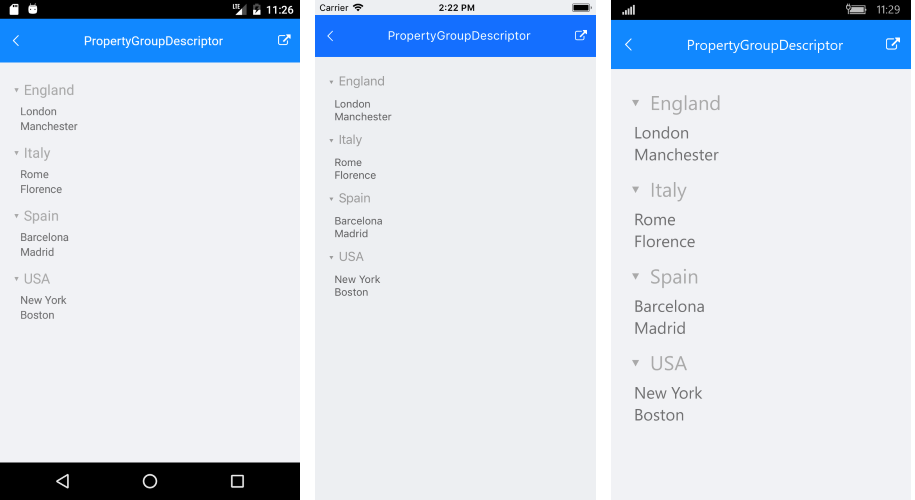
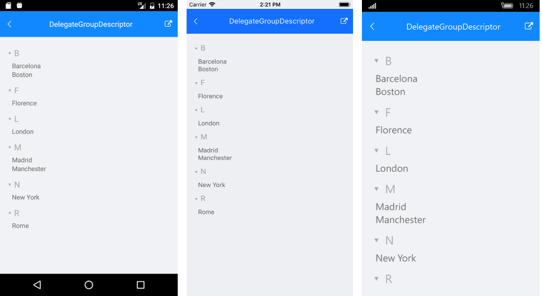

# Grouping

**RadListView** provides you with the functionality to programmatically group its data at runtime. This can be achieved through adding groupdescriptors to the **RadListView.GroupDescriptors** collection.

In addition, the control supports groups expand and collapse operations either through the UI by tapping on the group headers or programmatically. For more details on this refer to [Expand and Collapse Groups]().

## PropertyGroupDescriptor 

You can group the data by a property value from the class that defines your items. This descriptor exposes the following properties:

- **PropertyName**: Defines the string name of the property you want to group by.
- **SortOrder**: Defines the sort order in each group to Ascending or Descending.

Let's, for example, have the following business object:

<snippet id='listview-grouping-groupdescriptors-businessobject'/>

and a ViewModel with a collection of Cities:

<snippet id='listview-grouping-propertygroupdescriptor-viewmodel' />

Next snippet demonstrates how you could group the Cities by "Country" property through the PropertyGroupDescriptor:

<snippet id='listview-grouping-propertygroupdescriptor' />

In addition, you could create custom ListView ItemTemplate as well as GroupHeaderTemplate in order to achieve the desired look, the next snippet shows the previously referenced DataTemplates:

<snippet id='listview-grouping-templates' />

All that is left is to set the ViewModel as BindingContext of the control:

<snippet id='listview-grouping-propertygroupdescriptor-settingviewmodel' />

#### Figure 1: ListView grouped through PropertyGroupDescriptor

## DelegateGroupDescriptor 

This descriptor enables you to group by a custom key (e.g. some complex expression combining two or more properties) instead of being limited by the value of a single property. This descriptor exposes the following properties:

- **KeyExtractor**: Defines the `(Func<object, object)` delegate which returns the property to retrieve the group key for each data item.
- **SortOrder**:  Defines the sort order in each group to Ascending or Descending.

Let's use the same example from the previous section, just add DelegateGroupDescriptor through code instead. 

Next snippet shows how the ListView instance is defined:

<snippet id='listview-grouping-delegategroupdescriptor' />

And you could create and apply a delegate for grouping the items (for example by their first letter) as following:

<snippet id='listview-grouping-delegategroupdescriptor-settingdelegate' />

#### Figure 2: ListView grouped through DelegateGroupDescriptor

## See Also

[Filtering]()

[Sorting]()
