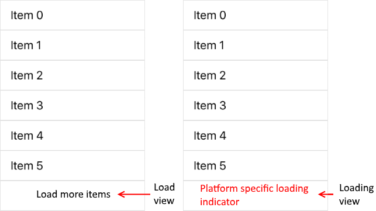

# Load On Demand

Loading a large data set on a mobile device has its chalenges. On of the most popular aproach is using incremental data loading as the items needs to be visualized. **RadListView** is capable of doing this using its load on demand capabilitites. The following properties are related to the **LoadOnDemand** event:
* **IsLoadOnDemandEnabled**(*bool*) 
* **IsLoadOnDemandActive** (*bool*) can be used once *IsLoadOnDemandEnabled* property is set to *true*. When the data is loading the *IsLoadOnDemandActive = "true"*, otherwhise *IsLoadOnDemandActive = false*.

**IsLoadOnDemandEnabled** offers two loading modes through its **LoadOnDemandMode** property:
 1. **Automatic** - the data is requested automatically when you scroll near the end of the listview.
 2. **Manual** - a button is rendered at the end of the listview. The data is requested explicitely by pressing the button.

In order to load the data Listview requires either to:
 1. Subscribe to **LoadOnDemand** event and add the loaded data to the source.
 2. Create **ListViewLoadOnDemandCollection** instance as source and pass it to listview ItemsSource property.

## Automatic mode
We will load the data automatically using event. In this case Here is how the setup will look like:

###Define the listview in xaml
We use the following snippet:
<snippet id='listview-loadondemand-loadondemandeventauto-declaration'/>

We would also need to define the listview namespace:
 <snippet id='xmlns-telerikdatacontrols'/>

###Add the code to load the data in the LoadOnDemand event
First, we set listview itemsSource in page constructor:
<snippet id='listview-loadondemand-loadondemandeventauto-bind'/>

Then We use the following snippet:
<snippet id='listview-loadondemand-loadondemandeventauto-event'/>

## Manual loading mode
Alternatively you can request items only explicitely when pressing the load more button rendered at the end of the loaded items.

###Define the listview in xaml with manual loading mode
We use the following snippet:
<snippet id='listview-loadondemand-loadondemandeventmanual-declaration'/>

We would also need to define the listview namespace
 <snippet id='xmlns-telerikdatacontrols'/>

###Add the code to load the data in the LoadOnDemand event
First, we set listview itemsSource in page constructor:
<snippet id='listview-loadondemand-loadondemandeventmanual-bind'/>

Then, we use the following snippet:
<snippet id='listview-loadondemand-loadondemandeventmanual-event'/>

Figure 1: Manual Loading on demand

## Loading mode with collection
In many sceanarios you would like to control the loading of the data directly from our viewmodel. For these cases you can take advantage of our **ListViewLoadOnDemandCollection** that takes case of reqesting new items internally. It can work both in **Manual** and **Automatic** mode. Let's see the setup for Automatic loading mode using the collection.

###Define the listview in xaml
Define the listview in xaml and bind its ItemsSource to the data in the viewmodel.
<snippet id='listview-loadondemand-loadondemandcollection-declaration'/>

We would also need to define the listview namespace
 <snippet id='xmlns-telerikdatacontrols'/>

###Define the Viewmodel
We use the following snippet:
<snippet id='listview-loadondemand-loadondemandcollection-viewmodel'/>

###Bind the BindingContext 
We use the following snippet in the page constructor:
<snippet id='listview-loadondemand-loadondemandcollection-binding'/>

## Advanced options

###Control the number of preloaded items
This feature works in conjunction with [LoadOnDemandMode.Automatic mode of the listview](#automatic-mode).  You can control the number of minimum items loaded ahead through listview **LoadOnDemandBufferItemsCount** property. By default it is set to 10 item. When the listview requests an item in the buffer it will trigger new loading batch.

###Change the appearance of Manual load button
This feature works in conjunction with [LoadOnDemandMode.Manual mode of the listview](#manual-loading-mode)
You can control load more button content through the **LoadOnDemandItemTemplate** property.
<snippet id='listview-loadondemand-loadondemandcustomizations-lodbutton'/>

###Change the appearance of Manual loading indicator
This feature works in conjunction with [LoadOnDemandMode.Manual mode of the listview](#manual-loading-mode)
You can control the loadinf indicator content through the **LoadingOnDemandItemTemplate** property.
<snippet id='listview-loadondemand-loadondemandcustomizations-loadingindicator'/>
