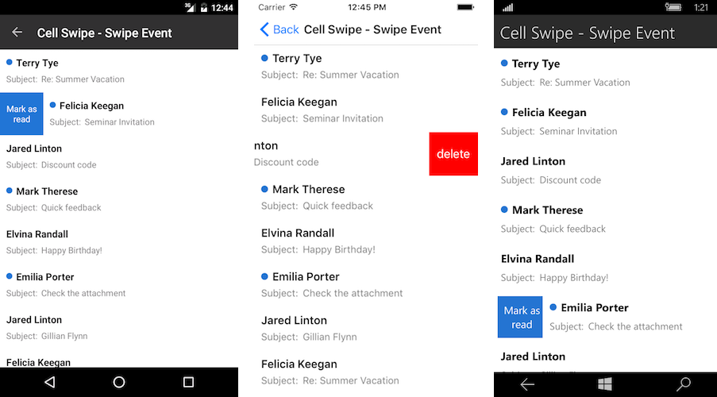

# Cell Swipe

The cell swipe feature allows end-users to use swipe gesture on cells. When the user swipes, the content view moves revealing a designated swipe background view where you can place custom views ready for interaction e.g. buttons, images etc.

The image below shows how swiping right could reveal additional view on the left containing a Delete button:

The same can be achieve if the user swipes left - in this case a view on the right would be displayed. As soon as the user taps the swiped item or anywhere on the ListView, the item returns to its original position.

## Properties

The following RadListView properties are related to the cell swiping feature:

- **IsItemSwipeEnabled** (*bool*): Turns on or off the feature. It's default value is False.
- **SwipeThreshold** (*double*): Defines the length (in pixels) of the swipe gesture which is required to trigger the feature. Any shorter swipe will not be respected. Its default value is 0.
- **SwipeOffset** (*Thickness*): Specifies how much the swiped cell will be moved to the side and stick there. It's default value is 100.
- **ItemSwipeContentTemplate** (*DataTemplate*): Defines the content that will be visualized when users swipe a cell.

To enable swipe feature the **IsItemSwipeEnabled** property of the RadListView should be set to **True**. 

>tip Please keep in mind that **SwipeThreshold** should be set to a smaller number than the **SwipeOffset** - this is required as the **SwipeThreshold** defines the minimum swipe gesture length that needs to be exceeded in order for the swipe feature to be initialized.

## Methods

The following RadListView methods are related to the cell swiping feature:

- void **EndItemSwipe**(bool *isAnimated*): Moves the swiped item to its default position.

## Events

The following RadListView events are related to the cell swiping feature:

- **ItemSwipeStarting**: Occurs when the user has initiated swipe gesture. The event arguments are of type **ItemSwipeStartingEventArgs**, that provides the following properties:
 - **Item** (object): The item that will be swiped.
 - **Cancel** (bool): If you set this value to `false`, the swiping will be canceled.
- **ItemSwiping**: Occurs while the user is swiping the item. The event arguments are of type **ItemSwipingEventArgs**, that provides the following properties:
 - **Item** (object): The item that is being swiped.
 - **Offset** (double): The current swipe offset.
- **ItemSwipeCompleted**: Occurs when the user finishes the swipe gesture. The event arguments are of type **ItemSwipeCompletedEventArgs**, that provides the following properties:
 - **Item** (object): The item that has been swiped.
 - **Offset** (double): The swipe offset at which the item has been dropped.

## Commands

In addition to the swipe events, RadListView provides similar commands related to certain swipe actions, namely:

* **ItemSwipeStarting**:
* **ItemSwiping**
* **ItemSwipeCompleted**

For more detailed information on how you can utilize the ListView commands, go to [Commands]() topic.
  
## Examples

With the RadListView swipe events, we can perform custom actions depending on the swipe direction, the swiped amount or the data item.

Alternatively, we can add interactive elements to the swipe content and use the swipe gesture only to reveal this content. The user then can choose how to interact with the revealed content.

### Example with swipe events

The following example demonstrates how to use the **ItemSwipeCompleted** event and depending on the swipe distance, we will modify the data item or remove it from the source.

Here is the view model for the list view:

<snippet id='listview-gestures-cellswipe-swipeevents-viewmodel'/>

Below is the setup of the list view. Swiping left or right will reveal content with a hint for what will happen if the user completes the swipe action. 

<snippet id='listview-gestures-cellswipe-swipeevents-listview'/>

Where:

<snippet id='xmlns-teleriklistview'/>

Finally, here is what happens when the user has completed the swipe gesture:

<snippet id='listview-gestures-cellswipe-swipeevents-swipecompleted'/> 

We call the **EndItemSwipe()** method to force the item to go to its default position, since the scenario does not require any interaction with the swipe content itself.

### Example with interactive content

The following example demonstrates how to add a delete button to the swipe content and using the button `Clicked` event handler, delete an item from the list view source.

Here is the view model for the list view. 

<snippet id='listview-gestures-cellswipe-interactivecontent-viewmodel'/>

Below is the setup of the list view. Note that the SwipeOffset is equal to the width of the button in the swipe content. Thus when the swipe is complete, the revealed content will be the whole button.

<snippet id='listview-gestures-cellswipe-interactivecontent-listview'/>

Where:

<snippet id='xmlns-teleriklistview'/>

The BindingContext of the swipe content is the data item. This could be used to perform operations on the data. In our case we will delete the item from the source.

<snippet id='listview-gestures-cellswipe-interactivecontent-deleteitem'/>

>important Sample Cell Swipe examples are available in ListView -> Gestures folder of the [SDK Browser application](#sdk-browser-application).
>
>You can directly explore the code in the [SDKBrowser Examples repository on GitHub](https://github.com/telerik/xamarin-forms-sdk/tree/master/XamarinSDK/SDKBrowser/SDKBrowser/Examples/ListViewControl/GesturesCategory).

## See Also

- [ListView Cell Types]()
- [ListView Layouts]()
- [Commands]()
- [Pull to Refresh]()
- [Reorder Items]()