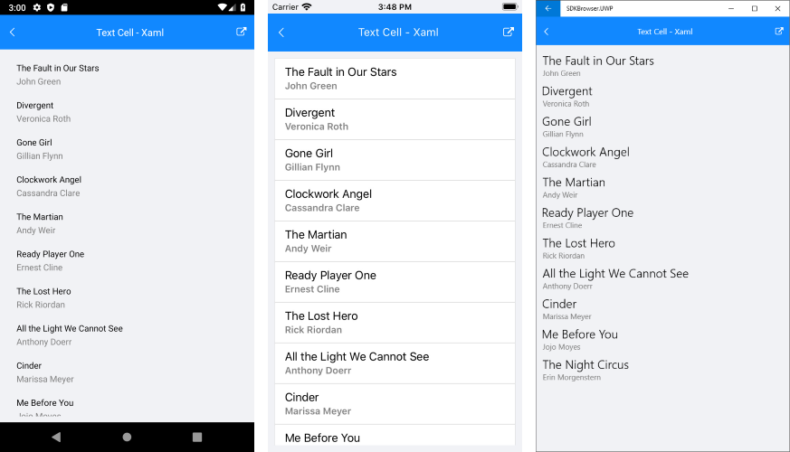

# ListView Cell Types
Cells are non visual objects used to describe a template for creating a visual element inside each ListView item. There are two types of cells:

- **ListViewTextCell**: derives from Xamarin.Forms.**TextCell** and is meant to visualize text and optionally detail text rendered as second row inside list view item. This is the default cell of the RadListView.
- **ListViewTemplateCell**: derives from Xamarin.Forms.**ViewCell** and is used to present complex data set as RadListView.**ItemTemplate**.

## ListViewTextCell Example

This example demonstrates how to create a list view with text cells, like this:

Let's create a view model that will be the source of the list view.

<snippet id='listview-celltypes-textcell-viewmodel'/>

And here is the definition of the listview control:

<snippet id='listview-celltypes-textcell-listview-xaml'/>
<snippet id='listview-celltypes-textcell-listview-csharp'/>

You also have to add the following namespaces:

<snippet id='xmlns-teleriklistview'/>
<snippet id='ns-teleriklistview'/>

Finally, set the list view as content of your page.

## ListViewTemplateCell Example

This example demonstrates how to create a list view with templated cells, like this:

Let's create a view model that will be the source of the list view.

<snippet id='listview-celltypes-templatecell-viewmodel'/>

### Definition in Xaml

You can define the list view in Xaml like this:

<snippet id='listview-celltypes-templatecell-listview-xaml'/>

Where:

<snippet id='xmlns-teleriklistview'/>

### Definition in code behind

For clarity, let's build the template of the list view cell in a separate method:

<snippet id='listview-celltypes-templatecell-cellcontent'/>

You can define the list view in code like this:

<snippet id='listview-celltypes-templatecell-listview-code'/>

Finally, set the list view as content of your page.

## See Also

- [ListView Layouts]()
- [Items Styling]()