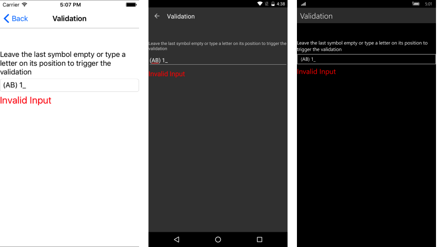

# Validation

The **RadMaskedInput** has a built-in validation mechanism, and you can utilize the following properties to modify the appearance when an input-related error is observed:

* **InvalidInputErrorText**(*string*): Defines the text that is shown as an error message on invalid input.
* **RejectedSymbolErrorText**(*string*):  Defines the error text when a symbol was rejected.  
* **ErrorColor**(*Color*): Defines the color of the error text.
* **ErrorFontSize**(*double*): Specifies the font size of the error text.

>note The **ErrorColor** and **ErrorFontSize** will affect the error message from both the **InvalidInputErrorText** and the **RejectedSymbolErrorText** properties.

## InvalidInputErrorText

The message from this property will appear when you have a required symbol in the input which is not filled in(the '9' or '?' tokens are in use). Your users will be notified of the need to fill in the required symbol by noticing the custom message you have set.

Here is an example of how to trigger the error message.

The **RadMaskedInput** definition:

<snippet id='maskedinput-features-validation-xaml'/>

The way the mask is set, it is mandatory to fill in a digit in the last position. In case you leave it empty and move the focus from the field. **Figure 1** shows the appearance of the message.

#### **Figure 1: Invalid input error message**

## RejectedSymbolErrorText

The string set to the **RejectedSymbolErrorText** will be observed in case the input typed into the RadMaskedInput is rejected. In the case of the previously declared mask, this will happen if you try to type in a letter in the last symbol. The effect is observed in **Figure 2**.

#### **Figure 2: Rejected symbol error message**

>note You can find a working demo labeled **Validation** in the MaskedInput/Features folder of the [SDK Samples Browser application](). 

## See Also

* [RadMaskedInput Tokens]()
* [RadMaskedInput Events]()
* [RadMaskedInput Commands]()
