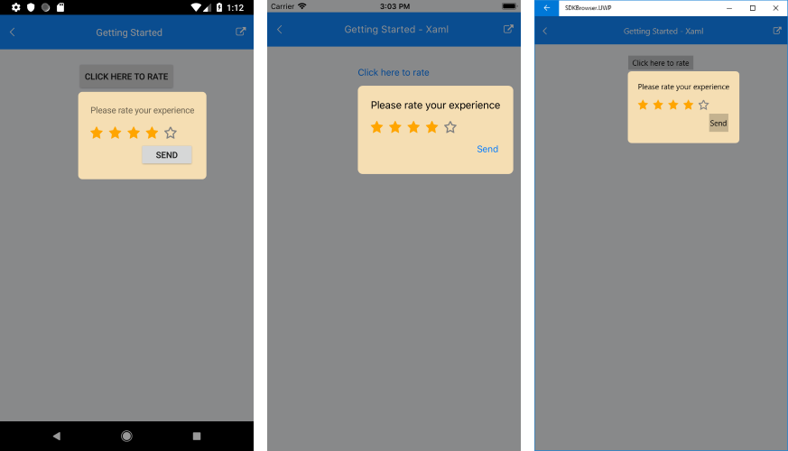

# Getting Started

This article will guide you through the steps needed to add a basic **RadPopup** control in your application. 

* [Setting up the app](#1-setting-up-the-app)
* [Adding the required Telerik references](#2-adding-the-required-telerik-references)
* [Adding RadPopup control](#3-adding-radpopup-control)

## 1. Setting up the app

Take a look at these articles and follow the instructions to setup your app:

- [Setup app with Telerik UI for Xamarin on Windows]()
- [Setup app with Telerik UI for Xamarin on Mac]()

## 2. Adding the required Telerik references

You have two options:

* Add the Telerik UI for Xamarin Nuget package following the instructions in [Telerik NuGet package server]() topic.

If you don't want to add the all Telerik.UI.for.Xamarin nuget package, you have the option to add a separate nuget package. For RadPopup control you have to install the **Telerik.UI.for.Xamarin.Primitives** nuget package. This nuget will automatically refer the *Telerik.UI.for.Xamarin.Common* and *Telerik.UI.for.Xamarin.SkiaSharp* nuget packages.

* Add the references to Telerik assemblies manually, check the list below with the required assemblies for **RadPopup** component:

| Platform | Assemblies |
| -------- | ---------- |
| Portable | Telerik.XamarinForms.Common.dll<br/>Telerik.XamarinForms.Primitives.dll |
| Android  | Telerik.Xamarin.Android.Common.dll<br/>Telerik.Xamarin.Android.Primitives.dll<br/>Telerik.XamarinForms.Common.dll<br/>Telerik.XamarinForms.Primitives.dll |
| iOS      | Telerik.Xamarin.iOS.dll <br/>Telerik.XamarinForms.Common.dll<br/>Telerik.XamarinForms.Primitives.dll |
| UWP      | Telerik.Core.dll<br/>Telerik.UI.Xaml.Primitives.UWP.dll<br/>Telerik.XamarinForms.Common.dll<br/>Telerik.XamarinForms.Primitives.dll |

## 3. Adding RadPopup control

You could use one of the following approaches:

#### Drag the control from the Toolbox. 

Take a look at the following topics on how to use the toolbox:

* [Telerik UI for Xamarin Toolbox on Windows]()
* [Telerik UI for Xamarin Toolbox on Mac]()
	
#### Create the control definition in XAML or C#.

The next example shows a sample RadPopup attached to a Button control. The purpose of the Popup in this scenario is to receive user input - it contains RadRating control for allowing the user to select a rating and a button for closing the popup.

Check below the Popup definition in XAML and in code-behind:

<snippet id='popup-getting-started-xaml' />
<snippet id='popup-getting-started-csharp' />

And here are the referenced event handlers:

<snippet id='popup-gettingstarted-events' />

In addition to this, you need to add the following namespaces (*telerikInput* namespace is needed for the Rating control used in the example, in general it's not required for RadPopup):

```XAML
xmlns:telerikPrimitives="clr-namespace:Telerik.XamarinForms.Primitives;assembly=Telerik.XamarinForms.Primitives"
xmlns:telerikInput="clr-namespace:Telerik.XamarinForms.Input;assembly=Telerik.XamarinForms.Input"
```
```C#
using Telerik.XamarinForms.Primitives;
using Telerik.XamarinForms.Input;
```

This is the result:



>important The presented example is available in Popup -> Getting Started folder of the [SDK Browser application](#sdk-browser-application).
>
>You can directly explore the code in the [SDKBrowser Examples repository on GitHub](https://github.com/telerik/xamarin-forms-sdk/tree/master/XamarinSDK/SDKBrowser/SDKBrowser/Examples/PopupControl/GettingStartedCategory/GettingStartedExample).

## See Also

- [Modal Popup Support](#modal-popup)
- [Placement Configuration](#placement-configuration)
- [Animation Settings](#animation-settings)