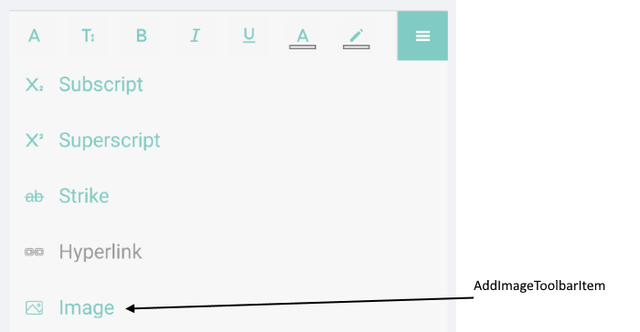
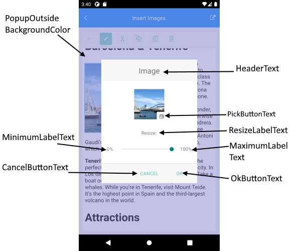

# Insert and Edit Images

From R3 2021 release the RichTextEditor control allows you to add(insert) images and edit the current selected image using built-in toolbar items. 

## Insert Images

RichTextEditor Toolbar has a support for inserting images. You can easily insert image using a predefined RichTextEditor toolbar item - `AddImageToolbarItem`. 

When tapping on `AddImageToolbarItem` the `PickImage` event is raised. 

Default look of the `AddImageToolbarItem`:



The image source is of type `RichTextImageSource`. Add images from file, stream, and byte array. Also you have to point out the image format type.

`RichTextImageType` specifies the format type of an image. The available formats are:

**Gif**
**Jpeg**
**Png**
**Svg**
**Webp**

### Events: 

* **PickImage**: Raised when the user has requested to pick an image in the RadRichTextEditor. The PickImage event handler receives two parameters:
	* The `sender` which is the RichTextEditor control;
	* `PickImageEventArgs` provides the following methods:
		* `Accept` - Invoke this method when the user has picked an image. Recieves one paramerter `imagesource` of type RichTextImageSource (Specifies the RichTextImageSource for the picked image);
		* `Cancel` - Invoke this method when the user has cancelled the operation;

>important It is an application logic how to get permissions to add images inside the RichTextEditor document.

* **InsertImageError**: Raised when trying to insert an image in the RadRichTextEditor. The InsertImageError event handler receives two parameters:
	* The `sender` which is the RichTextEditor control;
	* `InsertImageErrorEventArgs` provides the following methods:
		* `Source` - of type RichTextImageSource. The property allows you to get the source of the image (read-only property).

* **IsImageSelectedChanged**: Raised when an image inside the editor is selected. The IsImageSelectedChanged event handler receives two parameters:
	* The `sender` which is the RichTextEditor control;
	* `RadValueChangedEventArgs<bool>` provides `NewValue` and `OldValue` properties of type **bool**, indicating the `IsImageSelected` property change.

### Methods

* `GetImageAsync` method returns asynchronously the current selected image (or null in case there is no image). The RichTextImage object contains the Source, Title, Width and Height of the image;

### Commands

* **InsertImageCommand**(*ICommand*)
* **RemoveImageCommand**(*ICommand*)

## Built-in Toolbar Items for editing images

Built-in Toolbar editing options for currently selected image:

* `EditImageToolbarItem`(*InsertImageToolbarItem*): allows you to resize the image. In addition the toolbar allows you to pick an image if you haven't selected one. 
* `CutToolbarItem`(*RichTextEditorToolbarItem*): allows you to cut the selected HTML/image from the clipboard.
* `CopyToolbarItem`(*RichTextEditorToolbarItem*): allows you to copy the selected HTML to the clipboard. 
* `PasteHtmlToolbarItem`(*RichTextEditorToolbarItem*): allows you to paste HTML from the clipboard.
* `RemoveImageToolbarItem`(*RichTextEditorToolbarItem*): allows you to remove/delete the currently selected image.

How the editing toolbar looks when image is selected: 


## Edit Image ToolbarItem

EditImageToolbarItem allows you to resize the image. When tapping on the edit icon, a dialog is displayed. 

* **Text**(*string*): Defines the Edit Icon Text
* **HeaderText**(*string*): Defines the header text value. Default string `Image`
* **PickButtonText**(*string*): Defines the text of the button that allows you to pick images. Note that `PickImage` event is raised when `PickButton`(of type *Xamarin.Forms.Button*) is pressed. 
* **ResizeLabelText**(*string*): Defines the text of the `Resize` Xamarin.Forms.Label. Default value `Resize:`
* **MinimumLabelText**(*string*): Defines the text of the Minimum Xamarin.Forms.Label. Default value `0%`
* **MaximumLabelText**(*string*): Defines the text of the Maximum Xamarin.Forms.Label. Default value `100%`
* **OkButtonText**(*string*): Defines the text for Ok button. Default value `Ok`
* **CancelButtonText**(*string*): Defines the text for Cancel button. Default value: `Cancel`
* **PopupContentStyle**(*Style*): Defines the Style applied to the popup content.
* **PopupOutsideBackgroundColor**(*Color*): Defines the backgrounf color applied outside of the popup content.
* **PopupContentTemplate**(*ControlTemplate*): Defines  the control template of the popup.



### Example

RichTextEditor Definition in XAML and the Toolbar definition:

<snippet id='rte-insert-images' />

PickImage event handler with implementation to get permissions to access photos and media on the device

<snippet id='rte-insert-images-pick-image-implementation' />

Load HTML file

<snippet id='rte-insert-images-add-rte-source' />


>Insert Images example can be found inside the **SDK Browser App - RichTextEditor/Features folder**

## ImagePickerToolbar Item

* **ImagePickerToolbarItem**(*Telerik.XamarinForms.RichTextEditor.PickerToolbarItem*): Allows you to pick an image from a collection of pre-defined images.


### Example

RichTextEditor Definition in XAML and the Toolbar definition:

<snippet id='richtexteditor-custom-image-picker' />

Add the namespace:

```XAML
xmlns:telerikRichTextEditor="clr-namespace:Telerik.XamarinForms.RichTextEditor;assembly=Telerik.XamarinForms.RichTextEditor"
```

Add Images inside the ImagePickerToolbarItem ItemsSource:

<snippet id='rte-custom-image-picker-add-images-to-picker-toolbar-item' />

then call the InitializeImages inside the page's constructor:

<snippet id='rte-custom-image-picker-initialize-images' />

and set the RichTextEditor Source:

<snippet id='rte-custom-image-picker-html-document' />

> Custom Image Picker example can be found inside the **SDK Browser App - RichTextEditor/Features folder**

## See Also

- [Key Features]()
- [RadRichTextEditor Toolbar]()
- [Commands]()
