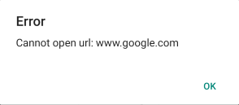
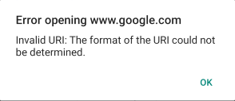

# Key Features

The purpose of this help article is to show you the key features of the **RadRichTextEditor** control.

## HTML Source options

RichTextEditor exposes **Source** property of type [RichTextSource](/devtools/xamarin/api/telerik.xamarinforms.richtexteditor.richtextsource) used to load HTML content into the editor from a string as well as from a stream. 

You can directly assign a string (containing HTML) as a <code>Source</code> of the editor - RadRichTextEditor will properly display the HTML content through the implemented in RichTextSource implicit converter. Check a simple example on this below:

```C#
this.richTextEditor.Source = "<b>Hello World!</b>";
```

### Load HTML from a string

You can easily load the HTML content from a string by using the static <code>FromString</code> method of the **RichTextSource** class and assigning the result to the **Source** property of RadRichTextEditor:

<snippet id='richtexteditor-getting-started' />

Alternatively, you can create a [RichTextHtmlStringSource](/devtools/xamarin/api/telerik.xamarinforms.richtexteditor.richtexthtmlstringsource) object and assign it to the <code>Source</code> property of the RichTextEditor.

### Load HTML from a stream

Another option to preload HTML is by retrieving it from a stream through the static <code>FromStream</code> method of the **RichTextSource** and again,  assign the result to the **Source** property of the RichTextEditor:

<snippet id='richtexteditor-keyfeatures-fromstream' />

Alternatively, you can create a [RichTextHtmlStreamSource](/devtools/xamarin/api/telerik.xamarinforms.richtexteditor.richtexthtmlstreamsource) object and set it as the <code>Source</code> of the RichTextEditor.

## Retrieving HTML Content

Through **GetHtmlAsync** method of RadRichTextEditor you can obtain the created and updated inside the editor HTML content:

<snippet id='richtexteditor-keyfeatures-gethtml' />

## RichText Editing Capabilities

RichTextEditor will help app users create and edit HTML content. You can apply provided by RichTextEditor editing features through the built-in UI, namely [RadRichTextEditorToolbar](), or you can create custom UI and manually execute the RadRichTextEditor [Commands]().

In addition, RichTextEditor provides flexible API to apply formatting at the current caret position or on the selected text inside the editing area.

* **TextFormatting** (of type [RichTextFormatting](/devtools/xamarin/api/telerik.xamarinforms.richtexteditor.richtextformatting)): Defines the text formatting, such as heading, paragraph or quotation of the text at the current position or selection. 

* **TextColor**: Specifies the color of the text at the current position or selection;

* **HighlightTextColor**: Defines the text background color at the current position or selection;

* **SelectionRange** (of type [RichTextSelectionRange](/devtools/xamarin/api/telerik.xamarinforms.richtexteditor.richtextselectionrange)): Specifies the start and end position of the currently selected inside the editor text.

* **FontSize**: Sets the font size of the text at the current caret position or selection;

* **FontAttributes** (of type [RichTextFontAttributes](/devtools/xamarin/api/telerik.xamarinforms.richtexteditor.richtextfontattributes)): Defines the font attributes, such as bold, italic, subscript and superscript at the current position or selection;

* **TextDecorations** (of type [RichTextDecorations](/devtools/xamarin/api/telerik.xamarinforms.richtexteditor.richtextdecorations)): Specifies text decorations, such as underline and strikethrough at the current position or selection;

* **HorizontalTextAlignment** (of type [RichTextHorizontalAlignment](/devtools/xamarin/api/telerik.xamarinforms.richtexteditor.richtexthorizontalalignment)): Specifies the text alignment, such as left, right, center or justify at the current position or selection;

* **ListType** (of type [RichTextListType](/devtools/xamarin/api/telerik.xamarinforms.richtexteditor.richtextlisttype)): Specifies the list type, such as numbered or bulleted list at the current position or selection.

## Text Selection

RichTextEditor supports text selection functionality - the end user can initiate a selection action through the tap and hold gesture over the text. The selected text is marked with a different background color and two drag handles are available to the user to make it easier to modify the current selection. 

In addition, as soon as the selection is made on Android and iOS, RichTextEditor displays a customizable ContextMenu with a few default commands. For more details on this go to [Context Menu]() topic.

You can take advantage of the following API related to text selection:

* **GetSelectionAsync** method - returns asynchronously a [RichTextSelection](/devtools/xamarin/api/telerik.xamarinforms.richtexteditor.richtextselection) object which defines the current text selection inside the editor (*null* if there is no text selection). The <code>RichTextSelection</code> object contains the *Text* itself as well as the *Start* and *End* position of the text characters;

## Hyperlink Support

RichTextEditor provides built-in support for creating and managing hyperlinks (hyperlinks are presented with the [RichTextHyperlink](/devtools/xamarin/api/telerik.xamarinforms.richtexteditor.richtexthyperlink) class). Through the exposed commands related to hyperlinks, namely ApplyHyperlinkCommand, RemoveHyperlinkCommand, and OpenHyperlinkCommand, users can manipulate the hyperlinks inside the RichTextEditor content.

In addition, RichTextEditorToolbar exposes predefined toolbar items wired to the hyperlink commands. For more details on this check [RichTextEditor Custom Toolbar](#predefined-toolbar-items) topic.

You can also take advantage of the following API related to hyperlinks:

* **GetHyperlinkAsync** method - returns asynchronously a [RichTextHyperlink](/devtools/xamarin/api/telerik.xamarinforms.richtexteditor.richtexthyperlink) under the caret in the editor (or *null* in case there is no hyperlink). The <code>RichTextHyperlink</code> object contains the *Url* and *Title* of the link;

### Hyperlink Error Handling

In case users try to open invalid urls (for example, the url is not absolute, the domain does not exist or is incomplete, etc) the following message is shown by default indicating there is an error with the url:



You can override the default behavior by handling the RichTextEditor's **OpenHyperlinkError** event:

* **OpenHyperlinkError** event - raised when users try to open invalid urls in the editor. The OpenHyperlinkError event handler receives two parameters:

	* The <code>Sender</code> which is the RichTextEditor control;
	* OpenHyperlinkErrorEventArgs provides the following properties:
		* <code>Error</code> - of type System.Exception, can be used to get the exact error message;
		* <code>Url</code> - of type string, defining the url of the hyperlink;
		* <code>Handled</code> - boolean property indicating whether the event is handled.

Subscribe to the event, set <code>Handled</code> property of the event args to *True* to prevent the default message and add custom implementation. 

Here is a quick example on the OpenHyperlinkError event usage:

<snippet id='richtexteditor-hyperlinkerrorhandling-xaml' />

And the event handler which shows a custom message:

<snippet id='richtexteditor-hyperlinkerrorhandling-code' />

Here is the custom message:



## Working With Images

You can easily add insert, delete, copy, paste, cut, edit images in the editor using the predefined toolbar items. For more details please check [Workin with Images]() article.
		
## Read-Only State

**IsReadOnly**(*bool*) property of the RichTextEditor indicating whether the control is in a read-only mode. Setting `IsReadOnly="True"` means that the Toolbar Items will be disabled, the content of the document cannot be changed and no selection can be performed. The default the value is `False`. 

### Example

For the example we will trigger the IsReadOnly State using a Switch. Here is the XAML Definition:

<snippet id='richtexteditor-readonly-state' />

For the example we will use a converter to hide the Toolbar when the control is in read-only state:

<snippet id='richtexteditor-readonly-converter' />

defining the Source of the RichTextEditor:

<snippet id='richtexteditor-readonly-state-code-behind' />

> The richtexteditor-htmlsource.html file is visualized in the Editor as an EmbeddedResource.

The sample Read-Only State demo can be found in our [SDK Browser Application](https://github.com/telerik/xamarin-forms-sdk/tree/master/XamarinSDK/SDKBrowser/SDKBrowser/Examples/RichTextEditorControl/FeaturesCategory/ReadOnlyStateExample).

## See Also

- [RichTextEditor Toolbar]()
- [Commands]()
- [Context Menu]()