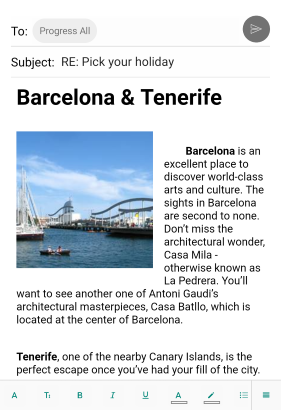

# Overview

Telerik RichTextEditor for Xamarin enables users to create rich textual content through a What-You-See-Is-What-You-Get (WYSIWYG) interface. It delivers a set of tools for creating, editing, and formatting of text, paragraphs, lists, hyperlinks and more, and outputs the modified content as standard HTML.

#### Figure 1: RadRichTextEditor Overview

## Key Features

* **Visualize HTML content**: RadRichTextEditor can display HTML content that includes paragraphs, formatted text, images, tables, ordered and unordered lists, and more. 

* **Rich text editing features**: The control comes with various editing capabilities:
	* Text formatting such as bold, italic, underline and strikethrough;
	* Font manipulations such as size, family, text color and text background color;
	* Bulleted and numbered lists;
	* Text selection;
	* Hyperlinks manipulations - create, edit and remove hyperlinks;
	* Subscript and superscript formatting;
	* Indentation and content alignment;
	* Undo/Redo editing actions.

* **Various HTML source options**: You can load the HTML source from a string as well as from a stream. Read more about this in the [Key Features]() article.

* **Commands Support**: RichTextEditor exposes commands, such as ToggleBoldCommand, ToggleBulletingCommand, AlignRightCommand, etc, that allow you to execute rich text editing actions over the loaded into the editor content. For detailed information on the matter check [Commands]() article. 

* **Insert and Edit Images Support**: You can easily insert images and use the built-in edit images operations like resize, cut, copy, paste, remove. Read more about this in [Working with Images]() article.  

* **RichTextEditor Toolbar**: Take advantage of a pre-defined UI automatically wired with all of the commands provided by the control through built-in functionality. For more details check the [RadRichTextEditor Toolbar]() article. 

* **Custom Toolbar**: The RadRichTextEditor Toolbar can be fully customized. You could populate the toolbar with the ToolbarItems needed for editing the HTML content. Read more about this in [RichTextEditor Custom Toolbar]().

* **Customizable Context Menu**: RichTextEditor comes with a built-in context menu support which shows common operations such as Copy and Paste for sharing data between the apps or within the app. For more details check [Context Menu]() topic.
 
* **Flexible Styling API**: You can easily modify the visual appearance of RadRichTextEditor as well as the toolbar items through various styling properties such as BackgroundColor, Border Color and Thickness, CornerRadius, and more. Go to [RichTextEditor Styling]() and [RichTextEditor Toolbar Styling]() topics for detailed information on this.

>tip Check out RadRichTextEditor [Getting Started]() help article that shows how to use it in a basic scenario.

## See Also

- [Getting Started]()