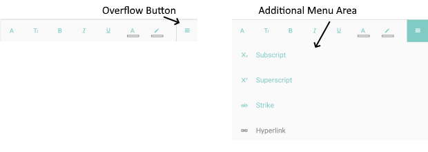

# RichTextEditor Toolbar

RadRichTextEditor control comes with various editing capabilities and with the help of the RadRichTextEditorToolbar you can provide to the users easy and quick way to edit their HTML content. The default toolbar include items for all the available text formatting options, alternatively you could customize the shown editing options according to your needs.

By default the RadRichTextEditorToolbar Items are auto-populated. You could change this by setting the RadRichTextEditorToolbar boolean <code>AutoGenerateItems</code> property to False. In this case you will need to manually define the available editing options, for more details check [Custom Toolbar]() article.

In order to attach the RichTextEditor control to the RadRichTextEditorToolbar control you need to set the <code>RichTextEditor</code> (from type *RadRichTextEditor*) property. All toolbar items execute their actions against the specified richtext editor.

<snippet id='richtexteditor-getting-started-xaml' />

RadRichTextEditorToolbar is horizontally scrollable, so that the toolbar items can be easily accessed - you can control this by setting **IsScrollable** boolean property (by default it is **True**).


In addition, an OverflowButton is available in the toolbar on the right to enable opening a menu area with additional toolbar items. If you'd like to customize the toolbar and manually define the toolbar items, you can define what toolbar items should be located in that menu area.



## RichTextEditor Toolbar Placement

There are some specifics you'd need to take into account when placing RichTextEditorToolbar on the page:

* On Android - when you place the RichTextEditor Toolbar below the RichTextEditor, you will need to set the Application WindowSoftInputModeAdjust to **Resize** - this setting causes the page to resize when the keyboard is shown and in this way if the RichTextEditorToolbar is on the bottom of the page it will be displayed over the keyboard when it appears.

You can apply it on application level like this:

```C#
App.Current.On<Android>().UseWindowSoftInputModeAdjust(WindowSoftInputModeAdjust.Resize);
```

>tip For more details on the matter check the [Soft Keyboard Input Mode on Android](https://docs.microsoft.com/en-us/xamarin/xamarin-forms/platform/android/soft-keyboard-input-mode) from Xamarin documentation.

* on iOS -  if the RadRichTextEditorToolbar is positioned under the keyboard, when the keyboard shows, the control is translated over the keyboard, so users can access it without a problem. Due to [Xamarin.Forms implementation](https://docs.microsoft.com/en-us/dotnet/api/xamarin.forms.visualelement.translationy?view=xamarin-forms), it is important that the RadRichTextEditorToolbar is placed in a container which bounds would still contain it after the control is translated over the keyboard. Otherwise, the Tap and Pan gestures on the RadRichTextEditorToolbar will not work until the keyboard is hidden and the control is translated back to its original place.

## See Also

- [Key Features]()
- [Commands]()
