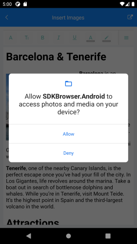

# Overview

From R3 2021 release the RichTextEditor control allows you to add(insert), cut, copy, paste, resize and delete images using built-in toolbar items. 

 


* `AddImageToolbarItem`(*RichTextEditorToolbarItem*): allows you to add images 
* `EditImageToolbarItem`(*InsertImageToolbarItem*): allows you to resize the image. In addition the toolbar allows you to pick an image if you haven't selected one. 
* `CutToolbarItem`(*RichTextEditorToolbarItem*): allows you to cut the selected HTML/image from the clipboard.
* `CopyToolbarItem`(*RichTextEditorToolbarItem*): allows you to copy the selected HTML to the clipboard. 
* `PasteHtmlToolbarItem`(*RichTextEditorToolbarItem*): allows you to paste HTML from the clipboard.
* `RemoveImageToolbarItem`(*RichTextEditorToolbarItem*): allows you to remove/delete the currently selected image.

You can insert images from Uri, Data(byte []), Stream, File. The image source is of type `RichTextImageSource`. Also you have to point out the image format type.

The supported image format types(of type `RichTextImageType`) are:

**Gif**
**Jpeg**
**Png**
**Svg**
**Webp**

## Permissions if adding images from gallery

>important If you want to work with images from the device gallery, then you have to grant permissions.

Add images using the predefined toolbar item - `AddImageToolbarItem`. When tapping on it the `PickImage` event is raised. You need to implement your logic for picking images from the gallery insdie the PickImage event handler:

The RichTextEditor definition in XAML and the Toolbar definition:

<snippet id='rte-insert-images' />

And the PickImage event handler with implementation to get permissions to access photos and media on the device

<snippet id='rte-insert-images-pick-image-implementation' />

Load HTML file

<snippet id='rte-insert-images-add-rte-source' />



The demo uses the Xam.Plugin.Media nuget package for all projects - .NET Standard, Android, iOS, UWP. In addition for Android Plugin.Permissions NuGet package is installed. 

### Permissions for Android

Inside the OnCreate method initialize the Plugin.Media:

```C#
Plugin.Media.CrossMedia.Current.Initialize();
```

Inside the MainActivity.cs file override the `OnRequestPermissionsResult` method

```C#
public override void OnRequestPermissionsResult(int requestCode, string[] permissions, [GeneratedEnum] Permission[] grantResults)
{
    Xamarin.Essentials.Platform.OnRequestPermissionsResult(requestCode, permissions, grantResults);
    Plugin.Permissions.PermissionsImplementation.Current.OnRequestPermissionsResult(requestCode, permissions, grantResults);
    base.OnRequestPermissionsResult(requestCode, permissions, grantResults);
}
```

### Permissions for iOS 

Inside the Info.plist file add the following code to grant permissions to access the device gallery 

```xml
<key>NSPhotoLibraryUsageDescription</key>
<string>This app needs access to photos.</string>
<key>NSPhotoLibraryAddUsageDescription</key>
<string>This app needs access to the photo gallery.</string>
```

## Events 

* **PickImage**: Raised when the user has requested to pick an image in the RadRichTextEditor. The PickImage event handler receives two parameters:
	* The `sender` which is the RichTextEditor control;
	* `PickImageEventArgs` provides the following methods:
		* `Accept` - Invoke this method when the user has picked an image. Recieves one paramerter `imagesource` of type RichTextImageSource (Specifies the RichTextImageSource for the picked image);
		* `Cancel` - Invoke this method when the user has cancelled the operation;

* **InsertImageError**: Raised when trying to insert an image in the RadRichTextEditor. The InsertImageError event handler receives two parameters:
	* The `sender` which is the RichTextEditor control;
	* `InsertImageErrorEventArgs` provides the following methods:
		* `Source` - of type RichTextImageSource. The property allows you to get the source of the image (read-only property).
		* `error` - of type Exception. Specifies the exception that is raised when image cannot be inserted.

* **IsImageSelectedChanged**: Raised when an image inside the editor is selected. The IsImageSelectedChanged event handler receives two parameters:
	* The `sender` which is the RichTextEditor control;
	* `RadValueChangedEventArgs<bool>` provides `NewValue` and `OldValue` properties of type **bool**, indicating the `IsImageSelected` property change.

## Methods

* `GetImageAsync` method returns asynchronously the current selected image (or null in case there is no image). The RichTextImage object contains the Source, Title, Width and Height of the image;

## Commands

* **InsertImageCommand**(*ICommand*): uses for inserting images in the editor. The command takes a single parameter of type `RichTextImage`. The RichTextImage object contains the source, title, width, height of the image. If you do not set width and height explicitly, the image will be added with its original size. 
* **RemoveImageCommand**(*ICommand*): uses for removing images from the editor.

## See Also

- [Key Features]()
- [RadRichTextEditor Toolbar]()
- [Commands]()
