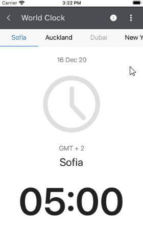
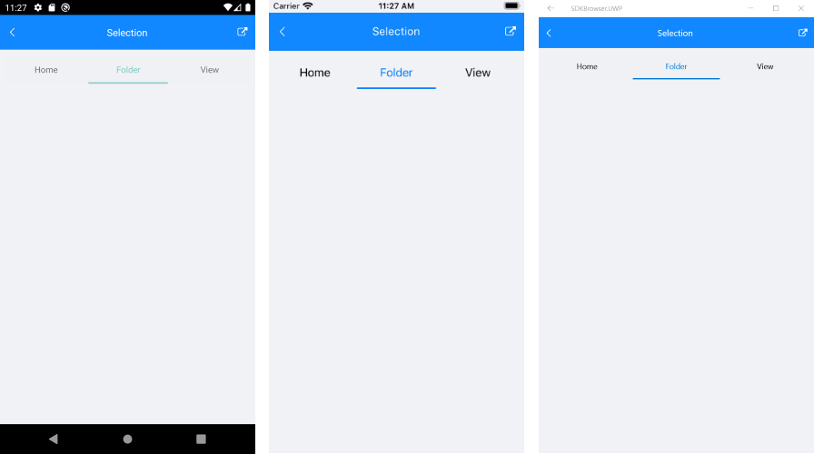

# Key features

**RadTabView** control exposes the following properties:

* **Items**(*ObservableItemCollection<TabViewItem>*)
* **Header** (*Telerik.XamarinForms.Primitives.TabViewHeader*): Modify the header appearance.
* **HeaderPosition**(*Telerik.XamarinForms.Primitives.TabViewHeaderPosition*). Defnes the tabview header position. You can choose between two options top and bottom. The default header position is top. 
* **SelectedItem**(*object*):
* **IsContentPreserved**: This property could be used to preserve the tabs content when switching them. In this way the visual state of the components inside each tab wouldn't be reset. When IsContentPreserved is set to True, the tabview does not unload/reload the tabs' content. By default the property is False.

## Swiping inside the TabView content

RadTabView allows you to **swipe inside the content** in order to change the selected item. This is the default behavior of the control.

If you want to prevent this feature you will need to set the `IsContentSwipingEnabled` bool property to `False`. The default value of the `IsContentSwipingEnabled` property is `True`.

`IsContentSwipingAnimationEnabled`(*bool*) property specifies whether a swipe inside the content will change the selected item with animation. The default value is false.

Here is how the swiping inside the content looks:

>tip **IsContentSwipingEnabled** and **IsContentSwipeAnimationEnabled** are part of the TabView features set from R1 2021 Release. **IsContentPreserved** property is part of the TabView features set from R2 2019 Service Pack.

## TabView Selection

Changing the selection will highlight the corresponding item and show its content under the tab strip area.

The RadTabView control exposes a few useful properties which can help you work with the items selection.

* **SelectedItem** property is used to set up the selection.

>tip TabViewItem can be selected by setting its IsSelected property to *true*.

>important If the item assigned to the SelectedItem property is not added in the Items collection the control, the selection will be lost.

### Example

The snippet below shows how to set the selection manually.

<snippet id='tabview-features-selection-csharp'/>

This is the result:

>important A sample Selection example can be found in the TabView/Features folder of the [SDK Samples Browser application]().

## Customizing the Selected Item

In order to customize the appearance of the selected item, you can modify the control template of the TabViewHeaderItem. More about this check the [TabViewHeader Custom Template](#tabview-header-item-custom-template).

## See Also

- [TabViewItem]()
- [TabView HeaderItem]()
- [TabView Scrolling Tabs]()
