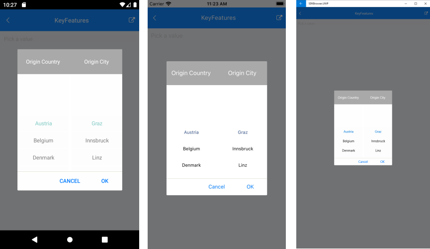

# Key Features

The purpose of this help article is to show you the key features of the Templated(Custom) Picker control for Xamarin.

## DisplayMemberPath

Its purpose is to specify a property of the source object to serve as the visual representation of the spinner item.

## DisplayStringFormat

You can choose what text to display when an item from the spinner was picked through the Picker DisplayStringFormat property. For more info on this check the Key Features - Display String section.

## SelectedValue

The SelectedValue property is used when you have linked your RadTemplatedPicker to a data source, and you want to return a value of type object other than the one which is displayed. 

## Example

Here is a sample example which shows how the *SelectedValue* and *DisplayMemberPath* can be used:

<snippet id='templatedpicker-keyfeatures' />

Here is a sample definition of the SelectorTemplate:

<snippet id='templatedpicker-keyfeatures-selectortemplate' />

and for the HeaderTemplate:

<snippet id='templatedpicker-keyfeatures-headertemplate' />

add the following Business model for the first spinner:

<snippet id='templatedpicker-country-businessmodel' />

add the following Business model for the second spinner:

<snippet id='templatedpicker-city-businessmodel' />

here is a sample definition of the ViewModel:

<snippet id='templatedpicker-viewmodel' />

In addition to this, you need to add the following namespace:

```XAML
xmlns:telerikInput="clr-namespace:Telerik.XamarinForms.Input;assembly=Telerik.XamarinForms.Input"
```

This is the result:



## See Also

- [Templates]()
- [Styling]()