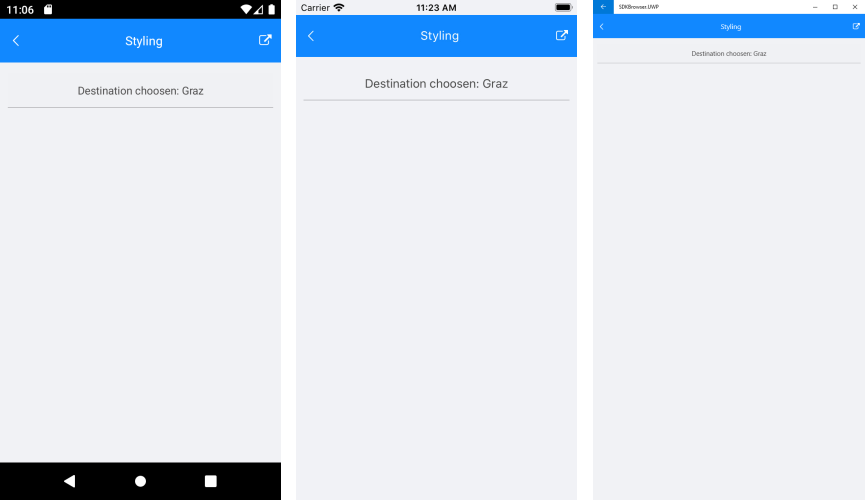

# Styling

## TemplatedPicker Styling

* **PlaceholderLabelStyle**(of type *Style* with target type **Label**): Defines the style applied to the placeholder label.
* **DisplayLabelStyle**(of type *Style* with target type **Label**): Defines the style applied to the label which is visualized when item from the selector is picked.

PickerContentView class exposes the following properties for styling the DatePicker Border and Background Color:

* **BackgroundColor**(*Xamarin.Forms.Color*): Defines the background color of the picker.
* **BorderColor**(*Xamarin.Forms.Color*): Defines the border color of the picker.
* **BorderThichness**(*Xamarin.Forms.Thickness*): Specifies the border thickness of the picker.
* **CornerRadius**(*Xamarin.Forms.Thinckness*): Specifies the corner radius of the picker.

### PlaceholderLabel Style


### DisplayLabel Style



## Popup Styling

Using the **SelectorSettings** property (*of type Telerik.XamarinForms.Input.PickerPopupSelectorSettings*) of the DatePicker you can modify the appearance of the dialog (popup). PickerPopupSelectorSettings class exposes the following Style properties:

* **PopupViewStyle**(of type *Style* with target type **telerikInput:PickerPopupContentView**): Defines the popup view style.
* **HeaderStyle**(of type *Style* with target type **telerikInput:PickerPopupHeaderView**): Defines the popup header style.
* **HeaderLabelStyle**(of type *Style* with target type **Label**): Defines the popup header label style.
* **FooterStyle**(of type *Style* with target type **telerikInput:PickerPopupFooterView**): Defines the popup footer style.
* **AcceptButtonStyle**(of type *Style* with target type **Button**): Defines the Accept button style.
* **CancelButtonStyle**(of type *Style* with target type **Button**): Defines the Cancel button style.

The SelectorSetting also provides the following properties for popup customization:

* **PopupOutsideBackgroundColor**(*Xamarin.Forms.Color*): Defines the color outside of the popup.
* **IsPopupModal**(*bool*): Defines a boolean value indicating if the popup should be closed when tapped outside of the popup. By default the value of the **IsPopupModal** is **false**.
	* When *IsPopupModal="True"*  the UI behind the popup gets inactive and cannot be used until the popup is closed. 
	* When *IsPopupModal="False"* the popup could be closed when clicking outside the popup. 
	
* **HeaderLabelText**(*string*): Specifies the text visualized in the popup header.
* **IsHeaderVisible**(*bool*): Specifies whether the Popup header is currently visible. By default the valuse is *True*.
* **AcceptButtonText**(*string*): Defines the text visualized for the accept button. By default the text is *OK*.
* **CancelButtonText**(*string*): Defines the text visualized for the cancel button. By default the text is *Cancel*. 

## Namespaces

Using one of the following styles **PopupViewStyle**, **HeaderStyle**, **FooterStyle** you need to add the following namespace

```XAML
xmlns:telerikInput="clr-namespace:Telerik.XamarinForms.Input;assembly=Telerik.XamarinForms.Input"
```

## Example

Here is a sample example which shows how the styling properties are applied.

A sample Templated Picker definition:

<snippet id='templatedpicker-style' />

and here are how the styles are defined in the page resources

## PlaceholderLabel Style

<snippet id='templatedpicker-placeholderlabelstyle' />

## DisplayLabel Style

<snippet id='templatedpicker-displaylabelstyle' />

## HeaderLabel Style

<snippet id='templatedpicker-headelabelstyle' />

## Footer Style

<snippet id='templatedpicker-commonbuttonstyle' />

## AcceptButton Style

<snippet id='templatedpicker-acceptbuttonstyle' />

## CancelButton Style

<snippet id='templatedpicker-cancelbuttonstyle' />

add the following Business model for the first spinner:

<snippet id='templatedpicker-country-businessmodel' />

add the following Business model for the second spinner:

<snippet id='templatedpicker-city-businessmodel' />

here is a sample definition of the ViewModel:

<snippet id='templatedpicker-viewmodel' />

In addition to this, you need to add the following namespace:

```XAML
xmlns:telerikInput="clr-namespace:Telerik.XamarinForms.Input;assembly=Telerik.XamarinForms.Input"
```

This is how the Templated Picker looks when the SelectorSetting properties are applied:


>important A sample Styling example can be found in the TemplatedPicker/Features folder of the [SDK Samples Browser application]().

## See Also

- [Getting Started]()
- [Templates]()