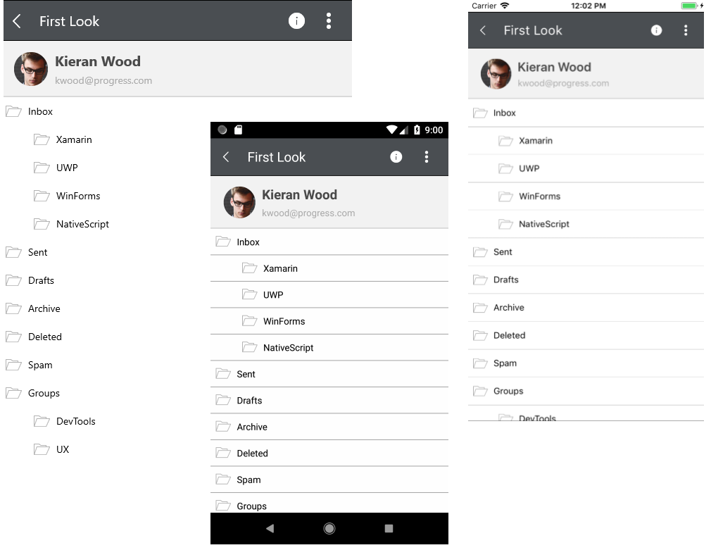

# Overview

 **RadTreeView** facilitates display, management, and navigation of hierarchical data structures. The product offers many advanced features like commands mechanism, data binding, checkbox support. RadTreeView allows you to achieve complex behavior and nicely blends into the interface of your application.

> **RadTreeView** is available for the following platforms:

> - **Android**
> - **iOS**
> - **Universal Windows Platform**

#### Figure 1: Overview

## Key features

* **Hierarchical Navigation**: RadTreeView significantly improves the navigation and performance of your application where navigation over hierarchical structure is required.

* **Expand/Collapse API**: **RadTreeView** introduces several methods which can be used to programmatically control the state of its items.

* **Commands Support**: RadTreeView strictly follows the MVVM best practices and provides an intuitive and easy-to-use set of APIs that allow different aspects of the RadTreeView control’s behavior to be handled and/or completely overridden. RadTreeView exposes a Commands collection that allows you to register custom commands with each control’s instance. 

* **CheckBox Support**: Telerik RadTreeView provides check boxes buttons displayed next to each item. The RadTreeView allows the user to check/uncheck the nodes and to perform various tasks with the collection of checked nodes. The Tri-State CheckBox mode of RadTreeView allows for RadTreeViewItems' CheckBoxes to have an additional, third state - Indeterminate.

* **Data Binding**: Simply setting the collection of custom business objects as an ItemsSource in combination with a "HierarchyAdapter" class is enough to visualize the hierarchically-structured source. 

* **UI Virtualization**: The user interface uses virtualization for displaying the required elements, meaning  that they are created only when needed and only for the currently visible cells.

* **Theming Support:** **RadTreeView** comes with built-in theming support that allows you to easily build slick interfaces with the look-and-feel of a predefined theme

