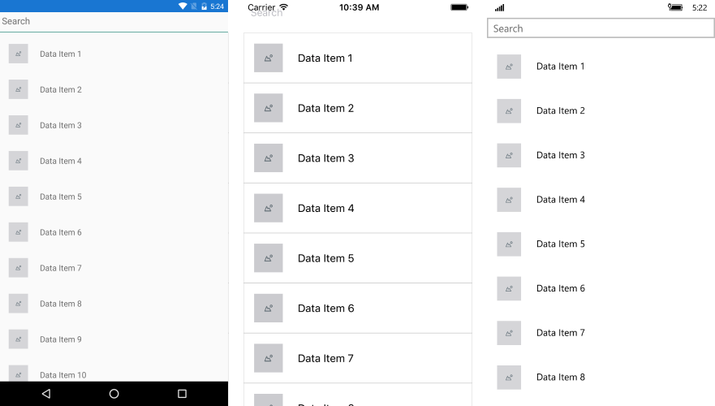
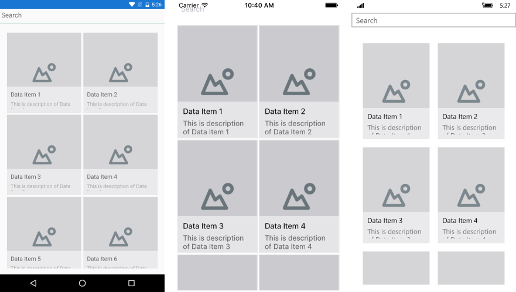
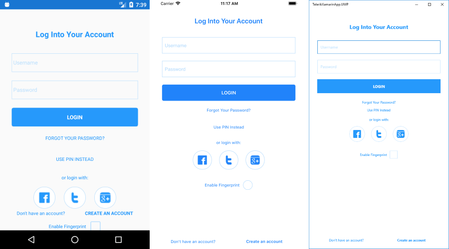
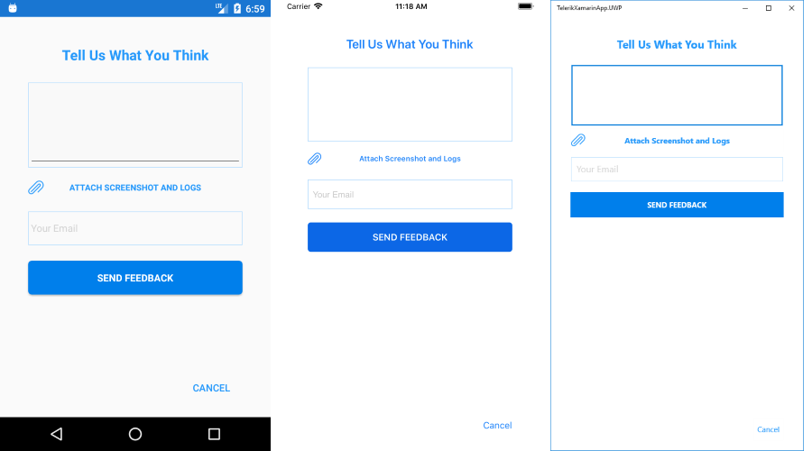

# Visual Studio Item Templates

>important Currently Item Templates are available only for Visual Studio on Windows.

There are several **predefined item templates for Visual Studio** included in the **UI for Xamarin** suite which come by default with the installation of the product. You can directly include them in your **Xamarin Forms** project and use them as footprints for similar scenarios in your application. This article provides more information on the different templates included and the controls which they utilize.

> The Item Templates are installed through a Visual Studio extension file(vsix) which can be found in the **VSExtensions** folder of your local installation. 

## Adding Item Templates to your project

As these item templates will be automatically added when you run the **UI for Xamarin** installation, you can find them when you try adding a new item to your Xamarin Forms project, as shown in **Figure 1**.

##### Figure 1: Adding a custom item to your Xamarin Forms project

 

You can also add them through the Telerik menu of Visual Studio as shown in **Figure 2**:

##### Figure 2: Adding a custom item to your Xamarin Forms project through Telerik menu:

 

Or through the context menu of your Visual Studio project:

##### Figure 3: Adding a custom item to your Xamarin Forms project through the context menu:
 

## Views

The available item templates are listed below:

* [Stocks View](#stocks-view)
* [Activity View](#activity-view)
* [Search View](#search-view)
* [Login Screen](#login-screen)
* [Feedback Screen](#feedback-screen)

### Stocks View

The Stocks View represents a list of several companies and information related to their stocks such as current price, trends, percentage difference, etc. The main controls which are utilized are the [RadListView]() and [RadCartesianChart]() controls. **Figure 2** shows the default appearance of the view.

##### Figure 4: Stocks View's default appearance
 
  
### Activity View

The Activity View provides an information regarding a specific user and information regarding his daily physical activity such as calories burned, average steps and active time. The view utilizes the [RadCartesianChart](), [RadRadialGauge]() and [RadHorizontalGauge]() controls. **Figure 3** shows the default appearance of the Activity View:

##### Figure 5: Activity View's default appearance
 

### Search View

There are several Search View custom items which show the same setup with a slightly different visualization. All of the item templates use the [RadAutoComplete]() and [RadListView]() controls with different modifications in order to achieve a diverse look. The **RadAutoComplete** control is used to filter the visible collection according to a certain user input.

#### Multiline Items

In the **SearchViewMultiLineItems** template, the items within the **RadListView** have multiple line description.

##### Figure 6: Search View Multiline Items 
 

#### Singleline Items

In the **SearchViewSingleLineItems** template, only a single line of information regarding the specific item is present.

##### Figure 7: Search View Singleline Items 
 

#### Singleline Items Big Image

The **SearchViewSingleLineItemsBigImage** template is similar to the **SearchViewSingleLineItems** template, however, the look of the item within the **RadListView** is slightly tweaked for a distinctive appearance that emphasizes on the image.

##### Figure 8: Search View Singleline Items Big Image 
 

#### Twoline Items

The **SearchViewTwoLinesItems** template once again shows a different approach of modifying RadListView's ItemTemplate.

#### Figure 9: Search View Twolines Items 
 

### Login Screen

The **Login Screen** templates provide various options for entering user credentials, such as with fingerprint, with pin or integrating a social login. There are 5 different scenarios available, so you could choose the one that best suits your requirements. The templates use [RadEntry](), [RadButton](), [RadBorder](), and [RadCheckBox]() components from Progress Telerik UI for Xamarin.

The image below shows LoginComplete template:

#### Figure 10: Login Complete Screen
 

### Feedback Screen

The **Feedback Screen** template implements a feedback scenario for receiving comments, notes or recommendations (and attachments) from the end users regarding the app. The template uses [RadBorder](), [RadButton]() and [RadListView]() from Progress Telerik UI for Xamarin.

#### Figure 11: Feedback Screen
 

## See Also

- [System Requirements]()
- [Getting Started on Windows]()
- [Getting Started on Mac]()