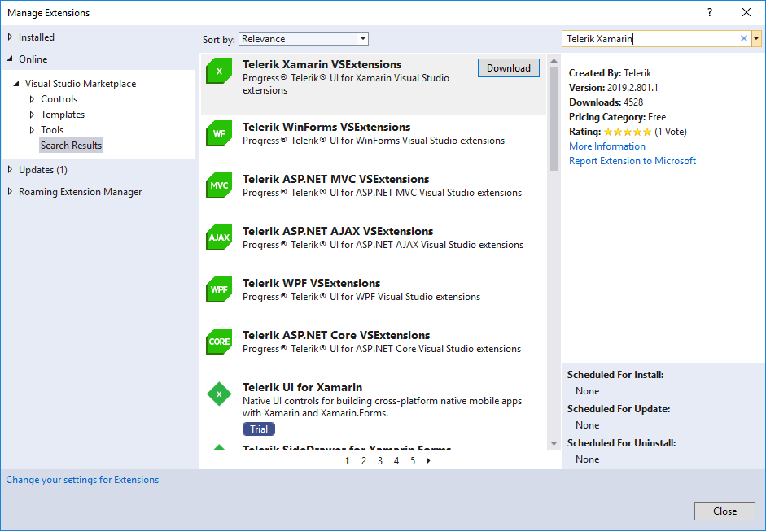
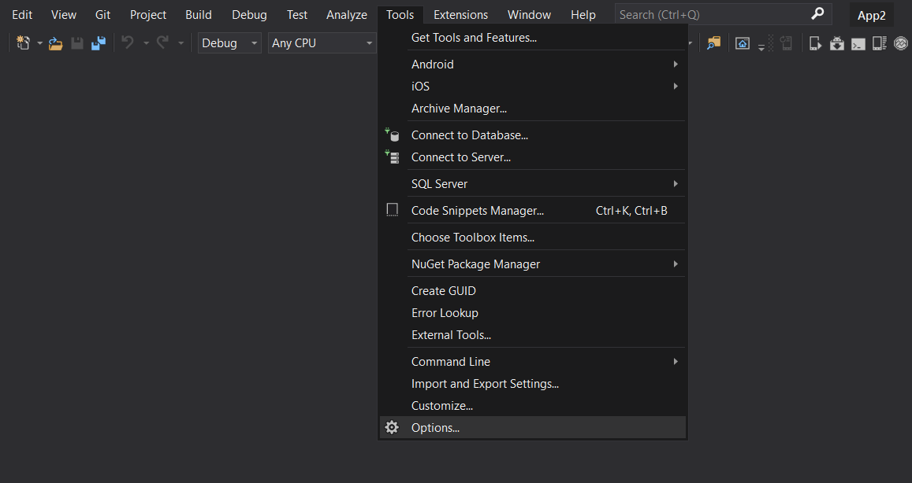
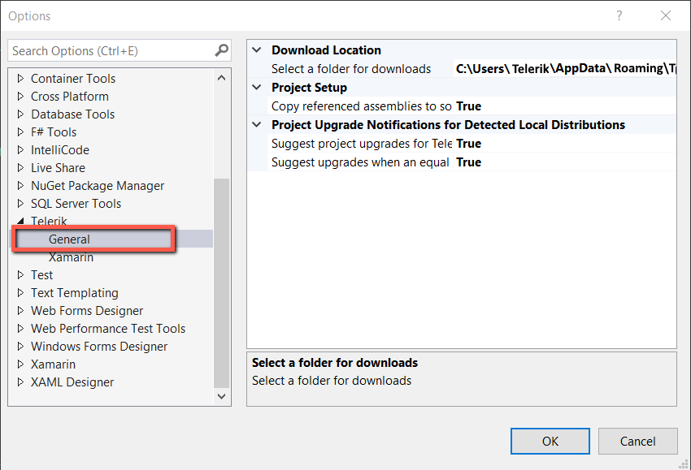
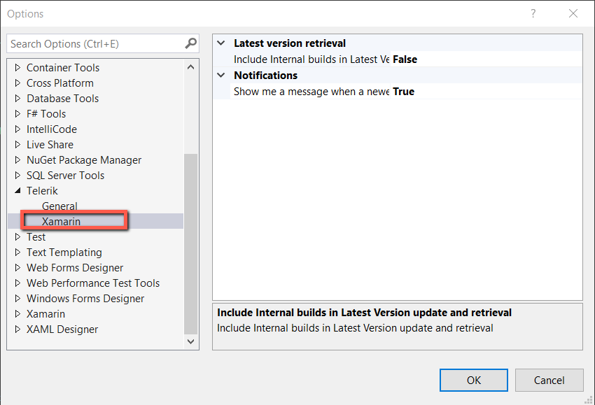

# Visual Studio Extensions

**Visual Studio Extensions** for Telerik UI for Xamarin aim to help developers when creating Xamarin Application with Telerik Xamarin components.

The extensions handle the following major points in the development with Telerik UI for Xamarin:

* **Project creation**: Through the [Project Wizard for Visual Studio]() you can quickly create an application pre-configured to use Telerik UI for Xamarin;

* **Toolbox support**: [Telerik UI for Xamarin Toolbox]() will ease the process of adding Telerik controls to your Xamarin.Forms application.

* **Common scenarios creation**: VSExtensions includes several predefined [item templates for Visual Studio](), such as Login and Feedback screens, that will simplify development for commonly used application UI.

## Installing VSExtensions

Visual Studio Extensions for Telerik UI for Xamarin are distributed with the Telerik UI for Xamarin MSI installation. They can be downloaded and installed as separate product from the [Visual Studio Marketplace](https://marketplace.visualstudio.com/) for Visual Studio 2019 and 2022 Preview.
 
>tip Telerik UI for Xamarin Extension for Visual Studio is avaiulable for Visual Studio 2022 Preview and Visual Studio 2019 

Below you can find more details on both options:

* **Telerik UI for Xamatin installer**: If you install the Telerik Xamarin suite through the [MSI automatic installation](), you will be prompted to install the extensions automatically;

* **Visual Studio Marketplace**: You can download the Telerik Xamarin VSExtensions from within Visual Studio:

	1. Go to Extensions/Manage Extensions menu item in VS 2019 and select Online->Visual Studio Marketplace section;
	1. Search for "Telerik Xamarin":
	
	1. Download "Telerik Xamarin VSExtensions";	
	1. After the installation is complete, it will be present in the "Installed" section in Visual Studio:	
	

Either way you choose, after installing Telerik Xamarin VSExtensions, a Telerik menu (under Extensions menu item) will be available in Visual Studio with several links that will help you quickly navigate to various useful resources:

## VSExtensions Options

The **Visual Studio Extensions** options dialog provides settings, so you can configure the Telerik Visual Studio Extensions to best suit your needs.

It can be accessed through the Telerik menu in Visual Studio (under Extensions menu item) -> VSExtensions Options…

or from the Visual Studio Options Dialog -> Tools -> Options -> Telerik

The **Options** dialog contains two sets of options that affect the Telerik UI for Xamarin.

The settings under the General category affect all of the installed **Telerik Visual Studio Extensions**.

* **Project Setup**
	* **Copy referenced assemblies to solution and integrate with source control**: When enabled, the referenced assemblies will be copied to the solution when using Telerik wizard.
	
* **Project Upgrade Notifications for Detected Local Distributions**
	* **Suggest project upgrades for Telerik product version available on my computer**: When enabled, you will be prompted to upgrade upon opening a project, which is not using the latest version of Telerik UI installed on your system;
	* **Suggest upgrades when an equal Dev release is detected on projects using a Trial**: When enabled, you will be prompted to upgrade if a licensed version of Telerik UI for Xamarin is available on your system, but the current project uses a trial version.

* **Download Location**: Configures the path where the extensions look for and store distributions.

All settings under the Telerik UI for **Xamarin** category affect only the respective product.

* **Latest Version Retrieval**: When enabled, the Latest Version Acquirer tool will retrieve internal builds as well as official releases when checking for a new version.
* **Notifications**: When enabled, you will receive notifications if a new version of Telerik UI for Xamarin is available on the Telerik website.

## Troubleshooting

#### Missing Telerik menu in Visual Studio

*Reason:*

Telerik Visual Studio Extensions are disabled or not installed correctly.

*Suggested solution 1 (Extension is Disabled):*

1. Open Visual Studio
1. Go to menu **Extensions -> Manage Extensions** (for Visual Studio 2017 - **Tools -> Extensions and Updates...**)
1. Open the **Installed** tab on the left
1. Search for **Telerik Xamarin VSExtensions** and make sure it's **Enabled**

*Suggested solution 2 (Extension is not installed):*

1. Open Visual Studio
1. Go to menu **Extensions -> Manage Extensions** (for Visual Studio 2017 - **Tools -> Extensions and Updates...**)
1. Open the **Online** tab on the left
1. Search for **Telerik Xamarin VSExtensions**
1. Download and install the extensions

>important If the article does not help in solving your problem, please follow these steps to generate a Visual Studio [ActivityLog](https://docs.microsoft.com/en-us/visualstudio/ide/reference/log-devenv-exe?view=vs-2019) file before contacting our support:
>* Open [Developer Command prompt](https://docs.microsoft.com/en-us/dotnet/framework/tools/developer-command-prompt-for-vs) for Visual Studio 20xx under **Administrative rights**.
>* Execute the command - **devenv /log %userprofile%\desktop\ActivityLog.xml**. This will start Visual Studio and create logs on your Desktop.
>* Reproduce the problem.
>* Attach the **Activitylog** files when you contact our support.

## See Also
- [Project Wizard]()
- [Telerik UI for Xamarin Toolbox]()
- [Visual Studio Item Templates]()

