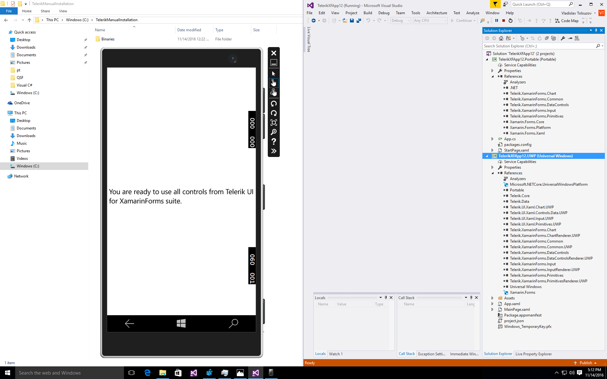
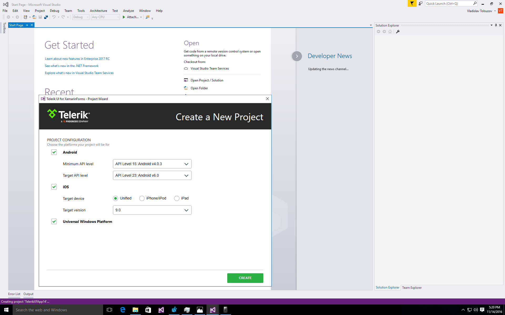
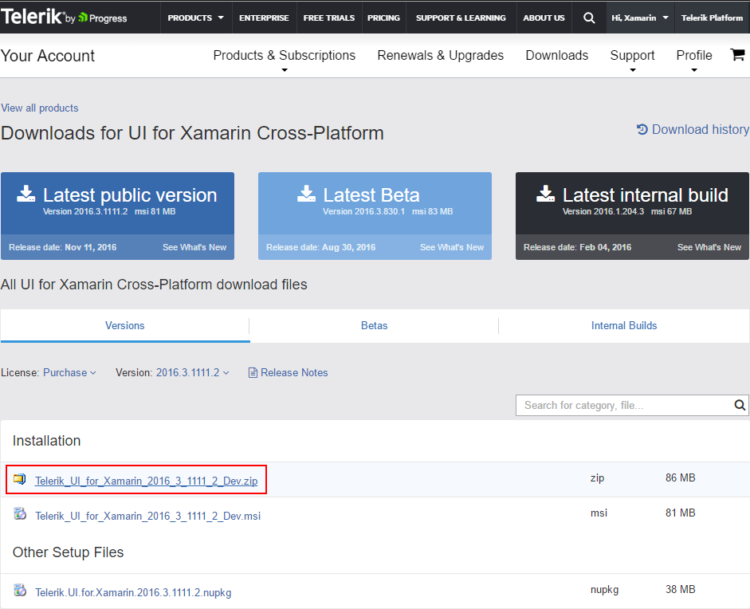

## How to manually install Telerik UI for Xamarin

In case you do not want to or can't use the MSI for some reason. UI for Xamarin offers means for manual installation. This will allow you to enable the Telerik Project Template as well as the Project Wizard in Visual Studio.



Some additional work is required, however, to finalize the installers that will provide smooth out-of-the-box integration experience between UI for Xamarin and Visual Studio RC 15, in the face of our **Project Template** and **Project Wizard**.



If you are eager to try **UI for Xamarin** on Visual Studio 15 and get the integration goodies set up, there’s still a relatively easy and quick and easy way to install them manually. This approach will also find its place in the cases where, for one reason or another, our organization does not allow usage of downloaded MSI installers. Here is the general flow when manual installation is used.

First, you need to log into your Telerik account and download the latest ZIP package. Unzip its content to any folder (for the purpose of this article *C:\\TelerikManualInstallation* will be used) and manually install the **Project Wizard** by triggering the **ProjectTemplateVS14.VSIX.vsix** file.



These steps will allow you to create projects using the **Project Wizard**. However, the projects will not build out of the box due to incorrect references.

## What breaks the wizard?

When our components are installed using the MSI we know where the binaries are copied. Also we create a special RegistryKey during the installation. Later on, when customers use the **Project Wizard** to create new solution, we rely on that particular key to create all projects with correct references to our binaries. When this registry key does not exist all references inside the newly created projects will be incorrect.

## How to fix the projects? 

### Manual reference update

One possible way to fix the issue is to manually update the references by deleting the existing ones and creating new ones pointing to the folder of the manual installation. This approach will resolve the binaries from the new folder and the references will be correct. 

Another way to correctly reference the binaries is to open each of the created **\*.csproj** files in a text editor and update the tag **BinariesFolder** with the new path. By default, that tag uses the custom registry key to find the path to the binaries folder. However, when a new solution is created, the same issue will exist and the same steps should be made again.

```xml
<PropertyGroup>
    <Configuration Condition=" '$(Configuration)' == '' ">Debug</Configuration>
    <Platform Condition=" '$(Platform)' == '' ">x86</Platform>
    <ProjectGuid>{2843F59C-670B-47F6-AB88-E81ADBD06C9E}</ProjectGuid>
    <OutputType>AppContainerExe</OutputType>
    <AppDesignerFolder>Properties</AppDesignerFolder>
    <RootNamespace>TelerikXFApp1.UWP</RootNamespace>
    <AssemblyName>TelerikXFApp1.UWP</AssemblyName>
    <DefaultLanguage>en-US</DefaultLanguage>
    <TargetPlatformIdentifier>UAP</TargetPlatformIdentifier>
    <TargetPlatformVersion>10.0.10586.0</TargetPlatformVersion>
    <TargetPlatformMinVersion>10.0.10240.0</TargetPlatformMinVersion>
    <MinimumVisualStudioVersion>14</MinimumVisualStudioVersion>
    <FileAlignment>512</FileAlignment>
    <ProjectTypeGuids>{A5A43C5B-DE2A-4C0C-9213-0A381AF9435A};{FAE04EC0-301F-11D3-BF4B-00C04F79EFBC}</ProjectTypeGuids>
    <PackageCertificateKeyFile>Windows_TemporaryKey.pfx</PackageCertificateKeyFile>
    <BinariesFolder>C:\TelerikManualInstallation\Binaries</BinariesFolder>
</PropertyGroup>
```
There you go, you can now create Project Wizard-supported projects with UI for Xamarin in Visual Studio 15. Happy coding!


## See Also
- [System Requirements]()
- [Getting Started on Mac]()
- [Required Android Support Libraries]()
