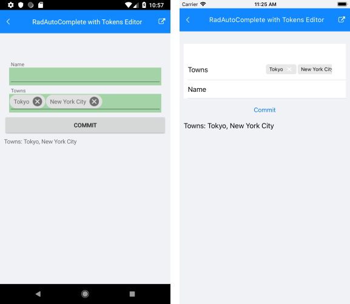

## Environment
<table>
	<tr>
		<td>Product Version</td>
		<td>2018.3.1122</td>
	</tr>
	<tr>
		<td>Product</td>
		<td>DataForm for Xamarin</td>
	</tr>
</table>

## Description

RadDataForm provides AutoCompleteEditor which uses RadAutoComplete control on different platforms. With AutoComplete you could enable users to search for and select several items known as "tokens". This article will show how you could enable the tokens support of RadAutoComplete inside DataForm through custom renderers on Android and iOS (tokens are not available for UWP).

## Solution

First, create a sample *SourceItem* class which will be the Source of RadDataForm, it has a property of type List<string> which will hold the selected items from RadAutoComplete:

```C#
public class SourceItem
{
	[DisplayOptions(Header = "Name")]
	public string Name { get; set; }

	[DisplayOptions(Header = "Towns")]
	public List<string> Towns { get; set; }
}
```

Add a simple RadDataForm definition to your page:

```XAML
<telerikInput:RadDataForm x:Name="dataForm" />
```

Add some code for setting its Source and registering the AutoCompleteEditor in code-behind. In addition, you would need to supply a *PropertyDataSourceProvider* for the AutoComplete ItemsSource:

```C#
this.dataForm.Source = new SourceItem();
this.dataForm.RegisterEditor(nameof(SourceItem.Towns), EditorType.AutoCompleteEditor);
this.dataForm.PropertyDataSourceProvider = new DataFormSourceProvider();
```
	
Here is the provider:

```C#
public class DataFormSourceProvider : PropertyDataSourceProvider
{
	public override IList GetSourceForKey(object key)
	{
		if (key.ToString().Equals("Towns"))
		{
			return new List<string> { "Tokyo", "London", "Paris", "New York City" };
		}
		return null;
	}
}
```
That's all on the shared project.

Now, let's start with the Android project:

Create a custom renderer class in order to set the DisplayMode mode of the native AutoComplete control to "Tokens":

```C#
public class RadAutoCompleteEditorRenderer : DataFormRenderer
{
	public RadAutoCompleteEditorRenderer(Context context) : base(context)
	{
	}
	protected override void UpdateEditor(EntityPropertyEditor editor, Telerik.XamarinForms.Input.DataForm.IEntityProperty property)
	{
		base.UpdateEditor(editor, property);

		if (editor.Property().Name() == "Towns")
		{
			var autoComplete = editor.EditorView as RadAutoCompleteTextView;
			if (autoComplete != null)
			{
				autoComplete.DisplayMode = DisplayMode.Tokens;
			}
		}
	}
}
```

Do not forget to register the renderer by adding the following line before the namespace:

```C#
[assembly: ExportRenderer(typeof(RadDataForm), typeof(RadAutoCompleteEditorRenderer))]
```

In addition, the used type List<string> should be converted to a JavaList type through a Telerik.XamarinForms.Common.Android.TypeRegister inside the MainActivity.cs file of the Android project (call it before LoadApplication):

```C#
public class MainActivity : FormsAppCompatActivity
{
    protected override void OnCreate(Bundle bundle)
    {
        ...

        TypeRegister.Register(typeof(List<string>), typeof(Android.Runtime.JavaList), new JavaToCSharpListConverter());
        this.LoadApplication(new App());
    }
	...
}	
```
And here is the converter:

```C#
public class JavaToCSharpListConverter : ITypeConverter
{
    public Java.Lang.Object Convert(object sourceObject)
    {
        Android.Runtime.JavaList items = null;
        List<string> cSharpList = sourceObject as List<string>;
        if (cSharpList != null)
        {
            items = new Android.Runtime.JavaList(cSharpList);
        }

        return items;
    }

    public object ConvertBack(Java.Lang.Object nativeObject)
    {
        List<string> items = null;
        var javaList = nativeObject as Android.Runtime.JavaList;
        if (javaList != null)
        {
            items = new List<string>();
            for (int i = 0; i < javaList.Size(); i++)
            {
                items.Add(javaList[i].ToString());
            }
        }

        return items;
    }
}
```

Finally, let's go to the iOS project. Again, add a custom renderer class where the DisplayMode needs to be set. You would also need to use a delegate in order to handle adding and removing tokens.

```C#
public class RadAutoCompleteEditorRenderer : DataFormRenderer
{
    protected override void UpdateEditor(TelerikUI.TKDataFormEditor editor, Telerik.XamarinForms.Input.DataForm.IEntityProperty property)
    {
        base.UpdateEditor(editor, property);

        if (property.PropertyName == "Towns")
        {
            var autoCompleteEditor = (TKDataFormAutoCompleteInlineEditor)editor;
            if (autoCompleteEditor.AutoCompleteView.Delegate == null)
            {
                autoCompleteEditor.AutoCompleteView.Delegate = new CustomAutoCompleteListDelegate(autoCompleteEditor);
                autoCompleteEditor.AutoCompleteView.DisplayMode = TKAutoCompleteDisplayMode.Tokens;
            }
        }
    }
}
```

As on Android, the renderer has to be registered - just add the following line before the namespace:

```C#
[assembly: ExportRenderer(typeof(RadDataForm), typeof(RadAutoCompleteEditorRenderer))]
```

Here is the delegate class:

```C#
public class CustomAutoCompleteListDelegate : TKAutoCompleteDelegate
{
    private TKDataFormAutoCompleteInlineEditor tKDataFormAutoCompleteInlineEditor;
    private List<string> tokens = new List<string>();

    public CustomAutoCompleteListDelegate(TKDataFormAutoCompleteInlineEditor tKDataFormAutoCompleteInlineEditor)
    {
        this.tKDataFormAutoCompleteInlineEditor = tKDataFormAutoCompleteInlineEditor;
    }

    public override void DidAddToken(TKAutoCompleteTextView autocomplete, TKAutoCompleteToken token)
    {
        this.tokens.Add(token.Text);
        tKDataFormAutoCompleteInlineEditor.Value = this.tokens.ToNSObject();
    }

    public override void DidRemoveToken(TKAutoCompleteTextView autocomplete, TKAutoCompleteToken token)
    {
        this.tokens.Remove(token.Text);
        tKDataFormAutoCompleteInlineEditor.Value = this.tokens.ToNSObject();
    }
}	
```
	
Here is the result after running the example:



>note You could find a runnable example inside DataForm/HowTo/RadAutoComplete with Tokens Editor folder of the [SDK Samples Browser application](#sdk-browser-application).
>
>Or you can directly browse the example source code on github - [SDKBrowser GitHub Repository](https://github.com/telerik/xamarin-forms-sdk/tree/master/XamarinSDK/SDKBrowser/SDKBrowser/Examples/DataFormControl/HowToCategory/RadAutoCompleteEditorTokensExample)
