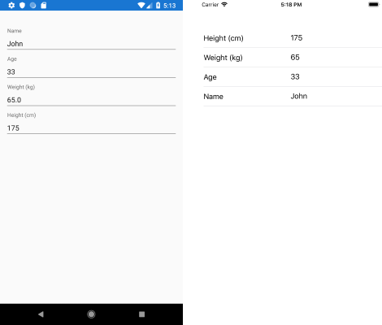
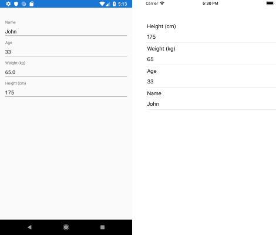

## Environment
<table>
	<tr>
		<td>Product Version</td>
		<td>2018.3.1109</td>
	</tr>
	<tr>
		<td>Product</td>
		<td>DataForm for Xamarin Cross-Platform</td>
	</tr>
</table>


## Description

Currently DataForm is designed to follow the native look &mp; feel of the platform, so the editors containing a header and an input field are arranged differently on iOS and Android. You could rearrange the components in each editor in DataForm on iOS through a custom renderer.  

You would need to create a class that inherits from DataFormRenderer​ and override its *UpdateEditor* method - in it you could get a reference to each of the editors you're using ( you could check the available editors and their counterparts on iOS [here](#editor-types) and update their layout per your needs. 

In addition, you would need to override the method for setting the height of the editors that is defined through a DataFormDelegate.

## Solution

Let's have the following sample DataForm definition:

```XAML
<telerikInput:RadDataForm x:Name="dataForm">
	<telerikInput:RadDataForm.Source>
		<local:SourceItem />
	</telerikInput:RadDataForm.Source>
</telerikInput:RadDataForm>
```

and a sample SourceItem:

```C#
public class SourceItem
{   
	[DisplayOptions(Header = "Name")]
	public string Name { get; set; }
	  
	[DisplayOptions(Header = "Age")]
	public int Age { get; set; }
	  
	[DisplayOptions(Header = "Weight (kg)")]
	public double Weight { get; set; }
	   
	[DisplayOptions(Header = "Height (cm)")]
	public int Height { get; set; }
}
```

with the editors defined like this:

```C#
dataForm.RegisterEditor(nameof(SourceItem.Age), EditorType.IntegerEditor);
dataForm.RegisterEditor(nameof(SourceItem.Name), EditorType.TextEditor);
dataForm.RegisterEditor(nameof(SourceItem.Weight), EditorType.DecimalEditor);
dataForm.RegisterEditor(nameof(SourceItem.Height), EditorType.IntegerEditor);
```	

The snippet below shows how you would need to implement the CustomDataFormRenderer and UpdateEditor method:

```C#
public class CustomDataFormRenderer : DataFormRenderer
{
	protected override TKDataFormDelegate GetDataFormDelegate(TKDataForm form)
	{
		return new IOSDataFormDelegate(this);
	}
	public class IOSDataFormDelegate : DataFormDelegate
	{
		public IOSDataFormDelegate(DataFormRenderer renderer) : base(renderer)
		{
		}
		public override nfloat HeightForEditor(TKDataForm dataForm, uint groupIndex, uint editorIndex)
		{
			return 70;
		}
	}
	protected override void UpdateEditor(TKDataFormEditor editor, IEntityProperty property)
	{
		if (editor is TKDataFormTextFieldEditor)
		{
			var editorDef = editor.GridLayout.Definitions[4];
			editorDef.Row = 1;
			editorDef.Column = 1;
			editorDef.ColumnSpan = 3;

			var editorLabelDef = editor.GridLayout.Definitions[1];
			editorLabelDef.Row = 0;
			editorLabelDef.Column = 1;

			var feedbackDef = editor.GridLayout.Definitions[3];
			feedbackDef.Row = 2;
		}

		base.UpdateEditor(editor, property);
	}
}
```	

Here is the result:

#### Before:



#### After:


