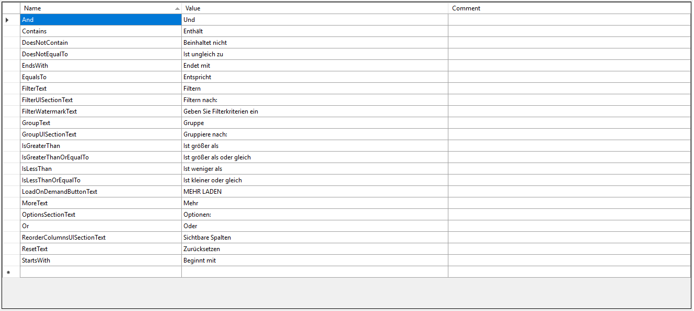
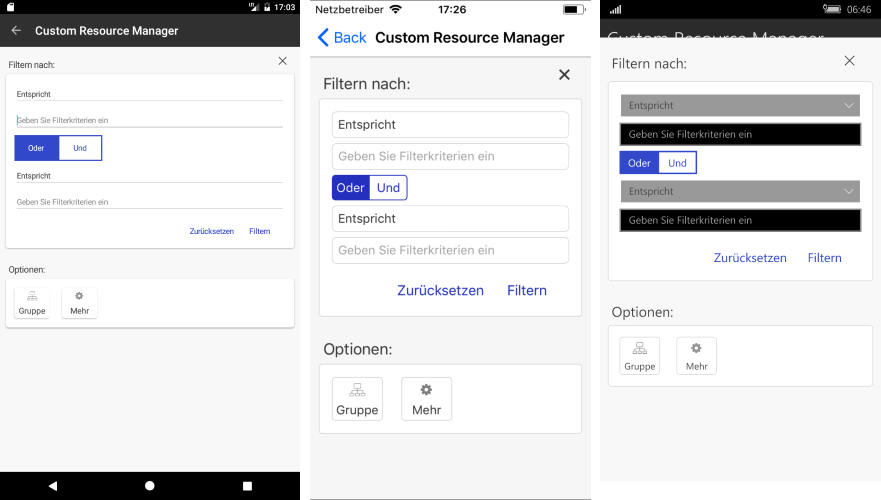

# Localization and Globalization

Localization and Globalization is the process of designing and developing your application in such a way that it adapts to different languages and culture configurations. 

This topic provides an overview on how you could utilize localization and globalization feature of Telerik UI for Xamarin components.

## Globalization

Globalization refers to developing an application in such a way that it works with respect to the target device culture. This includes numbers formatting which can vary between cultures, especially for some specific symbols, such as decimal separators, currency and other, as well as date and time formatting. Following is a list of Telerik Xamarin controls that support globalization:

* Calendar &amp; Scheduling
* Chart
* DataForm
* DataGrid
* MaskedInput
* NumericInput

## Localization

Localization refers to the translation of application resources into localized versions for the specific languages that the application supports. Check below a list of Telerik Xamarin controls that support localization:

* AutoCompleteView
* Calendar &amp; Scheduling
* ConversationalUI
* DataForm
* DataGrid

The localization mechanism in Telerik Xamarin controls is implemented through **TelerikLocalizationManager** class and more specifically the **TelerikLocalizationManager.Manager** static property. To enable localization to any of the listed above components you should choose between the approaches below:

* [Localization using Custom Localization Manager](#localization-using-custom-localization-manager)
* [Localization using ResourceManager](#localization-using-resourcemanager)

In both cases you would need to provide a translation of all the resource keys used inside the supported controls.

>important You can download the complete list with the resource keys used in all the supported components from the [SDKBrowser Examples repository on GitHub](https://github.com/telerik/xamarin-forms-sdk/tree/master/XamarinSDK/SDKBrowser/SDKBrowser). 

### Localization using Custom Localization Manager

To apply localization to your controls just instantiate your custom TelerikLocalizationManager and set it to the static property TelerikLocalizationManager.Manager, before the creation of the UI. Below you could find an example with RadDataGrid control.

First, create a custom class that inherits from **TelerikLocalizationManager** and override the **GetString()** method:

<snippet id='datagrid-custom-localizationmanager-csharp'/>

Set it as the **TelerikLocalizationManager.Manager**:

<snippet id='datagrid-setting-the-custom-manager-csharp'/>

>important You should set the custom manager before the InitializeComponent() method is invoked otherwise the default values will be applied to the RadDataGrid.

Check below the appearance of the filtering component within the RadDataGrid after the custom localization manager is applied.

### Localization using ResourceManager

The second option for applying localization is through setting a custom **ResourceManager**:

<snippet id='datagrid-setting-the-custom-resource-manager-csharp'/> 

In the same way as the built-in mechanism for localizing .NET applications uses [RESX files](https://docs.microsoft.com/en-us/previous-versions/visualstudio/visual-studio-2008/ekyft91f(v=vs.90)) and the classes in the **System.Resources** and **System.Globalization** namespaces, Telerik Xamarin controls rely on similar setup to achieve the functionality.

You should add different resource files according to the different languages/cultures which you would like to use. Next image shows an example of a custom resource file used for German:

The resource file ends with "de.resx" and is automatically used when the language of the target device is set to German.

Check below the appearance of the filtering control when the localization is applied:

#### Figure 3: Custom Resource File for German language

>important You can check a working example in the **DataGrid/Localization/CustomResourceManager** folder within the **SDK Samples Browser**.
