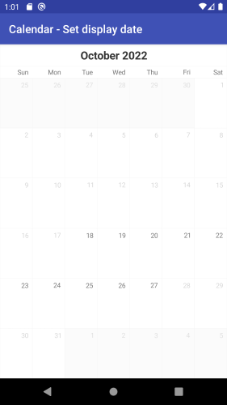

# CalendarView for Xamarin.Android: Disabled Dates

**RadCalendarView** allows you to restrict the dates that can be displayed and selected by the users. This can be achieved by setting minimum date and maximum date for the calendar. The default values for these properties are `0`.
This means that there are no restrictions. If you would like to use the calendar for hotel/flight reservation, you wouldn't want the selection to be possible for dates that are in the past. In this scenario the minimum date
comes useful. 

The followinmg propertiest allows you to set disabled dates:

* **MinDate**: Specifies the minimum selectable date
* **MaxDate**: Specifies the maximum selectable date

Here's the example:

```C#
RadCalendarView calendarView = new RadCalendarView (Activity);
calendarView.DisplayDate = new GregorianCalendar (2022, Calendar.October, 1).TimeInMillis;
calendarView.MinDate = new GregorianCalendar(2022, Calendar.October, 18).TimeInMillis;
calendarView.MaxDate = new GregorianCalendar(2022, Calendar.October, 27).TimeInMillis;

return calendarView;
```

And here's how the calendar looks when the dates before today are disabled:


