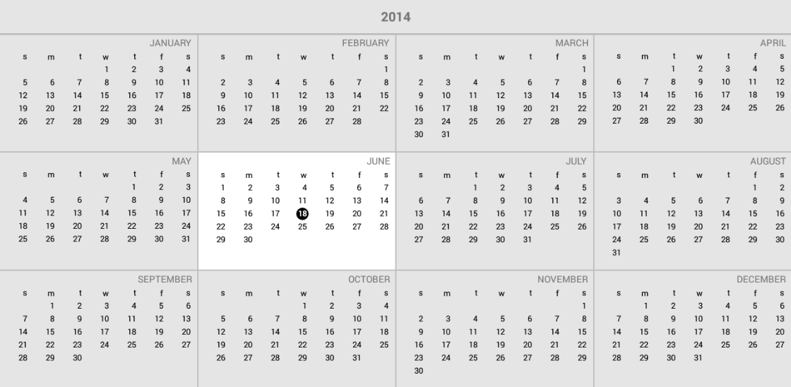

# RadCalendarView: DisplayMode

**RadCalendarView** provides three modes for displaying dates. They are `Month`, `Week` and `Year` and are included in the `CalendarDisplayMode` enumeration.
These modes represent the period that is displayed at once by the control. To see the current mode use the method **getDisplayMode()** and to change it, use **setDisplayMode(CalendarDisplayMode)**.
You can also change the display mode through the XML attribute **displayMode**.

## Month

This is the default display mode for **RadCalendarView** and means that the control displays a representation of one month. It looks like this:


## Week

This mode represents the dates from one week and they look as one of the rows that are displayed while the control is in Month display mode. Let's set the display mode of our **RadCalendarView** instance to `Week`:


```C#
	calendarView.DisplayMode = CalendarDisplayMode.Week;
```

Here's the result:


## Year

This mode represents all dates from one year grouped in months in a way similar to a calendar that stands on the wall. Here's how it looks:



Since the default look of the year view contains a lot of dates it may seem too overcrowded on smaller devices. This is why this view also has a compact mode, where the months are represented only by their names and the exact dates are not drawn.
Whether the Year view is in compact mode can be changed through the XML attribute **isYearModeCompact** or through the **setYearModeCompact(boolean)** method. The current value can be accessed through the **getYearModeCompact()** method.
