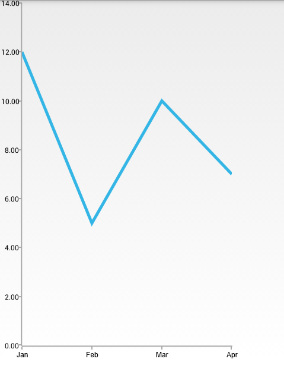

## ChartView for Xamarin.Android: LinearAxis

**RadCartesianChartView** needs an axis that can represent the values of the data points. The base class for the axes that can represent value is **NumericalAxis**.
It is an abstract class which extends the base **CartesianAxis** class and is used to represent the value of a data point.

The **LinearAxis** extends the base **CartesianAxis** class and plots the associated data points using each point's actual value, provided for the axis. The axis works with categorical data and uses the Value property of each CategoricalDataPoint that needs to be plotted. It will build a numerical range (user-defined or automatically calculated) and will determine each data point X or Y coordinate (depending on whether the axis is specified as Horizontal or as Vertical).

## Example

You can read from the [Getting Started]( "Read how to define the MonthResult type") page how to define the `MonthResult` type and declare the **initData()** method.

After you create the method for initialization of sample data, you can create a **RadCartesianChartView** with **LinearAxis** by adding the following code to the **onCreate()** method of your Activity.

```C#
InitData();

RadCartesianChartView chartView = new RadCartesianChartView(this);

LineSeries lineSeries = new LineSeries();
lineSeries.CategoryBinding = new MonthResultDataBinding ("Month");
lineSeries.ValueBinding = new MonthResultDataBinding ("Result");
lineSeries.Data = (Java.Lang.IIterable)this.monthResults;
chartView.Series.Add(lineSeries);

CategoricalAxis horizontalAxis = new CategoricalAxis();
chartView.HorizontalAxis = horizontalAxis;

LinearAxis verticalAxis = new LinearAxis();
chartView.VerticalAxis = verticalAxis;

ViewGroup rootView = (ViewGroup)FindViewById(Resource.Id.container);
rootView.AddView(chartView);
```

Here's the result:



## Major Step

Major Step specifies the step at which the major ticks are positioned on the axis. If this property is set to `0` (by default), the axis automatically calculates the step so that the data will be visualized in the best possible way. For example, if you want to set the distance between the ticks to a fixed value like 10, you will need to apply **MajorStep** property:

```C#
verticalAxis.MajorStep = 10;
```