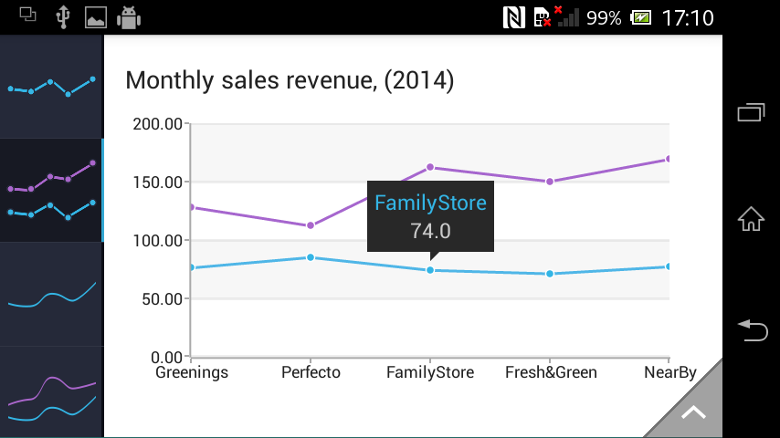

# RadChartView: ChartTooltipBehavior

**ChartTooltipBehavior** is responsible for rendering concise information about a data point in a small popup which displays close
to its relevant data point.

## Getting Started

The ChartTooltipBehavior class is used by creating an instance of it and adding the instance to the behaviors collection of a chart view.
For example:


```C#
	ChartTooltipBehavior tooltipBehavior = new ChartTooltipBehavior(this);
	chartView.Behaviors.Add(tooltipBehavior);
```

This code example assumes that there is an existing instance of RadCartesianChartView which is initialized and populated with data. You
can see how to do this [here]( "Getting started with Chart in Telerik Android UI").

Here is the tooltip in action:



## Features
ChartTooltipBehavior has several options for configuration. The most commonly used would probably be the tooltip trigger mode. The chart tooltip
can be triggered either with a hold or a tap gesture. This is controlled with the getTriggerMode() and setTriggerMode() methods. The tooltip
behavior can display its tooltip through code via the open() and close() methods.

Finally ChartTooltipBehavior is integrated with the chart palettes, which means simple color modifications of the existing tooltip view can
be quickly achieved by simple modification of the existing palette as shown [here]( "Palettes").
