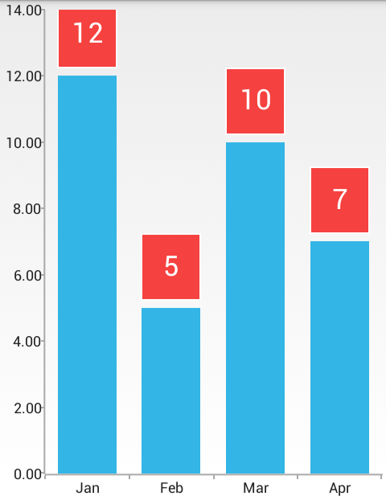

## ChartView for Xamarin.Android: Labels

In this article, you will learn to use the labels in **RadChartView for Android**: how to use the labels for the series and for the axes and how to customize them.

## Series Labels

All series have their default labels. In order to display them, you simply need to set show labels of the series to `true`:

```C#
series.ShowLabels = true;
```

## Axes Labels

All axes have their default labels. They are visible by default. In order to hide them, you simply need to set show labels of the axis to `false`:

```C#
 axis.ShowLabels = false;
```

## Customization

All axes and series have properties which provide various customization options for the labels:

* **LabelTextColor**(*Android.Graphics.Color*): specifies the color of the label text;
* **LabelFillColor**(*Android.Graphics.Color*): sets the background color of the labels;
* **LabelStrokeColor**(*Android.Graphics.Color*): sets the border color of the labels;
* **LabelSize**(*float*): sets the size of the labels;
* **LabelMargin**(*float*): specifies the margins of the labels;
* **LabelFont**(*Android.Graphics.Typeface*): determines the font of the labels;
* **LabelFormat**: specifies the format string of the labels.

Additionally, you can provide a custom label render in order to completely change the way the labels are rendered. 
In order to set the renderer you need to use the **LabelRenderer** of type *BaseLabelRenderer* property.
 
Here's an excerpt from a custom label renderer:

```C#
class CustomLabelRenderer : BaseLabelRenderer {

	private String labelFormat = "{0}";
	private TextPaint paint = new TextPaint();
	private Paint strokePaint = new Paint();
	private Paint fillPaint = new Paint();
	private float labelMargin = 10.0f;
	private float labelPadding = 20.0f;

	public CustomLabelRenderer(ChartSeries owner)
		:base(owner) {

		this.strokePaint.SetStyle(Paint.Style.Stroke);
		this.strokePaint.Color = Color.White;
		this.strokePaint.StrokeWidth = 2;

		this.fillPaint.Color = Color.ParseColor("#F5413F");
		this.paint.TextSize = 35.0f;
		this.paint.Color = Color.White;
	}

	public override void RenderLabel (Canvas canvas, 
		Com.Telerik.Widget.Chart.Engine.ElementTree.ChartNode relatedLabelNode)	{
		
		CategoricalDataPoint dataPoint = 
			relatedLabelNode.JavaCast<CategoricalDataPoint>();
			
		RadRect dataPointSlot = dataPoint.LayoutSlot;
		Double val = dataPoint.Value;
		String labelText = String.Format(this.labelFormat, (int)val);

		StaticLayout textInfo = this.CreateTextInfo(labelText, dataPoint);
		this.RenderLabel(canvas, dataPointSlot, labelText, textInfo);
	}

	private StaticLayout CreateTextInfo(String labelText, 
		CategoricalDataPoint dataPoint) {
		
		return new StaticLayout(labelText,
			0,
			labelText.Length,
			this.paint,
			(int)Math.Round((float) dataPoint.LayoutSlot.Width),
			Layout.Alignment.AlignCenter,
			1.0f,
			1.0f,
			false);
	}

	private void RenderLabel(Canvas canvas, RadRect dataPointSlot, 
		String labelText, StaticLayout textBounds) {

		RectF labelBounds = new RectF();
		float height = textBounds.Height + this.labelPadding * 2;
		float top = (float) dataPointSlot.GetY() - this.labelMargin - height;

		labelBounds.Set(
			(float) dataPointSlot.GetX(),
			top,
			(float) dataPointSlot.Right,
			top + height);

		canvas.DrawRect(
			labelBounds.Left, 
			labelBounds.Top, 
			labelBounds.Right, 
			labelBounds.Bottom, 
			this.fillPaint);

		canvas.DrawRect(
			labelBounds.Left, 
			labelBounds.Top, 
			labelBounds.Right, 
			labelBounds.Bottom, 
			this.strokePaint);

		canvas.DrawText(
			labelText, 
			(float) dataPointSlot.GetX() + (float) (dataPointSlot.Width / 2.0) - 
				textBounds.GetLineWidth(0) / 2.0f, 
			labelBounds.CenterY() + textBounds.GetLineBottom(0) -
				textBounds.GetLineBaseline(0), 
			paint);
	}
}
```
	
And the result:

 