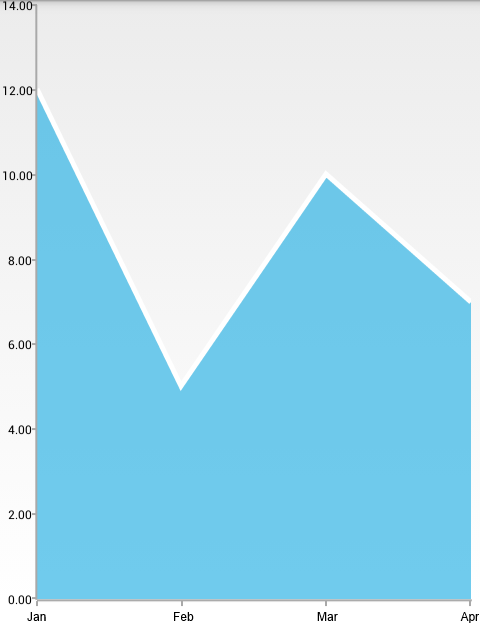

# RadChartView: AreaSeries

**RadCartesianChartView** visualizes **AreaSeries** as an area on the chart that is enclosed by the coordinate axes and straight line segments that connect the data points represented by these series. The **AreaSeries** extend **CategoricalStrokedSeries**, so they are also **CategoricalSeries** and require one **CategoricalAxis** and one **LinearAxis**.

## Example

You can read from the [Getting Started]( "Read how to define the MonthResult type") page how to define the `MonthResult` type and declare the **initData()** method.

After you create the method for initialization of sample data, you can create a **RadCartesianChartView** with **AreaSeries** by adding the following code to the **onCreate()** method of your Activity.


```C#
	InitData();

	RadCartesianChartView chartView = new RadCartesianChartView(this);

	AreaSeries areaSeries = new AreaSeries();
	areaSeries.CategoryBinding = new MonthResultDataBinding ("Month");
	areaSeries.ValueBinding = new MonthResultDataBinding ("Result");
	areaSeries.Data = (Java.Lang.IIterable)this.monthResults;
	chartView.Series.Add(areaSeries);

	CategoricalAxis horizontalAxis = new CategoricalAxis();
	chartView.HorizontalAxis = horizontalAxis;

	LinearAxis verticalAxis = new LinearAxis();
	chartView.VerticalAxis = verticalAxis;

	ViewGroup rootView = (ViewGroup)FindViewById(Resource.Id.container);
	rootView.AddView(chartView);
```

> This example assumes that your root container has id `container`

Here's the result:



## Customization

**AreaSeries** extend **CategoricalStrokedSeries** which provide the following way to change their style:

* **setStrokeColor(int)**: changes the color used to draw lines. In order to get the current value, use **getStrokeColor()**.
* **setStrokeThickness(float)**: changes the width of the lines. In order to get the current value, use **getStrokeThickness()**.

Additionally, **AreaSeries** can change the color of their fill with the method **setFillColor(int)**. **getFillColor()** returns the current value of the color used to fill the series.

You can also customize the appearance of **AreaSeries** by using [Palettes]( "Read how to use Palettes in RadChartView").
