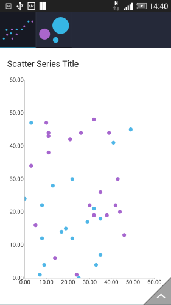

# RadChartView: ScatterPointSeries

**RadCartesianChartView** visualizes each data item from the **ScatterPointSeries** as individual points on the plot area. ScatterPointSeries like all other scatter series require two numerical axes to function propely.
All scatter series are incompatible with all categorical axes.

## Example

To create a chart with scatter series developers need to create a chart object, add horizontal and vertical axes and add a scatter series object populated with data. It must be
noted that the chart must have a LinearAxis set for both the horizontal and vertical axes. 

Immediately below is the implementation of the **initScatterData()** method which is used to populate the scatter series with data along with the ScatterPoint class which serves as the actual chart data.

```Java
	public class ScatterPoint {
		private int x;
		private int y;
		
		public ScatterPoint(int x, int y) {
			this.x = x;
			this.y = y;
		}
		
		public int getX() {
			return this.x;
		}
		
		public void setX(int value) {
			this.x = value;
		}
		
		public int getY() {
			return this.y;
		}
		
		public void setY(int value) {
			this.y = value;
		}
	}

	public Iterable initScatterData() {
		ArrayList<ScatterPoint> data = new ArrayList<ScatterPoint>();
		Random random = new Random();
		for(int i = 0; i < 20; ++i) {
			data.add(new ScatterPoint(random.nextInt(50), random.nextInt(50)));
		}
		
		return data;
	}
```

```C#
	public class ScatterPoint : Java.Lang.Object 
	{
       	public ScatterPoint(int x, int y)
		{
            this.X = x;
            this.Y = y;
       	}

            public int X { get; set; }

            public int Y { get; set; }
    }

    public Java.Lang.IIterable InitScatterData() 
	{
    	Java.Util.ArrayList data = new Java.Util.ArrayList ();
        Random random = new Random();
        for(int i = 0; i < 20; ++i) 
		{
            data.Add(new ScatterPoint(random.Next(50), random.Next(50)));
        }

        return data;
    }
```

After you create the method for initialization of sample data, you can create a **RadCartesianChartView** with **ScatterPointSeries** by adding the following code to the **onCreate()** method of your Activity.

```Java
	RadCartesianChartView chartView = new RadCartesianChartView(this);

	ScatterPointSeries scatterSeries = new ScatterPointSeries();
	scatterSeries.setXValueBinding(new PropertyNameDataPointBinding("X"));
	scatterSeries.setYValueBinding(new PropertyNameDataPointBinding("Y"));
	scatterSeries.setData(initScatterData());
	chartView.getSeries().add(scatterSeries);

	LinearAxis horizontalAxis = new LinearAxis();
	chartView.setHorizontalAxis(horizontalAxis);

	LinearAxis verticalAxis = new LinearAxis();
	chartView.setVerticalAxis(verticalAxis);

	ViewGroup rootView = (ViewGroup)findViewById(R.id.container);
	rootView.addView(chartView);
```

```C#
	RadCartesianChartView chartView = new RadCartesianChartView(this);

	ScatterPointSeries scatterSeries = new ScatterPointSeries();
	scatterSeries.XValueBinding = new MonthResultDataBinding("X");
	scatterSeries.YValueBinding = new MonthResultDataBinding("Y");
	scatterSeries.Data = InitScatterData();
	chartView.Series.Add(scatterSeries);

	LinearAxis horizontalAxis = new LinearAxis();
	chartView.HorizontalAxis = horizontalAxis;

	LinearAxis verticalAxis = new LinearAxis();
	chartView.VerticalAxis = verticalAxis;

	ViewGroup rootView = (ViewGroup)FindViewById(Resource.Id.container);
	rootView.AddView(chartView);
```

> This example assumes that your root container has id `container`

Here's the result:



## Customization

**ScatterPointSeries** provide the following API to change their style:

* **setStrokePaint(Paint)**: changes the color used to draw points' stroke. In order to get the current value, use **getStrokePaint()**.
* **setFillPaint(Paint)**: changes the fill of the scatter points. In order to get the current value, use **getFillPaint()**.

You can also customize the appearance of **ScatterPointSeries** by using [Palettes]( "Read how to use Palettes in RadChartView").