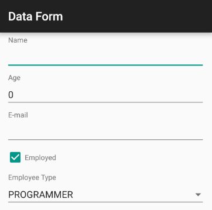

## DataForm for Xamarin.Android: Getting Started

To use **RadDataForm** you will need to add the following Telerik references:

* Telerik.Xamarin.Android.Input
* Telerik.Xamarin.Android.Common 

Then it's just a matter of creating a new RadDataForm instance, adding it to the Android UI tree and providing an object to edit. For example:

```C#
RadDataForm form = new RadDataForm(context);
form.SetEntity(new Person());

layout.AddView(form);
```

Here's the <code>Person</code> class:

```C#
public class Person : Java.Lang.Object
{
	[DataFormProperty(Label = "Age", Index = 1)]
	public int Age 
	{
		get;
		set;
	}

	[DataFormProperty(Label = "Employee Type", Index = 4)]
	public EmployeeType EmployeeType 
	{
		get;
		set;
	}

	[DataFormProperty(Label = "Name", Index = 0)]
	public string Name 
	{
		get;
		set;
	}

	[DataFormProperty(Label = "E-mail", Index = 2)]
	public string Mail 
	{
		get;
		set;
	}

	[DataFormProperty(Label = "Employed", Index = 3)]
	public bool IsEmployed 
	{
		get;
		set;
	}
}
public enum EmployeeType
{
	PROGRAMMER,
	MANAGER,
	SUPPORT,
	MARKETING
}
```

Now the data form should be ready to edit the fields of the person object:


To learn more about the @DataFormProperty annotation see the page about [property metadata]( "Read more about the data form metadata.").

## Editing JSON Objects

You can also use **RadDataForm** to edit Json Objects. For example, if you have the Person details in a json file with the following content:

	{
		"name": "John Doe",
		"age": 21,
		"email": "john.doe@example.com"
	}
	
You can edit it through RadDataForm like this:


```C#
// The file Person.json is in the Assets folder of the project
String json = LoadJSONFromAsset ("Person.json");
try {
	JSONObject jsonObject = new JSONObject (json);
	dataForm.SetEntity(jsonObject);
} catch(JSONException e) {
	Log.Error ("json", "error parsing json", e);
}
```

The loadJSONFromAsset simply returns the content of file with given name. Here's one sample implementation:


```C#
private String LoadJSONFromAsset(String fileName)
{
	String json = null;
	try
	{
		using (StreamReader sr = new StreamReader (Activity.Assets.Open (fileName)))
		{
			json = sr.ReadToEnd ();
		}
	}
	catch (IOException ex)
	{
		Log.Error("error", ex.StackTrace);
	}
	return json;
}
```