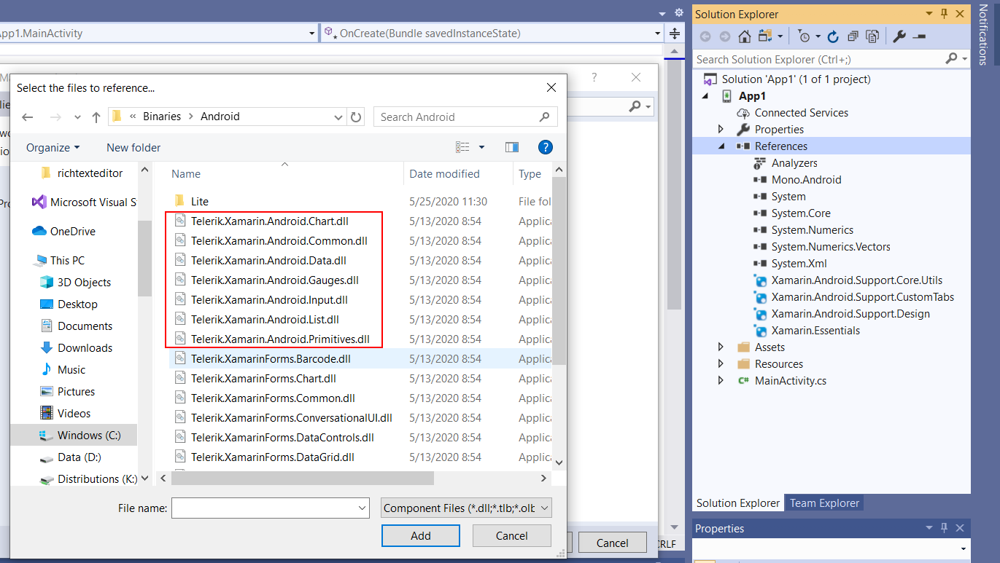
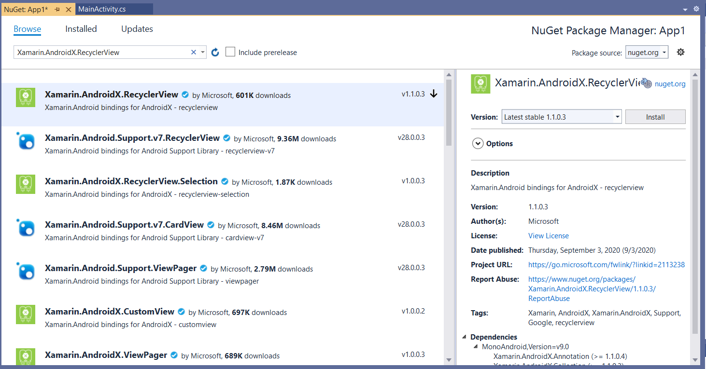

# Getting Started for Xamarin

This article explains how to start using **Telerik UI for Xamarin.Android** in **Xamarin**.

## Overview
The **Telerik UI for Xamarin.Android** Xamarin distribution comes as a set of **Dynamic Link Libraries**. To be able to use Telerik UI for Xamarin.Android in Xamarin, you will need to complete the following steps:

1. Add references to the libraries inside your project.
2. Add the appcompat and the recyclerview packages using the NuGet.

> Please note, that since we are using features added with API 23, the target API for your project should also be at least 23. Also note, that the Target API level is different than the Minimum API level. UI for Android supports API 14 as a Minimum API level. <a href="http://developer.android.com/training/basics/supporting-devices/platforms.html#sdk-versions" target="_blank">Here</a>'s more about the difference between Minimum and Target API Levels.

## Referencing the libraries from your project

>tip Check [Download Product Files]() topic for detailed instructions on how to navigate to Telerik UI for Xamarin download page. Download "Telerik_UI_for_Xamarin_[version]_[license].zip" file which contains the needed assemblies for Xamarin.Android development inside Binaries/Android folder.

1. Click on **New Solution** in the home screen in **Xamarin**.

2. In the **New Project** Wizard, select **Android Application** , choose a name for your project and click **Ok**.

3. Add references to the libraries by right-clicking the **References** of your project and selecting **Edit References...**.

	>Depending on the functionality you would like to use, make sure to add all needed dependencies as described in the [Installation contents and dependencies section](installation-contents-and-dependencies)

4. Add the following packages using the NuGet:
	* Xamarin Support Library v7 AppCompat (required by the following assemblies: Chart, Feedback, Input, List & Primitives)
	* Xamarin Support Library v7 RecyclerView (required by the List assembly)
	* Xamarin Support Library v8 RenderScript (required by the Primitives assembly)
	

5. Your solution is now ready to use Telerik UI for Xamarin.Android.

## Opening the Examples solution

We have prepared a Samples project which you can find in the installation folder in the `\Examples` subfolder. 