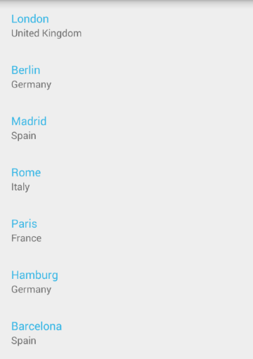

## ListView for Xamarin.Android: Getting Started

In this article, you will learn how to get started with **ListView for Xamarin.Android**: how to initialize the list, how to create the adapter that populates it and extend it in accordance with your layout. 

By the end of the article we will have a list that looks like this:



### Project Setup

For **RadListView** you will need the following Telerik references:

* Telerik.Xamarin.Android.Common
* Telerik.Xamarin.Android.Data
* Telerik.Xamarin.Android.List

And add references to the following AndroidX packages:

* Xamarin.AndroidX.AppCompat
* Xamarin.AndroidX.RecyclerView

### Adding the list view instance

Now that the project is setup, you can easily add **RadListView** in the layout file for the main activity of your project:

	<RelativeLayout xmlns:android="http://schemas.android.com/apk/res/android"
		xmlns:tools="http://schemas.android.com/tools"
		android:layout_width="match_parent"
		android:layout_height="match_parent"
		tools:context=".MainActivity">

		<com.telerik.widget.list.RadListView
			android:id="@+id/listView"
			android:layout_width="match_parent"
			android:layout_height="match_parent"/>

	</RelativeLayout>

You can access the control from the activity in order to be able to apply further modifications:


```C#
protected override void OnCreate (Bundle bundle)
{
	base.OnCreate (bundle);
	SetContentView (Resource.Layout.Main);

	RadListView listView = FindViewById<RadListView> (Resource.Id.listView);
}
```

### Adapter

**RadListView** extends <a href="https://developer.android.com/reference/androidx/recyclerview/widget/package-summary" target="_blank">RecyclerView</a> and requires a similar adapter, which will be responsible for providing a proper view for each data item. The items are represented by ViewHolders which are recycled for better performance. 

For example if we have a list of 20 items, but only 7 are visible on the screen at one point, then 7 view holders should be enough to represent all the data. Later when the user scrolls the same view holders will be reused to show the new data. 

The default adapter that is used by **RadListView** is called **ListViewAdapter**. In order to create a new instance, you simply need to pass a list of items to the constructor of the adapter.

Let's create a simple class that we will use later to populate the list:

```C#
public class City : Java.Lang.Object {
	public String Name { get; set; }
	public String Country { get; set; }

	public City(String name, String country) {
		this.Name = name;
		this.Country = country;
	}

	public override string ToString () {
		return string.Format ("{0} ({1})", Name, Country);
	}
}
```

Now, let's create a method that will create a list of items that we can use for our list view adapter:

```C#
private List<City> GetListOfCities() {
	List<City> cities = new List<City> ();
	cities.Add (new City ("London", "United Kingdom"));
	cities.Add (new City ("Berlin", "Germany"));
	cities.Add (new City ("Madrid", "Spain"));
	cities.Add (new City ("Rome", "Italy"));
	cities.Add (new City ("Paris", "France"));
	cities.Add (new City ("Hamburg", "Germany"));
	cities.Add (new City ("Barcelona", "Spain"));
	cities.Add (new City ("Munich", "Germany"));
	cities.Add (new City ("Milan", "Italy"));
	cities.Add (new City ("Cologne", "Germany"));
	return cities;
}
```

We are now ready to create a new adapter from the list and pass it to the list view instance:


```C#
ListViewAdapter listViewAdapter = new ListViewAdapter (GetListOfCities ());
listView.SetAdapter (listViewAdapter);
```

More often than not, you will want your list view items to include a bit more complex layout. In order to achieve this you will need to extend the **ListViewAdapter** class and override its **onCreateViewHolder** and **onBindViewHolder** methods. The first one is responsible for creating a new view holder that will be later reused to visualize different data items. The second is responsible for the binding of a view holder with information about a specific item from the list. 

Here's one way to extend the default adapter:

```C#
public class CityAdapter : ListViewAdapter
{
	public CityAdapter(IList items)
		:base(items) {
	}

	public override RecyclerView.ViewHolder OnCreateViewHolder (ViewGroup parent, int viewType)
	{
		LayoutInflater inflater = LayoutInflater.From(parent.Context);
		View view = inflater.Inflate(Resource.Layout.city_list_item, parent, false);
		return new CityViewHolder(view);
	}

	public override void OnBindListViewHolder (ListViewHolder holder, int position)
	{
		CityViewHolder viewHolder = (CityViewHolder)holder;
		City city = (City)Items[position];
		viewHolder.nameView.Text = city.Name;
		viewHolder.countryView.Text = city.Country;
	}

	public class CityViewHolder : ListViewHolder {
		public TextView nameView;
		public TextView countryView;

		public CityViewHolder(View itemView)
			:base(itemView){

			nameView = (TextView)itemView.FindViewById(Resource.Id.nameView);
			countryView = (TextView)itemView.FindViewById(Resource.Id.countryView);
		}
	}
}
```

The resource city_list_item that is used in the adapter is a new layout resource added in the layout directory of your project and its content is as follows:

	<LinearLayout xmlns:android="http://schemas.android.com/apk/res/android"
		android:layout_width="match_parent"
		android:layout_height="match_parent"
		android:orientation="vertical"
		android:background="@drawable/pressable_item_background"
		android:padding="16dp">

		<TextView
			android:id="@+id/nameView"
			android:layout_width="match_parent"
			android:layout_height="wrap_content"
			android:textSize="16sp"
			android:textColor="#FF33B5E5" />

		<TextView
			android:id="@+id/countryView"
			android:layout_width="match_parent"
			android:layout_height="wrap_content"
			android:textSize="14sp"
			android:textColor="#8A000000" />

	</LinearLayout>

When you set an instance of your new adapter to the list view, it will look as the one in image from the beginning of the article:

```C#
CityAdapter cityAdapter = new CityAdapter (GetListOfCities ());
listView.SetAdapter (cityAdapter);
```